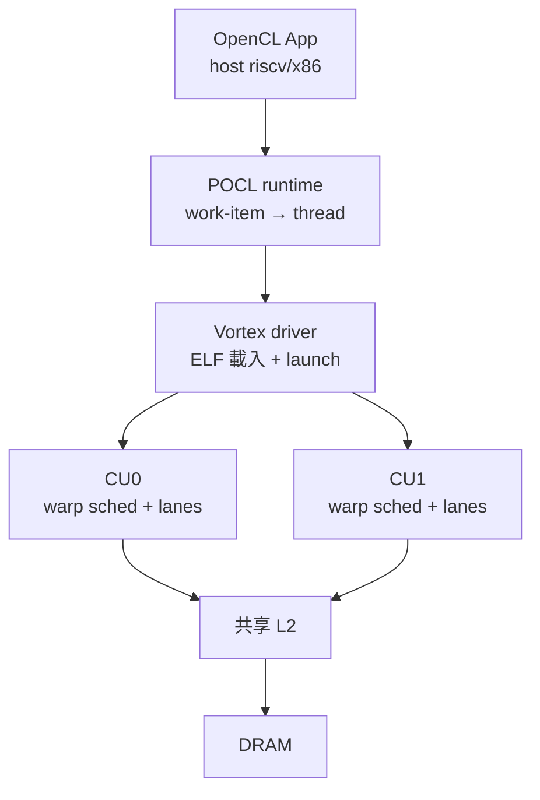

# 10.1 Vortex GPGPU 剖析

> 想親手摸到 Device-side（RISC-V 當 GPU）的全貌？Vortex 是目前唯一「RTL（暫存器傳輸級）→ 驅動 → runtime → 編譯器」全開源的 GPGPU。

## 動機：紙上 SIMT 不夠，要可跑的

8.2 節講了 RV64X 規範、8.3 節講了 warp 排程，但沒有硬體一切是空談。Vortex（Georgia Tech）的價值是把 SIMT 做成能 `git clone` 就跑的東西：Chisel / Verilog 核心、可在 FPGA（現場可程式閘陣列）合成、附 POCL（Portable OpenCL）runtime，讓學生在筆電上就能跑通 `vecadd`。

## 核心講解：Vortex 軟硬體棧

### 1. 硬體：小核心拼大陣列

一個 Vortex CU（Compute Unit，計算單元）= RV32IM 管線 × N threads + warp 排程器 + shared memory；多個 CU 再拼成叢集（Cluster），配 L2 與 DRAM 控制器。可組態（Configurable）是靈魂：`--cores 2 --warps 4` 一行參數即換一個 GPU，適合做架構探索（Design Space Exploration）。

### 2. 軟體：POCL 當橋

應用寫 OpenCL C，POCL 把 work-item（工作項）映射為 Vortex thread，`barrier()` 降為 `bar.sync`。另有 Vortex 自家 driver 負責把 ELF 載入 device memory、發射（Launch）並回收。這條「OpenCL → POCL → Vortex ISA」就是 10.2 節工具鏈的實例化。

### 3. 對照表：Vortex vs NVIDIA SM

| 面向 | NVIDIA SM | Vortex CU |
|------|-----------|-----------|
| ISA | 封閉 SASS | 開放 RV32IM + custom SIMT |
| 排程器 | 多 warp 調度器（文檔黑盒） | 開源 warp scheduler，可改策略 |
| 記憶體 | 片上 shared / L1 可配 | 開源 SRAM 参数可調（容量/bank 數） |
| 工具鏈 | `nvcc` 封閉 | LLVM + POCL 開源，可加指令 |
| 效能 | 數十 TFLOPS | FPGA 數十 GFLOPS（教學夠用） |
| 定位 | 產品 | 研究與教學載體 |

### 4. 效能現實

別拿 Vortex 對標 RTX：它是正確性與可改性優先。但正因如此，學生可以改 warp 策略、加 shared memory bank，第二天就看到 Rodinia 分數變化——這是封閉 GPU 給不了的。

## 範例：從零跑起 Vortex

```bash
# 1. 取碼並建置（simv 為週期近似模擬器，rtlsim 為 RTL 模擬）
git clone https://github.com/vortexgpgpu/vortex.git && cd vortex
make -j$(nproc)

# 2. 編譯 OpenCL kernel（POCL 路徑，Device-side）
riscv32-unknown-elf-gcc -march=rv32im -O3 \
  tests/opencl/vecadd/vecadd_kernel.c -o vecadd.elf
./simv vecadd.elf --cores 4 --warps 8 --threads 32 --dump-perf

# 3. 跑完整 benchmark（對照 Rodinia）
cd tests && bash run_tests.sh --sim simv --bench vecadd,saxpy,transpose
```

```c
// Vortex 上的 OpenCL kernel：與 NVIDIA 寫法幾乎相同，底層已換成 RV SIMT
__kernel__ void vecadd(__global int *a, __global int *b, __global int *c) {
    int gid = get_global_id(0); // 底層讀硬體 thread ID CSR
    c[gid] = a[gid] + b[gid];
}
```

## Mermaid：Vortex 系統視圖



## 本節小結

- Vortex 是 Device-side 的標準答案：全開源、可合成、可改排程器。
- 它證明 RISC-V 當 GPU 不需 NVIDIA 授權，只需 SIMT 前端 + runtime。
- 效能是教學級，但架構實驗價值無可取代。
- Host-side（9.2 節）與它正交：Vortex 系統裡沒有 `nvidia.ko`。

## 想一想

1. 把 `--warps` 從 4 調到 16 再跑 `saxpy`，perf 計數如何變？用延遲掩蓋原理解釋。
2. 在 Vortex RTL 裡找到 warp scheduler，試著把輪詢（Round-robin）改成貪婪（Greedy），會影響正確性嗎？
3. 為何 Vortex 選 RV32IM 而非 RV64G 當底？從面積與教學定位分析。
