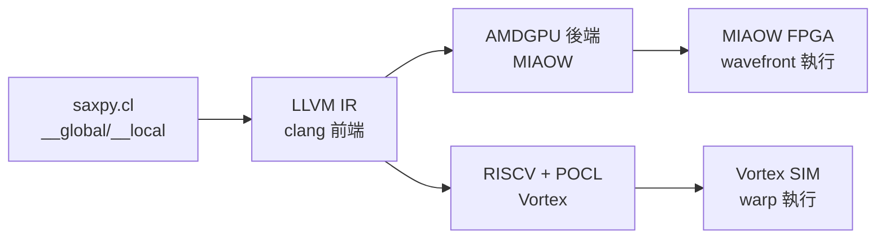

# 10.2 MIAOW 與 OpenCL 工具鏈

> Vortex 之前，開源 GPGPU 的先行者叫 MIAOW：它選了一條更硬的路——相容 AMD Southern Islands ISA，讓現成 OpenCL kernel 直接跑。

## 動機：為何還要談 MIAOW

Vortex 用 RISC-V ISA，长遠乾淨；MIAOW（AMD 研究計畫開源）用 AMD GPU ISA，短平快：Mesa / Gallium 堆疊、現成 OpenCL benchmark 無需重編語義即可驗證。兩者一 soft（ISA 創新）一 hard（相容既有），對照讀才能看懂開源 GPU 的取捨光譜。本節仍屬 Device-side（裝置端當 GPU）維度。

## 核心講解：MIAOW 架構與 OpenCL 工具鏈

### 1. MIAOW 硬體要點

MIAOW 實現 AMD Southern Islands（GCN 前代）指令集：CU 內 wavefront（等同 warp，64 threads）lockstep 執行，標量（Scalar）+ 向量（Vector）雙管線，LDS（Local Data Share，等同 shared memory）。RTL（Verilog）全開源，可在 FPGA 合成，但已多年未大改——讀它學思想，動手玩選 Vortex。

### 2. OpenCL 工具鏈：kernel 如何變 GPU 指令

無論 MIAOW 還是 Vortex，路徑都是：OpenCL C → Clang/LLVM IR（中間表示）→ 後端（MIAOW 用 AMDGPU 後端、Vortex 用 RISCV + POCL）→ device ELF → runtime（MIAOW 配自家 driver、Vortex 配 POCL）載入執行。`get_global_id`、`barrier` 這些 builtin（內建函式）由 runtime 頭檔與後端 intrinsic 聯手降為硬體指令。

### 3. 對照表

| 面向 | MIAOW | Vortex（對照） |
|------|-------|----------------|
| ISA | AMD Southern Islands（相容舊生態） | RV32IM + custom SIMT（RISC-V 原生） |
| 執行單位 | wavefront 64 threads | warp 32 threads（可配） |
| 片上記憶體 | LDS（GCN 語義） | shared memory（CUDA 語義） |
| 工具鏈 | Clang AMDGPU 後端 + 自家 runtime | POCL + LLVM RISCV 後端 |
| 維護狀態 | 停滯（研究遺產） | 活躍（持續更新） |
| 學習價值 | 讀懂商用 GPU 記憶體/排程真實取捨 | 動手改、跑分、發 paper |

### 4. 通用心法：Address Space

OpenCL 的 `__global` / `__local` / `__private` 不是註解，是位址空間限定詞（Qualifier）：後端據此選編碼、runtime 據此配記憶體。寫 kernel 時先問「這陣列住哪層」，正是 8.4 節階層的軟體投影。

## 範例：OpenCL 工具鏈端到端

```bash
# 1. 寫 OpenCL kernel 並用 Clang 產 LLVM IR（MIAOW/Vortex 通用前端）
clang -cl-std=CL2.0 -Xclang -finclude-default-header \
  -emit-llvm -c saxpy.cl -o saxpy.bc
llvm-dis saxpy.bc -o - | grep -E "get_global_id|barrier"

# 2a. 往 MIAOW（AMDGPU 後端）編譯
llc -march=r600 -mcpu=SI saxpy.bc -o saxpy_miaow.s

# 2b. 往 Vortex（RISCV + POCL）編譯執行
riscv32-unknown-elf-gcc -march=rv32im -O3 saxpy_host.c -o saxpy_host -lpocl
./saxpy_host --device vortex  # POCL 把 kernel 載入 Vortex
```

```c
// saxpy.cl：同一份 source，後端不同即跑在不同 Device 上
__kernel__ void saxpy(__global float *x, __global float *y,
                      float a, int n) {
    int i = get_global_id(0); // MIAOW→wavefront ID，Vortex→thread ID
    if (i < n) y[i] = a * x[i] + y[i];
    // __local 陣列即放 shared/LDS，需 barrier 同步
}
```

## Mermaid：OpenCL 編譯流



## 本節小結

- MIAOW 證明相容商用 ISA 可行，Vortex 證明 RISC-V 原生更可持續。
- OpenCL 工具鏈核心是位址空間 + builtin 降級，前端共用、後端分叉。
- 選型建議：讀論文讀 MIAOW，動手做選 Vortex。
- 兩者皆 Device-side，與 9.2 節 Host 驅動無關。

## 想一想

1. 把 `saxpy.cl` 的 `__global` 誤寫成 `__private`，編譯器與 runtime 各會發生什麼？
2. 比較 `llc -march=r600` 與 `riscv32-unknown-elf-gcc` 產生的組語，找出 `get_global_id` 各降成了什麼指令。
3. 若要把 MIAOW 的 LDS 語義搬到 Vortex shared memory，最大的語義落差是什麼？
