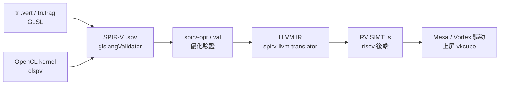

# 10.3 Vulkan / OpenGL 著色器編譯：SPIR-V 到自訂 ISA

>  GPGPU 之外，GPU 的老本行是畫圖：Vulkan（新一代圖形 API）/ OpenGL（傳統圖形 API）的著色器（Shader）如何編到 RISC-V 自研 GPU 上？答案叫 SPIR-V。

## 動機：圖形是 GPU 的入場券

一顆自研 RISC-V GPU 若只能跑 OpenCL，手機與嵌入式廠商不會買單——他們要的是 Vulkan / OpenGL ES 能點亮螢幕。SPIR-V（Standard Portable Intermediate Representation-V，Khronos 標準中間碼）正是圖形與計算的共同入口：GLSL（OpenGL Shading Language）/ HLSL 先編成 SPIR-V，再由各家後端降為自訂 ISA。本節把 Device-side 拼圖補完：從計算（CUDA/OpenCL）延伸到圖形。

## 核心講解：Shader 編譯管線

### 1. 三段式

前端：`glslangValidator` 把 `.vert` / `.frag` 編成 `.spv`（SPIR-V 二進制）。
優化：`spirv-opt` 做死碼刪除、內聯（Inline），`spirv-val` 驗證合法性。
後端：`glslang → SPIRV-LLVM` 轉 LLVM IR，再接 RISCV / Vortex 後端；或直轉 Mesa Gallium 驅動，由 driver 即時（Just-in-Time）編碼。

### 2. 著色器階段速覽

頂點著色器（Vertex Shader）：每頂點跑一次，算位置。
片段著色器（Fragment Shader）：每像素跑一次，算顏色。兩者都是 SIMT 天然 workload（工作負載）：頂點/像素即 thread，不需 `__syncthreads`，分歧也少——比通用計算更好餵。

### 3. 對照表

| 階段 | 輸入 / 輸出 | SIMT 映射 | RISC-V 後端要處理什麼 |
|------|-------------|-----------|----------------------|
| glslang 前端 | `.vert/.frag` → `.spv` | 無，純編譯 | 不需硬體，host 工具 |
| spirv-opt/val | `.spv` → 優化 `.spv` | 無 | 同上，可跑在 riscv64 host |
| LLVM 後端 | SPIR-V → LLVM IR → RV SIMT | thread = 頂點/像素 | 紋理（Texture）取樣、varying 插值指令 |
| Mesa 驅動 | IR → 自訂機器碼 | warp 排程不變 | framebuffer（幀緩衝）混合、深度測試固定管線 |

### 4. 與計算管線的關係

SPIR-V 亦可承載 OpenCL kernel（`clspv` 把 OpenCL C 轉 SPIR-V），於是「圖形 shader 與計算 kernel 共用 SPIR-V → LLVM IR → RV SIMT」成為統一後端。這正是開源驅動（Mesa + Vortex）夢寐以求的一條路徑。

## 範例：GLSL 到 RISC-V 的完整鏈

```bash
# 1. 寫 shader 並編成 SPIR-V（host 上跑即可）
glslangValidator -V tri.vert -o tri.vert.spv
glslangValidator -V tri.frag -o tri.frag.spv
spirv-val tri.vert.spv && spirv-opt -O tri.vert.spv -o tri.vert.opt.spv

# 2. SPIR-V 轉 LLVM IR，再往 RISC-V GPGPU 後端
spirv-llvm-translator tri.vert.opt.spv -o tri.ll
llc -march=riscv32 -mattr=+m tri.ll -o tri_rv.s
grep -E "lw|sw|tmc" tri_rv.s | head

# 3.（可選）經 Mesa 在 Vortex 上點亮
MESA_LOADER_DRIVER_OVERRIDE=vortex VK_ICD_FILENAMES=vortex_icd.json vkcube
```

```c
// tri.vert：每個頂點一個 thread，天然 SIMT
#version 450
layout(location = 0) in vec3 pos;   // 頂點位置
layout(location = 0) out vec3 color; // 傳給 fragment 的 varying
void main() {
    gl_Position = vec4(pos, 1.0);
    color = pos * 0.5 + 0.5; // 純量寫法，硬體 warp 化
}
```

## Mermaid：Shader 編譯管線



## 本節小結

- SPIR-V 是圖形與計算的共同中間碼，GLSL 與 OpenCL 在此匯合。
- RISC-V GPU 只要接好「SPIR-V → LLVM IR → RV SIMT」即同時拿到圖形與計算生態。
- Shader 比通用 kernel 更 SIMT-friendly，是自研 GPU 先求點亮的好起點。
- 全篇仍是 Device-side；Host-side（9.2 節）的 NVIDIA 驅動走另一套閉源 shader 編譯器，勿混淆。

## 想一想

1. 用 `spirv-dis` 反組譯 `tri.vert.spv`，找出 `OpEntryPoint` 與 varying 變數對應哪幾條指令。
2. 為何 fragment shader 幾乎沒有 `barrier`？從像素獨立性解釋。
3. 若 Vortex 要支援紋理取樣（texture sampling），後端至少要加哪類指令與固定管線？參考 8.2 節的 `tex` 討論。
