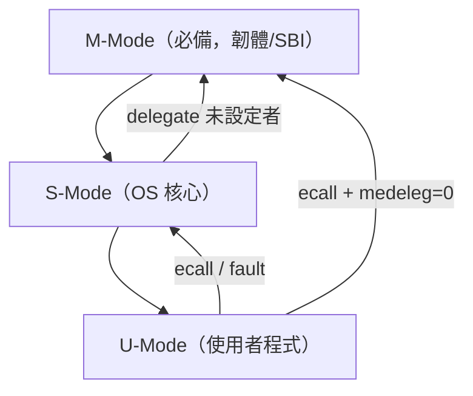

# 11.1 機器模式（Machine Mode, M-Mode）

## 動機：為什麼需要一個「最高權限」？

作業系統核心再可信，也可能有漏洞；一旦核心被攻破，若沒有更高一層的監護者，整台機器就無險可守。機器模式（Machine Mode, M-Mode）就是 RISC-V 特權架構中的最高權限層級：開機時第一個執行的模式，也是唯一**必備（mandatory）**的特權模式——最簡單的嵌入式 MCU 可以只有 M-Mode，能跑完整 Unix 的晶片則是 M + S + U 三層。

M-Mode 的核心職責有三：開機初始化（reset 後唯一入口）、接管所有「沒人處理」的 trap、以及充當 S-Mode 與硬體之間的韌體墊片（例如 SBI 執行環境，詳見 14.2）。

## 核心講解：M-Mode 的權力邊界

M-Mode 能存取**所有 CSR 與全部實體記憶體**，並可用 `mret` 返回較低權限。權限編碼本身寫在 CSR 位址的 `csr[9:8]` 欄位：`11` 即 M 級，例如 `mstatus` 位址 `0x300` 的高兩位元為 `11`。

| CSR 名稱 | 位址 | 用途 |
|---|---|---|
| `mstatus` | `0x300` | 全域中斷使能、上一權限記憶（MPP/MPIE） |
| `misa` | `0x301` | 支援的擴充字串（M/A/F/D/C…） |
| `medeleg` / `mideleg` | `0x302` / `0x303` | 把 trap 下放（delegate）給 S-Mode |
| `mie` / `mip` | `0x304` / `0x344` | 中斷使能 / 中斷待決 |
| `mtvec` | `0x305` | M-Mode trap 向量基址 |
| `mscratch` | `0x340` | trap 進出時暫存交換用 |
| `mepc` | `0x341` | trap 返回位址 |
| `mcause` | `0x342` | trap 原因（中斷位元 + 異常碼） |
| `mtval` | `0x343` | 附加資訊（fault 位址或非法指令字） |
| `mhartid` | `0xF14` | 目前硬體執行緒編號（唯讀） |

### `mstatus`（`0x300`）關鍵欄位（RV64）

| 位元 | 欄位 | 意義 |
|---|---|---|
| 3 | MIE | M-Mode 全域中斷使能 |
| 7 | MPIE | `mret` 前保存的 MIE，返回時恢復 |
| 12:11 | MPP | trap 前的權限等級，`mret` 時恢復 |
| 17 | MPRV | 置位時 load/store 改用 MPP 權限檢查 |
| 18 | SUM | S-Mode 是否可存取 U-Mode 頁面 |
| 19 | MXR | 可讀頁面是否一律可執行（make executable readable） |
| 20 / 21 / 22 | TVM / TW / TSR | 把 `satp` 存取、`wfi`、`sret` 抓進 M-Mode 陷阱 |
| 63 | SD | FS/VS/XS 任一為 Dirty 時置位（唯讀綜合位元） |

 trap 進入 M-Mode 時硬體自動完成：`MIE → MPIE`、`MIE ← 0`、`MPP ← 當前權限`、`mepc ← 觸發指令 PC`；`mret` 則做精確的逆操作。

## 範例：讀 `mhartid`、開 MIE、從 M-Mode 退到 S-Mode

```asm
    csrr t0, mhartid        # t0 = hart ID（唯讀 CSR）
    csrr t1, mstatus
    ori  t1, t1, 0x8        # 置位 MIE（bit 3）
    csrw mstatus, t1

    # 準備 mret 到 S-Mode：MPP=01，MPIE=1，mepc=目標
    li   t2, 0x880          # MPP(11:12)=01, MPIE(bit7)=1
    csrc mstatus, 0x1800    # 先清 MPP
    csrs mstatus, t2
    la   t3, s_entry
    csrw mepc, t3
    mret                    # 跳到 s_entry，權限降為 S-Mode
s_entry:
    wfi
```

## Mermaid：權限層級與 trap 歸屬



## 本節小結

- M-Mode 是唯一必備的最高權限，開機入口與最後防線。
- `mstatus.MPP/MPIE` 記錄 trap 前狀態，`mret` 精確還原。
- `medeleg/mideleg` 決定哪些 trap 可下放 S-Mode；不下放的一律進 M-Mode。
- `mhartid`、`misa` 等唯讀 CSR 提供韌體識別硬體的依據。

## 想一想

1. 為什麼 RISC-V 規定 M-Mode 是必備，而 S/U-Mode 可選？試舉一個「只有 M-Mode」的產品例子。
2. 若 `medeleg` 把所有異常都下放給 S-Mode，惡意 OS 能否就此擺脫 M-Mode 監控？`TVM/TSR` 欄位在此扮演什麼角色？
3. ★★ 用 QEMU + GDB 觀察：reset 後第一條指令的權限是什麼？`mhartid` 在各 hart 上讀到什麼值？
