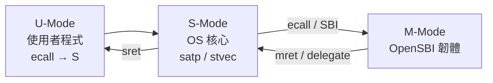

# 11.2 監督者模式（Supervisor Mode, S-Mode）

## 動機：OS 核心該住在哪一層？

作業系統核心（kernel）需要直接操作頁表、開關中斷、回應系統呼叫，但又不該碰觸整機安全命脈（如 PMP、實體開機流程）。監督者模式（Supervisor Mode, S-Mode）正是為此設計的「核心層」：權限低於 M-Mode（韌體/SBI），高於 U-Mode（使用者程式），是 Unix-like OS 常駐的模式。xv6-riscv 與 Linux on RISC-V 的核心態，指的都是 S-Mode。

## 核心講解：S-Mode 的 CSR 家族

S-Mode CSR 是 M-Mode 對應暫存器的「受限投影」：名稱把 `m` 換成 `s`，且有**自己的 trap 三元組** `stvec/sepc/scause`。`sstatus` 更是 `mstatus` 的可見子集——S-Mode 寫 `sstatus` 實際上只影響 `mstatus` 中允許的位元。

| CSR 名稱 | 位址 | 用途 |
|---|---|---|
| `sstatus` | `0x100` | SIE/SPIE/SPP/SUM/MXR/FS 等狀態位元 |
| `sie` / `sip` | `0x104` / `0x144` | S 級中斷使能 / 待決（SEIP/STIP/SSIP） |
| `stvec` | `0x105` | S-Mode trap 向量（BASE + MODE） |
| `sscratch` | `0x140` | 進 trap 時與 `sp` 交換用 |
| `sepc` | `0x141` | trap 返回位址 |
| `scause` | `0x142` | trap 原因（格式同 `mcause`） |
| `stval` | `0x143` | fault 位址或非法指令等附加資訊 |
| `satp` | `0x180` | 頁表基址 + ASID + 分頁模式（詳見 13.3） |
| `scounteren` | `0x106` | 允許 U-Mode 讀 `cycle/time/instret` 的開關 |

### `sstatus`（`0x100`）關鍵欄位

| 位元 | 欄位 | 意義 |
|---|---|---|
| 1 | SIE | S-Mode 全域中斷使能 |
| 5 | SPIE | 進入 trap 前的 SIE，`sret` 時恢復 |
| 8 | SPP | trap 前的權限（0=U, 1=S），`sret` 時恢復 |
| 14:13 | FS | 浮點單元狀態（Off/Initial/Clean/Dirty） |
| 18 | SUM | 置位才允許 S-Mode 存取 U 頁（預設禁止，防特權提昇） |
| 19 | MXR | 置位則「可讀即視為可執行」，影響 `copy_from_user` 語意 |

注意 `SUM=0` 是預設安全值：核心直接解參考使用者指標會 fault，必須用特殊路徑（或暫開 SUM）處理，這正是 `copy_from_user()` 存在的硬體理由。

### `sie/sip`（`0x104/0x144`）中斷位元

| 位元 | 欄位 | 意義 |
|---|---|---|
| 1 | SSIP | S 級軟體中斷待決（多核 IPI 經 SBI 轉發置位） |
| 5 | STIP | S 級計時器中斷（M-Mode 韌體反射 MTIP 而來） |
| 9 | SEIP | S 級外部中斷（PLIC 仲裁後的匯總線） |

`sstatus.SIE` 是總開關，`sie` 是分路開關：兩者皆為 1 且無更高權限攔截，中斷才會真正 trap。關中斷的慣用寫法是清 `SIE`（臨界區），而非逐個清 `sie`。

## 範例：S-Mode trap 入口保存現場（xv6 風格）

```asm
    # stvec 指向此處；sscratch 預存核心棧頂
    csrw sscratch, t0       # 先借 t0 暫存
    la   t0, kstack_top
    csrrw t0, sscratch, t0  # t0=使用者暫存，sscratch=核心棧
    # 之後把 32 個通用暫存器存入 trapframe，再：
    csrr t0, sepc
    csrr t1, scause
    csrr t2, stval
    # ... C 語言 usertrap() 依 scause 分派 ...
    sret                    # 回到 sepc，權限依 SPP 恢復
```

```c
// 核心態開 S 級外部中斷（S-Mode 視角）
w_sie(r_sie() | (1UL << 9));       // SEIP, bit 9
w_sstatus(r_sstatus() | (1UL << 1)); // SIE, bit 1
```

## Mermaid：S-Mode 在系統中的位置



## 本節小結

- S-Mode 是 OS 核心的家：自有 trap 三元組 `stvec/sepc/scause` 與頁表根 `satp`。
- `sstatus` 是 `mstatus` 的受限視窗；`SPP/SPIE` 配合 `sret` 完成 trap 往返。
- `SUM=0` 預設隔離使用者記憶體，是核心安全的基本盤。
- S-Mode 仍受 M-Mode 節制：`medeleg/mideleg` 與 `TVM/TSR` 決定其自由邊界。

## 想一想

1. `sstatus.SPP` 只有 1 位元，為何夠用？它能表示「從 M-Mode trap 進 S-Mode」嗎？
2. 若核心忘記在開中斷前設定 `stvec`，第一個 timer tick 會發生什麼事？
3. ★★ 追蹤 xv6-riscv 的 `usertrap()`：`scause=8`（U 級 ecall）與 `scause=13`（load page fault）分別走哪條路徑？
