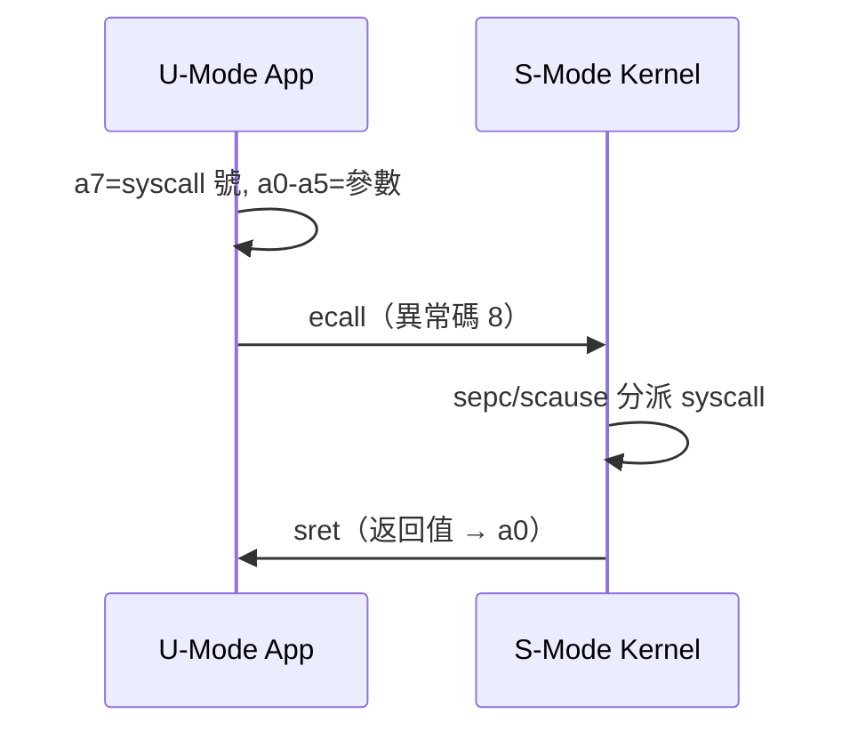

# 11.3 使用者模式（User Mode, U-Mode）

## 動機：應用程式憑什麼被信任？

一行使用者程式就可能有緩衝區溢位，OS 絕不能讓它直接碰硬體。使用者模式（User Mode, U-Mode）是最低權限：**只能執行非特權指令、只能存取自己的虛擬位址空間**，任何越界行為（非法指令、缺頁、系統呼叫）都會 trap 進 S-Mode 裁決。這正是行程隔離（process isolation）的硬體基石。

## 核心講解：U-Mode 能看見什麼？

U-Mode 可用的 CSR 只有「N 擴充」定義的使用者級暫存器，且多半是**唯讀計數器**；能否讀還要看 `mcounteren`（`0x306`）與 `scounteren`（`0x106`）是否放行。

| CSR 名稱 | 位址 | 存取 | 用途 |
|---|---|---|---|
| `ustatus` | `0x000` | RW | U 級狀態（UIE 等，N 擴充） |
| `uie` / `uip` | `0x004` / `0x044` | RW | U 級中斷使能 / 待決（需 N 擴充） |
| `utvec` | `0x005` | RW | U 級 trap 向量（需 N 擴充） |
| `uscratch` | `0x040` | RW | U 級 trap 暫存 |
| `uepc` | `0x041` | RW | U 級 trap 返回位址 |
| `ucause` | `0x042` | RW | U 級 trap 原因 |
| `utval` | `0x043` | RW | U 級 trap 附加資訊 |
| `cycle` / `time` / `instret` | `0xC00` / `0xC01` / `0xC02` | RO | 週期 / 牆鐘 / 退休指令計數 |
| `cycleh` / `timeh` / `instreth` | `0xC80` / `0xC81` / `0xC82` | RO | RV32 專用高 32 位元 |

### 權限檢查總表（U-Mode 視角）

| 動作 | 結果 |
|---|---|
| 執行 `csrw satp, x`（S 級 CSR） | 非法指令異常（`mcause/scause=2`） |
| 執行 `sret` / `mret` / `sfence.vma` | 非法指令異常 |
| 執行 `ecall` | U 級環境呼叫（異常碼 8），trap 進 S-Mode |
| 讀 `cycle` 但 `scounteren.CY=0` | 非法指令異常 |
| 存取未映射虛擬位址 | Load/Store/Fetch 頁錯誤（碼 13/15/12） |

U-Mode 系統呼叫約定：`a7` 放 syscall 號，`a0–a5` 放參數，`ecall` 後返回值回 `a0`——這是 Linux RISC-V ABI 與 xv6 共通的語言。

## 範例：U-Mode 的系統呼叫與計時器讀取

```asm
    # write(1, buf, len)：Linux rv64 syscall 號 64
    li a0, 1
    la a1, msg
    li a2, 13
    li a7, 64
    ecall               # 異常碼 8 → S-Mode 處理 → sret 返回

    # 讀牆鐘（需 OS 開 scounteren.TM，否則 fault）
    csrr t0, time       # 0xC01，唯讀
```

```c
// U-Mode 測量一段程式的週期數（裸機/模擬器示意）
unsigned long t0, t1;
asm volatile("csrr %0, cycle" : "=r"(t0));
// ... 待測程式 ...
asm volatile("csrr %0, cycle" : "=r"(t1));
printf("cycles = %lu\n", t1 - t0);
```

## Mermaid：U-Mode 的一生（系統呼叫往返）



## 本節小結

- U-Mode 權力最小：無特權 CSR、無特權指令，只有自己的位址空間。
- `ecall`（異常碼 8）是使用者程式請求服務的唯一正門。
- `cycle/time/instret` 是唯讀效能窗口，開關掌握在 `mcounteren/scounteren` 手上。
- N 擴充的 U 級 trap CSR（`utvec/uepc/ucause`）讓「使用者級中斷處理」成為可能，但一般系統用不到。

## 想一想

1. 為什麼 `time` 是唯讀的？若允許 U-Mode 任意寫 `time`，會破壞什麼系統假設？
2. `ecall` 在 U/S/M 三種模式下觸發的異常碼分別是什麼（8/9/11）？OS 如何用 `scause` 區分它們？
3. ★★ 在 QEMU-riscv64 上寫一個只用 `ecall` 做 `write+exit` 的「無 libc」Hello World。
