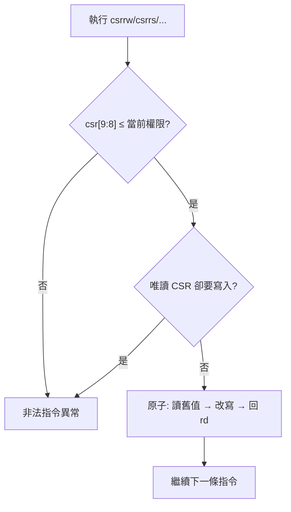

# 11.4 控制與狀態暫存器（CSR）與存取機制

## 動機：4096 個「硬體控制面板」

通用暫存器只有 32 個，但 CPU 的開關遠不只 32 個：中斷使能、trap 向量、頁表基址、效能計數器……RISC-V 把這些做成獨立的**控制與狀態暫存器（Control and Status Registers, CSR）**空間：12 位元位址、最多 4096 個，用專屬指令 `csrrw/csrrs/csrrc` 存取。搞懂 CSR 編碼，等於拿到特權架構的鑰匙圈。

## 核心講解：位址編碼即權限檢查

CSR 位址 `csr[11:0]` 本身藏著存取規則：

| 欄位 | 位元 | 意義 |
|---|---|---|
| `csr[11:10]` | 讀寫屬性 | `00/01/10`=可讀寫，`11`=唯讀（如 `mhartid`、`cycle`） |
| `csr[9:8]` | 最低所需權限 | `00`=U, `01`=S, `10`=H, `11`=M |
| `csr[7:0]` | 編號 | 同級內的流水號 |

常用 CSR 速查：

| CSR | 位址 | 權限 | CSR | 位址 | 權限 |
|---|---|---|---|---|---|
| `cycle` / `time` / `instret` | `0xC00` / `0xC01` / `0xC02` | U（RO） | `sstatus` / `stvec` / `sepc` | `0x100` / `0x105` / `0x141` | S |
| `scause` / `stval` / `satp` | `0x142` / `0x143` / `0x180` | S | `mstatus` / `mtvec` / `mepc` | `0x300` / `0x305` / `0x341` | M |
| `mcause` / `mie` / `mip` | `0x342` / `0x304` / `0x344` | M | `pmpcfg0` / `pmpaddr0` | `0x3A0` / `0x3B0` | M |
| `mhartid` / `mvendorid` | `0xF14` / `0xF11` | M（RO） | `medeleg` / `mideleg` | `0x302` / `0x303` | M |

### 六條 CSR 指令：原子讀改寫

指令格式：`csr | rs1/zimm | funct3 | rd | 1110011`，`funct3` 決定操作：

| 指令 | funct3 | 語意（原子） |
|---|---|---|
| `csrrw rd, csr, rs1` | `001` | `t=CSR; CSR=rs1; rd=t` |
| `csrrs rd, csr, rs1` | `010` | `t=CSR; CSR\|=rs1; rd=t`（置位） |
| `csrrc rd, csr, rs1` | `011` | `t=CSR; CSR&=~rs1; rd=t`（清除） |
| `csrrwi/rs si/ci` | `101/110/111` | 同上，但來源為 5 位元立即數 `zimm` |

兩條潛規則：`rs1=x0` 時 `csrrs/csrrc` **不寫入**（純讀，讀唯讀 CSR 不會 fault）；`rd=x0` 時不回讀（純寫）。編譯器與 `csrs/csrc` 偽指令（`csrrs/csrrc` 且 `rd=x0` 的別名）都依賴此語意。

### 解碼練習：從位址讀出政策

| CSR 位址 | `csr[11:10]` | `csr[9:8]` | 判決 |
|---|---|---|---|
| `sstatus 0x100` | `00` 可讀寫 | `01` 需 S 級 | U-Mode 存取 → 非法指令 |
| `cycle 0xC00` | `11` 唯讀 | `00` U 可讀 | U-Mode `csrr` 可，`csrw` fault |
| `mhartid 0xF14` | `11` 唯讀 | `11` 需 M 級 | S-Mode 連讀都 fault |
| `satp 0x180` | `00` 可讀寫 | `01` 需 S 級 | S-Mode 可讀寫（除非 TVM=1） |

這張表是除錯神器：看到「某模式下 CSR 存取 fault」，先查 `csr[11:10]` 與 `csr[9:8]`，八成當場破案。

## 範例：CSR 位元操作三件套

```asm
    csrr t0, mstatus       # 讀：csrrs t0, mstatus, x0
    csrs mie, t1            # 偽指令：csrrs x0, mie, t1（只置位）
    csrc sie, t2            # 偽指令：csrrc x0, sie, t2（只清除）
    csrwi satp, 0           # 立即數版：Bare 模式關分頁
    csrrw t3, sscratch, sp  # 原子交換：存 sp 並取回舊值
```

## Mermaid：CSR 存取檢查流程



## 本節小結

- CSR 位址即政策：`csr[11:10]` 定讀寫、`csr[9:8]` 定最低權限。
- 六條指令全是**原子讀改寫**，`rs1=x0` 純讀、`rd=x0` 純寫。
- `csrs/csrc/csr` 都是偽指令，底層只有 `csrrw/csrrs/csrrc` 家族。
- 背下速查表：`0x3xx`=M、`0x1xx`=S、`0x0xx`=U、`0xCxx`=計數器、`0xFxx`=唯讀 ID。

## 想一想

1. 為什麼讀 `cycle` 要用 `csrrs` 而非設計一條 `mv rd, csr`？原子性在此有何價值？
2. U-Mode 執行 `csrr t0, satp`（`0x180`）會發生什麼？是「讀到 0」還是 trap？
3. ★★ 反組譯 `csrs mie, t1`，驗證它確實是 `csrrs x0, mie, t1`，並說出 `funct3` 與 opcode 欄位值。
