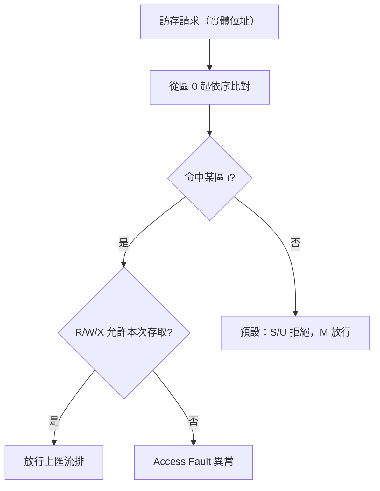

# 11.5 實體記憶體保護（Physical Memory Protection, PMP）

## 動機：沒有 MMU 時，誰來擋壞指標？

分頁（paging）是 S-Mode 的遊戲，但 M-Mode 跑的是**實體位址**，且許多嵌入式晶片根本沒有 MMU。若惡意韌體或 DMA 越界亂寫，連 M-Mode 都自身難保。實體記憶體保護（Physical Memory Protection, PMP）就是 M-Mode 專屬的「實體位址防火牆」：在所有訪存（含取指）真正送上匯流排之前，先比對最多 64 個區域規則。

## 核心講解：pmpcfg + pmpaddr 的雙暫存器設計

每個區域 `i` 由 `pmpcfg[i]` 的 8 位元配置與 `pmpaddr[i]` 的位址共同定義。`pmpcfg0`（`0x3A0`）裝 0–3 區，`pmpcfg2`（`0x3A2`）裝 8–11 區……RV32 另有奇數號 `pmpcfg1/3` 補高半部；`pmpaddr0` 起於 `0x3B0`，一路排到 `pmpaddr63`（`0x3EF`）。

### `pmpcfg[i]` 8 位元格式

| 位元 | 欄位 | 意義 |
|---|---|---|
| 0 | R | 可讀 |
| 1 | W | 可寫 |
| 2 | X | 可執行 |
| 4:3 | A | 位址匹配模式：`00`=OFF, `01`=TOR, `10`=NA4, `11`=NAPOT |
| 7 | L | 鎖定位：置位後連 M-Mode 都改不了，只能 reset 解鎖 |

`R=0,W=1` 為保留組合（「只寫不可讀」不被允許）；`L=1` 且 `R=W=X=0` 表示「誰都別碰此區，連 M-Mode 取指也不行」的全拒絕條目。

### 三種位址匹配（`pmpaddr` 存的是 `addr[33:2]`，即 4-byte 粒度右移兩位）

| 模式 | 範圍定義 | 典型用途 |
|---|---|---|
| TOR（Top of Range） | `[pmpaddr[i-1], pmpaddr[i])` | 保護一段連續韌體區 |
| NA4 | 單一 4-byte 字 | 守住一個 MMIO 暫存器 |
| NAPOT | 自然對齊的 2 的冪次區，尾部連續 1 表大小 | 保護一顆外設的整個暫存器窗 |

NAPOT 編碼是本節最愛考的點：`pmpaddr = (base >> 2) | ((size/4 - 1) >> 1)`，即基址右移兩位後，低位連續 `1` 的個數決定區間大小（`k` 個 1 → 區間 `2^(k+3)` bytes）。

另有 `mseccfg`（`0x747`）：`MMWP`（機器模式白名單）與 `MML`（機器模式鎖定）把 PMP 從「防 S/U」升級為「連 M-Mode 預設拒絕」的嚴格模式（ePMP / Smepmp）。

### `mseccfg`（`0x747`）關鍵欄位

| 位元 | 欄位 | 意義 |
|---|---|---|
| 0 | MML | 機器模式鎖定：置位後 M-Mode 存取也要過 PMP 表 |
| 1 | MMWP | 機器模式白名單：置位後未命中任何區者一律拒絕（含 M-Mode） |
| 2 | RLB | 規則鎖定繞過：置位才允許修改已鎖定（L=1）條目，限 M-Mode 安全流程用 |

`MML=1` 後 `R/W/X` 的語意反轉為「M-Mode 白名單」：只有被條目明確允許的才能碰，是 ePMP 與 Smepmp 的核心開關。

## 範例：鎖住韌體區，只留 UART 可寫

```asm
    # 區域 0：0x00000000-0x0000FFFF 韌體，TOR，只讀可執行 + 鎖定
    li  t0, 0x4000            # 0x10000 >> 2
    csrw pmpaddr0, t0
    li  t0, 0x8D              # L=1, A=TOR(01), X=1, R=1 => 0b10001101
    csrw pmpcfg0, t0          # 低 8 位元即區域 0

    # 區域 1：UART 0x10000000，NA4，可讀寫不可執行
    li  t0, 0x04000000        # 0x10000000 >> 2
    csrw pmpaddr1, t0
    # pmpcfg0 第二位元組 = 0x13 (A=NA4, R=1, W=1)
    li  t0, 0x138D
    csrw pmpcfg0, t0
```

## Mermaid：PMP 檢查順序



編號小的優先：重疊區域由**編號最小**的命中項裁決，寫配置時要把最嚴格的放前面。

## 本節小結

- PMP 是 M-Mode 的實體位址防火牆：`pmpcfg` 定權限、`pmpaddr` 定範圍。
- `L` 位元一鎖定，連 M-Mode 都不能改——安全啟動鏈（secure boot）的錨點。
- TOR 管區間、NA4 管單字、NAPOT 管對齊冪次窗；重疊時編號小者勝。
- `mseccfg`（`0x747`）開啟 ePMP 後，M-Mode 也預設被擋，需白名單放行。

## 想一想

1. 為什麼 `R=0, W=1` 被定為保留組合？試從「可寫推導出可讀」的攻擊角度回答。
2. 用 NAPOT 保護 `0x20000000–0x20003FFF`（16KB），算出應寫入 `pmpaddr` 的值。
3. ★★ 若韌體忘記設 PMP 就跳進 S-Mode，攻擊者控制的 OS 能讀寫 M-Mode 韌體區嗎？為什麼？
