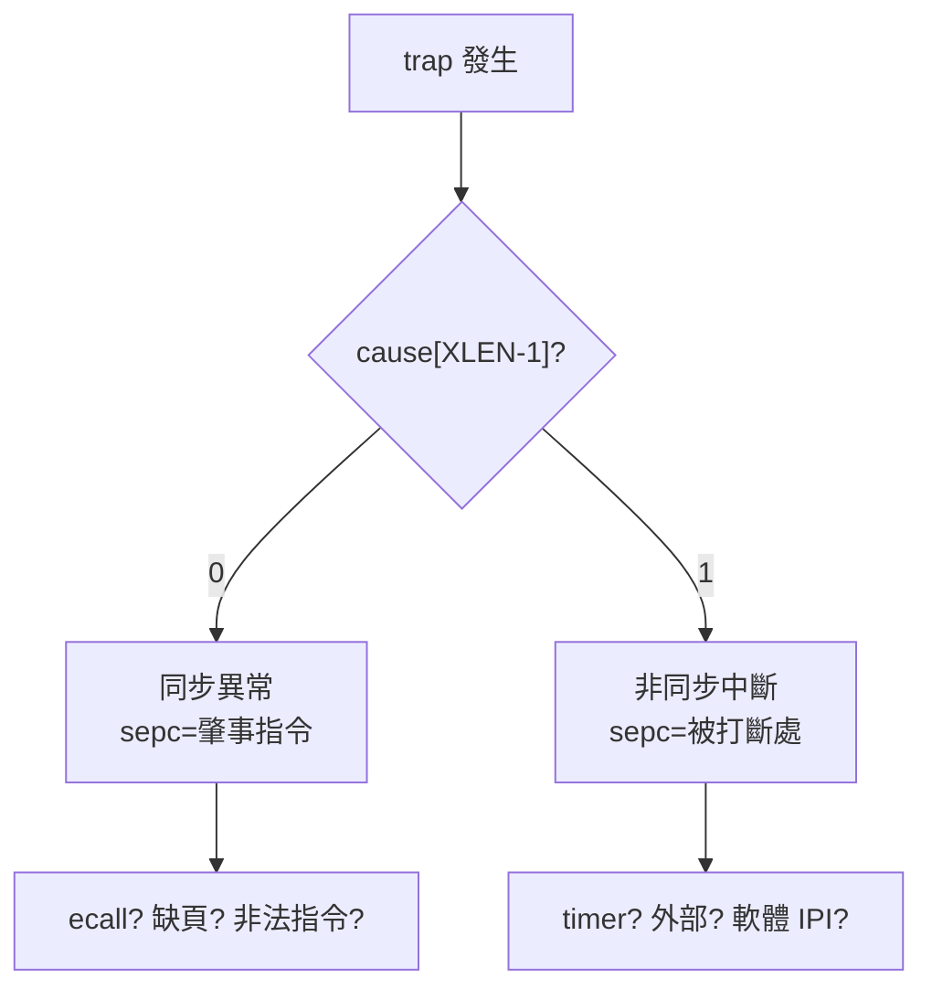

# 12.1 同步異常（Exception） vs. 非同步中斷（Interrupt）

## 動機：trap 有兩種心跳

程式除以零、缺頁、按了外部按鍵——CPU 都用「trap」打斷當前流程，但這兩類事件的本質完全不同：**同步異常（Exception）**由當前指令親手觸發，可重現、可定位到 PC；**非同步中斷（Interrupt）**來自外部（timer、鍵盤、網卡），與當前指令無關、隨時可到。RISC-V 用 `mcause/scause` 的最高位元一刀切開兩者，這是讀懂所有 trap 處理的第一步。

## 核心講解：`mcause`/`scause` 的判讀術

中斷位元 = `XLEN-1`（RV64 為 bit 63）：`1`=中斷，`0`=異常；低位為異常/中斷碼。

| scause/mcause | 類別 | 意義 |
|---|---|---|
| 0 | 異常 | 取指位址未對齊（misaligned fetch） |
| 1 | 異常 | 取指存取錯誤（fault） |
| 2 | 異常 | 非法指令（illegal instruction） |
| 3 | 異常 | 斷點（`ebreak`） |
| 4 / 5 | 異常 | 載入位址未對齊 / 載入存取錯誤 |
| 6 / 7 | 異常 | 存儲位址未對齊 / 存儲存取錯誤 |
| 8 / 9 / 11 | 異常 | U / S / M 級 `ecall` |
| 12 / 13 / 15 | 異常 | 取指 / 載入 / 存儲缺頁（page fault） |
| 1（中斷位=1） | 中斷 | S 級軟體中斷（SSIP） |
| 3（中斷位=1） | 中斷 | M 級軟體中斷（MSIP） |
| 5（中斷位=1） | 中斷 | S 級計時器中斷（STIP） |
| 7（中斷位=1） | 中斷 | M 級計時器中斷（MTIP） |
| 9（中斷位=1） | 中斷 | S 級外部中斷（SEIP，來自 PLIC） |
| 11（中斷位=1） | 中斷 | M 級外部中斷（MEIP） |

### 同步 vs. 非同步對照

| 維度 | 同步異常（Exception） | 非同步中斷（Interrupt） |
|---|---|---|
| 觸發源 | 當前指令（如 `ecall`、缺頁） | 外部事件（timer、外設、核間 IPI） |
| 可重現性 | 同輸入同 PC 必重現（精確異常 precise） | 到達時機不定 |
| 返回語意 | 處理完多半**重執行**（`sepc` 指向 fault 指令） | 處理完**繼續下一條**（`sepc` 指向被打斷處） |
| 使能開關 | 無法遮罩（該 trap 一定進） | 受 `mie/sie` 與 `mstatus.MIE/SIE` 閘控 |
| 優先級 | 同一指令多異常取最高者（如先對齊後映射） | 固定順序：MEI > MSI > MTI > SEI > SSI > STI |

精確異常（precise exception）是 RISC-V 的強保證：trap 時 `sepc` 精確指向肇事指令，且此前指令全部提交、之後全未提交——OS 修復缺頁後可直接 `sret` 重跑。

## 範例：C 語言分派 trap 原因

```c
// S-Mode trap handler 分派骨架
void kerneltrap(void) {
    uintptr_t cause = r_scause();
    int is_intr = (cause >> 63) & 1;   // 最高位元
    long code = cause & 0xff;
    if (is_intr) {
        switch (code) {
        case 5: timer_tick(); break;   // STIP
        case 9: plic_handle(); break;  // SEIP
        case 1: sbi_ipi_ack(); break;  // SSIP
        default: panic("unknown intr");
        }
    } else {
        switch (code) {
        case 8: syscall_dispatch();           // U ecall
                w_sepc(r_sepc() + 4); break;  // ecall 要跳過
        case 13: case 15: pagefault_handler(); break;
        default: panic("unknown exception");
        }
    }
}
```

注意 `ecall` 是少數返回時要 `sepc += 4` 的異常（已執行完畢）；缺頁則**不加**（要重執行）。

## Mermaid：trap 分類判決樹



## 本節小結

- 最高位元一切兩半：`0`=同步異常，`1`=非同步中斷。
- 異常精確可重執行，中斷隨機到達、可被 `mie/sie` 遮罩。
- `ecall` 返回要 `sepc+=4`，缺頁返回不加——這是新手 handler 的第一號 bug 來源。
- 中斷有固定優先級：外部 > 軟體 > 計時器，M 級 > S 級。

## 想一想

1. 缺頁異常處理完若誤把 `sepc += 4`，使用者程式會發生什麼可觀察的症狀？
2. 為什麼異常不能被遮罩，而中斷可以？試想「缺頁可被關掉」的後果。
3. ★★ 在 Spike 上故意執行 `unimp`（非法指令），用 GDB 觀察 `scause=2` 且 `stval` 等於指令字本身。
