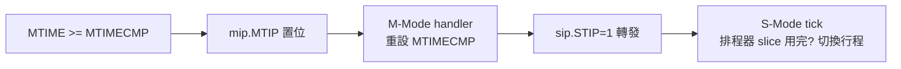

# 12.2 核心本地中斷控制器（CLINT / CLIC）

## 動機：每個 hart 都需要一個「私人鬧鐘」

多核晶片裡，每個 hart（hardware thread）都需要兩樣東西：能被其他核叫醒的門鈴（核間中斷 IPI），以及準時響的鬧鐘（timer tick，OS 排程的心跳）。核心本地中斷控制器（Core-Local Interrupt Controller）就是每個 hart 私有的這套裝備：經典版叫 **CLINT**（Core-Local Interruptor），新一代可搶佔版叫 **CLIC**（Core-Local Interrupt Controller）。

## 核心講解：CLINT 的三個 MMIO 暫存器

CLINT 以 SiFive 定義為準（QEMU `virt` 機器亦相容），基址通常 `0x02000000`：

| 暫存器 | 位址（hart 0 為例） | 對應中斷位元 |
|---|---|---|
| `MSIP[hart]` | `0x02000000 + 4*hart`（32 位元） | MSI：寫 1 觸發 M 級軟體中斷（`mip.MSIP`, bit 3） |
| `MTIMECMP[hart]` | `0x02004000 + 8*hart`（64 位元） | 與 `MTIME` 比較，`>=` 即置 `mip.MTIP`（bit 7） |
| `MTIME` | `0x0200BFF8`（64 位元，全核共享） | 自由遞增的牆鐘；U 級 `time` CSR（`0xC01`）是它的影子 |

S-Mode 的 `STIP`（`mip` bit 5）並無獨立硬體鬧鐘：M-Mode 韌體收到 MTIP 後，用軟體轉發（`sip.STIP=1`）的方式「反射」給 S-Mode——OpenSBI 就是這樣把 tick 交給 Linux 的（SBI HSM/legacy 轉發）。

實作提醒：`MTIMECMP` 是 64 位元，在 RV32 上需兩次 32 位元寫入（先寫高位為全 1 防誤觸發，再寫低位，最後補高位），否則中間態可能立即觸發一次假 tick。

### CLIC 的升級：可搶佔、有優先級

CLINT 的 wfi + 三中斷源對 MCU 夠用，但車用/即時系統要「高優先級中斷打斷低優先級 handler」。CLIC（Smclic 擴充）引入：

| CLIC 概念 | 說明 |
|---|---|
| `cliccfg`（`0x344` M / `0x144` S 借用 `mtvec` 模式頁） | 配置優先級位元切分 |
| per-interrupt `clicintcfg[i]` | 每個中斷源的 level + priority |
| `mnxti` / `snxti` CSR | 硬體自動「取最高待決中斷並開全域使能」，尾鏈（tail-chaining）加速 |
| 搶佔（preemption） | 高 level 中斷可打斷低 level handler，無需軟體查表 |

| 維度 | CLINT | CLIC |
|---|---|---|
| 模型 | 3 個固定源 + MMIO | 可配置多源 + 記憶體映射配置 |
| 優先級 | 固定（M 外 > M 軟 > M 計時） | level/priority 可编程，可搶佔 |
| 響應加速 | 無 | `mnxti` 硬體尾鏈、中斷向量表硬體索引 |
| 適用 | 通用 SoC、QEMU virt | 即時/車規 MCU（如 T-Head、SiFive 新核） |

## 範例：給 hart 0 上一個 10ms 的鬧鐘（M-Mode）

```asm
    # 假設時鐘 10MHz：10ms = 100000 ticks
    li t0, 0x0200BFF8      # MTIME
    ld t1, 0(t0)
    li t2, 100000
    add t1, t1, t2
    li t0, 0x02004000      # MTIMECMP[0]
    sd t1, 0(t0)           # 下一次 MTIP 時刻
    # 開 M 級 timer 中斷
    li t3, 0x80            # mie.MTIE = bit 7
    csrs mie, t3
    csrs mstatus, 0x8      # mstatus.MIE = bit 3
```

```c
// 核間中斷 IPI：叫醒 hart 1（OpenSBI 底層手法）
*(volatile uint32_t *)(0x02000000 + 4 * 1) = 1;
```

## Mermaid：timer tick 傳遞鏈



## 本節小結

- CLINT = 每 hart 的門鈴（MSIP）+ 鬧鐘（MTIMECMP/MTIME），MMIO 介面。
- S-Mode 沒有獨立 timer：靠 M-Mode 韌體把 MTIP 轉發成 STIP。
- CLIC 是可搶佔升級版：level/priority、`mnxti` 尾鏈，為即時系統而生。
- QEMU `virt` 用 CLINT 相容佈局，實驗可直接用固定位址。

## 想一想

1. 為什麼 `MTIME` 是全核共享一個，而 `MTIMECMP` 每 hart 一份？反過來會有什麼問題？
2. S-Mode 不能直接寫 `MTIMECMP`，那 Linux 的 `clockevents` 驅動如何設定下一個 tick？（提示：SBI，見 14.2。）
3. ★★ 在 QEMU 上讓 hart 0 對 hart 1 發 IPI，用 GDB 觀察 hart 1 的 `mip.MSIP` 由 0 變 1。
