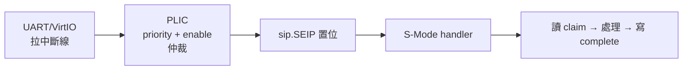

# 12.3 平台級中斷控制器（PLIC / APLIC）

## 動機：幾十個外設，一個 CPU 接得下嗎？

UART、VirtIO 網卡、鍵盤、GPIO……一顆 SoC 有幾十個外設中斷源，但 hart 的 `mip/sip` 外部中斷位元（MEIP/SEIP）各只有 1 位元。平台級中斷控制器（Platform-Level Interrupt Controller, PLIC）就是中間的「總機小姐」：匯聚全平台外設中斷，按優先級仲裁，一次只把最高優先級的那個呈報給 hart；新一代 **APLIC**（Advanced PLIC，Smaia 擴充）則補上 MSI 直投與虚拟化支援。

## 核心講解：PLIC 的四種暫存器（基址常為 `0x0C000000`）

| 暫存器群 | 偏移（示意） | 用途 |
|---|---|---|
| `priority[i]` | `0x000000 + 4*i` | 中斷源 `i` 的優先級（0=永不觸發，越大越急） |
| `pending[i]` | `0x001000 + …` | 待決位元（唯讀，線或結果） |
| `enable[hart][i]` | `0x002000 + …` | 每 hart 訂閱哪些源（S/M 上下文分開） |
| `threshold/claim/complete` | `0x200000 + …` | 每 hart 上下文：門檻 / 認領 / 完成 |

>`
標準使用流程：外設拉線 → `pending` 置位 → PLIC 選出「優先級 > threshold 的最高源」→ 置 `MEIP/SEIP` → hart 讀 `claim`（讀到源 ID，同時清 pending）→ 處理 → 寫 `complete`（同 ID，允許同源再次觸發）。

### PLIC vs. APLIC 對照

| 維度 | PLIC | APLIC（Smaia） |
|---|---|---|
| 投遞方式 | 只走 `MEIP/SEIP` 外部中斷線 | 另支援 MSI：直接寫 `IMSIC` 暫存器投遞 |
| 模式 | M/S 上下文（machine/supervisor） | root + 多個 domain，可直通 Guest（虚拟化） |
| 配置 | 固定記憶體映射 | domain 層級結構，可熱插拔委派 |
| 相容 | QEMU `virt` 預設、經典 Linux 驅動 | 新核 + KVM 加速場景，舊軟體仍可走 PLIC 模式 |

APLIC + IMSIC + IOMMU 是 RISC-V 虛擬化中斷（AIA 規範）的三件套；本書實驗以 PLIC 為主，知道 APLIC 的名字與定位即可。

### 常見除錯清單（PLIC 只響一次 / 完全不響）

| 症狀 | 排查點 |
|---|---|
| 完全不響 | `priority=0`？`enable` 該 hart 上下文沒訂閱？`sie.SEIE` 或 `sstatus.SIE` 沒開？`threshold` 設太高？ |
| 只響一次 | 忘了寫 `complete`，同源被永久屏蔽 |
| ID 一直是 0 | 讀 `claim` 時其實無待決（spurious），handler 應直接返回 |
| M-Mode 收到但 S-Mode 收不到 | `mideleg` 沒把 SEIP（bit 9）下放給 S-Mode |

記住口訣：優先級、訂閱、門檻、使能、認領、完成——六站全綠，中斷才通。

## 範例：讓 S-Mode 收到 UART 中斷（QEMU virt，UART 源 ID=10）

```c
// 1. UART 中斷優先級設為 1
*(volatile uint32_t *)(0x0C000000 + 4 * 10) = 1;
// 2. S-Mode 上下文訂閱源 10（enable bit）
*(volatile uint32_t *)(0x0C002080) |= (1U << 10);
// 3. S-Mode 門檻設 0（允許一切優先級 > 0 者通過）
*(volatile uint32_t *)(0x0C201000) = 0;
// 4. 開 sie.SEIE + sstatus.SIE
w_sie(r_sie() | (1UL << 9));
w_sstatus(r_sstatus() | (1UL << 1));

// 中斷到達後 handler：
uint32_t id = *(volatile uint32_t *)0x0C201004; // claim
uart_handle();
*(volatile uint32_t *)0x0C201004 = id;          // complete
```

## Mermaid：外設中斷旅程



## 本節小結

- PLIC 是外設總機：priority/enable 過濾、threshold 裁決、claim/complete 交接。
- `claim` 讀到 ID 即自動屏蔽同源，`complete` 寫回才重新開放——忘寫會「只響一次」。
- APLIC 是 PLIC 的虛擬化升級版（MSI 直投 + domain），AIA 三件套之一。
- QEMU `virt` 的 PLIC 基址 `0x0C000000`、UART 源 ID 10，是實驗起點。

## 想一想

1. 為什麼 `claim` 要設計成「讀即清 pending」？若改成需軟體另寫暫存器清除，會多出什麼競態？
2. 兩個同優先級外設同時 pending，PLIC 如何裁決？（提示：源 ID 小者勝。）
3. ★★ 在 QEMU 上把 UART 的 `priority` 設 0，觀察：敲鍵盤還會進中斷嗎？為什麼？
