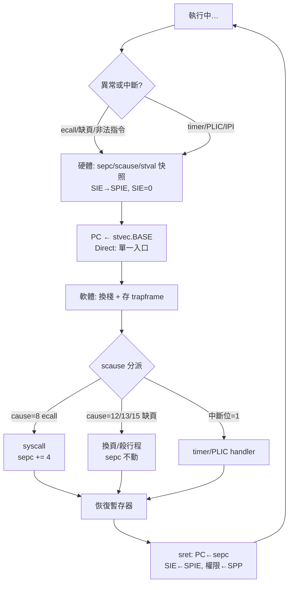

# 12.4 Trap 處理流程（stvec / sepc / scause / sret）

## 動機：從「中斷來了」到「回到程式」，中間發生了什麼？

前三節把零件（異常碼、CLINT、PLIC）都介紹完了，本節把它們串成一條完整的**陷阱（trap）流水線**：硬體自動保存什麼、軟體 handler 要做什麼、如何分派、如何返回。一次寫對 trap handler，是 OS 實驗（xv6、Linux 移植）的成年禮。

## 核心講解：硬體與軟體的分工契約

### 硬體 trap 進入時（原子完成）

| 步驟 | 動作 |
|---|---|
| 1 | `sepc ←` 肇事指令 PC（異常）或被打斷處 PC（中斷） |
| 2 | `scause ←` 原因碼、`stval ←` 附加資訊（fault 位址/非法指令字） |
| 3 | `SPIE ← SIE; SIE ← 0`（關中斷進臨界區） |
| 4 | `SPP ←` 原權限（U/S）；`PC ← stvec` 指向的入口 |

### `stvec`（`0x105`）編碼

| 欄位 | 位元 | 意義 |
|---|---|---|
| MODE | 1:0 | `0`=Direct（所有 trap 同一入口），`1`=Vectored（中斷按 `cause*4` 跳表） |
| BASE | XLEN-1:2 | 對齊到 4-byte（Direct）或 256-byte（Vectored）的基址 |

Direct 模式最常用：一個入口用軟體 `switch (scause)` 分派；Vectored 省一次跳轉，適合即時系統。

### 軟體 handler 的標準舞步

1. 用 `sscratch` 換棧、保存 32 個通用暫存器（trapframe）。
2. 讀 `scause/stval/sepc`，分派：`ecall`→syscall、`缺頁`→換頁、`中斷`→驅動。
3. `ecall` 把 `sepc += 4`（已執行完）；缺頁不加（重執行）。
4. 恢復暫存器、`sret`：`SIE ← SPIE`、`權限 ← SPP`、`PC ← sepc`。

`sret` 的完整語意還受 `mstatus.TSR` 閘控：S-Mode 設了 TSR 時執行 `sret` 會 trap 進 M-Mode（防客戶 OS 亂切權限，虛擬化必用）。

## 範例：最小 S-Mode trap 入口（Direct 模式）

```asm
    .align 2
trap_entry:
    csrrw t0, sscratch, t0   # 借 t0，換出核心棧
    # ... 存 x1-x31 到 trapframe（含剛換出的 t0） ...
    csrr a0, scause
    csrr a1, sepc
    csrr a2, stval
    call trap_dispatch       # C 函式分派
    # ... 恢復暫存器 ...
    csrr t0, sscratch
    sret
```

```c
void trap_dispatch(long cause, uintptr_t epc, uintptr_t tval) {
    if (cause == 8) {              // U ecall
        syscall();
        w_sepc(epc + 4);
    } else if (cause == 13 || cause == 15) {
        pagefault(tval, cause);    // sepc 不動，重執行
    } else if ((cause >> 63) && (cause & 0xff) == 9) {
        plic_claim_and_handle();   // SEIP
    } else panic("unexpected scause=%lx", cause);
}
```

## Mermaid：Trap 完整流程（本節必備圖）



## 本節小結

- Trap 是硬軟契約：硬體快照（`sepc/scause/stval`）+ 關中斷，軟體分派 + 恢復。
- `stvec.MODE` 選 Direct（軟體分派）或 Vectored（硬體跳表）。
- 返回鐵律：`ecall` 加 4，缺頁不加，中斷繼續；一律 `sret` 收尾。
- `sscratch` 是換棧的支點——沒有它，handler 連第一個暫存器都存不下來。

## 想一想

1. handler 中途又來一個更高優先級中斷會怎樣？（提示：SIE 已被硬體清零——這是 bug 還是 feature？）
2. `stval` 在「非法指令」與「缺頁」兩種 trap 下分別裝什麼？不看手冊猜一次，再翻手冊驗證。
3. ★★ 把 xv6 的 `usertrap()` 改成 Vectored 模式：`stvec` 該怎麼設？`claim` 路徑會快多少？
