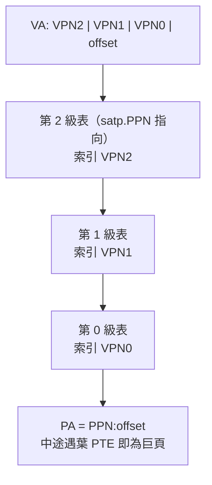

# 13.1 Sv39 / Sv48 頁表結構

## 動機：64 位元位址，頁表要幾層才夠？

RV64 的虛擬位址理論 64 位元，但沒人需要 2^64 的頁表——那要的記憶體比全世界 DRAM 加起來還多。RISC-V 用**多層前向頁表**：只為實際用到的位址區間分配頁表頁。Sv39（3 層，39 位元虛擬位址）與 Sv48（4 層，48 位元）是 Linux 與 xv6 的日常，搞懂 VPN 切分就搞懂了一半虛擬記憶體。

## 核心講解：VA 切分與 PTE 格式

### 虛擬位址切分（每級 9 位元，頁內偏移 12 位元 = 4KB）

| 模式 | VA 位寬 | 切分 |
|---|---|---|
| Sv39 | 39 位元 | `[38:30] VPN[2] \| [29:21] VPN[1] \| [20:12] VPN[0] \| [11:0] offset` |
| Sv48 | 48 位元 | `[47:39] VPN[3] \| [38:30] VPN[2] \| [29:21] VPN[1] \| [20:12] VPN[0] \| [11:0] offset` |

每級 9 位元 → 每張頁表 512 個條目（512 × 8B = 4KB，恰好一頁）。Sv39 覆蓋 512GB，Sv48 覆蓋 256TB；`VA[63:39]`（Sv39）必須是 bit 38 的符號擴展，否則 fault。

### PTE（頁表項，64 位元）格式

| 位元 | 欄位 | 意義 |
|---|---|---|
| 0 | V | Valid：此條目有效 |
| 1 / 2 / 3 | R / W / X | 可讀 / 可寫 / 可執行（全 0 = 指向下一級的分支 PTE） |
| 4 | U | 使用者頁（U-Mode 可存取；S-Mode 需 SUM 才可碰） |
| 5 / 6 | G / A | Global（ASID 免沖）/ Accessed（硬體置位，訪問過） |
| 7 | D | Dirty（硬體置位，寫過） |
| 9:8 | RSW | 軟體保留（OS 自用，如 COW 標記） |
| 53:10 | PPN | 實體頁號（44 位元，配 56 位元實體位址） |
| 63:54 | 保留 | 標準留空（Svpbmt/Svnx 用其中幾位做擴充） |

巨頁（megapage）是免費贈品：若 VPN[1] 層的 PTE 直接 R/W/X 非零，該項映射 2MB；VPN[2] 層直接映射則為 1GB（Sv48 再上還有 512GB）。Linux 用 2MB/1GB 巨頁裝核心本體，TLB 一箭覆蓋大片記憶體。

### 三種頁面大小對照（Sv39）

| 在哪層終止 | 頁面大小 | 覆蓋舉例 |
|---|---|---|
| VPN[0]（葉在末層） | 4KB | 一般使用者頁 |
| VPN[1]（葉在中層） | 2MB | 核心本體、framebuffer |
| VPN[2]（葉在頂層） | 1GB | QEMU virt 的整片 DRAM 恆等映射 |

終止層越早，page walk 訪存次數越少、TLB 覆蓋越大，但內部碎片也越多——這是巨頁永恆的取捨。

## 範例：手算一個 Sv39 PTE

```asm
# 把 VA 0x0000000080001000 映射到 PA 0x0000000080001000（QEMU virt 恆等映射常用）
# VPN[2]=2, VPN[1]=0, VPN[0]=1, offset=0x000
# 葉 PTE：PPN = 0x80001000 >> 12 = 0x80001， flags = V|R|W|X|U|A|D = 0xCF
# PTE = (0x80001 << 10) | 0xCF = 0x200004CF ? 展開：
#   0x80001 << 10 = 0x20000400，再 OR 0xCF → 0x200004CF
```

```c
// xv6 風格：PTE 旗標組合（kernel/riscv.h）
#define PTE_V (1L << 0)
#define PTE_R (1L << 1)
#define PTE_W (1L << 2)
#define PTE_X (1L << 3)
#define PTE_U (1L << 4)
#define PA2PTE(pa) ((((uint64)(pa)) >> 12) << 10)
#define PTE2PA(pte) (((pte) >> 10) << 12)
```

## Mermaid：Sv39 三層查表



> 對應範例：[`_code/ch13/pagetable.c`](_code/ch13/README.md) 是 Sv39 三層頁表的軟體模型（含 2M 巨頁），`make -C _code/ch13` 執行 map/walk/unmap 自檢。

## 本節小結

- Sv39 三層、Sv48 四層，每級 9 位元、頁 4KB；巨頁 2MB/1GB 免費附贈。
- PTE 八字訣：`V` 有效、`R/W/X` 全零即分支、`U` 分 user/kernel、`A/D` 硬體自寫。
- 高位必須符號擴展（canonical form），違者 fault。
- 記住算式：`PTE = (PPN << 10) | flags`，`PA = PTE2PA(葉PTE) | offset`。

## 想一想

1. 為什麼每級選 9 位元而不是 10 位元？（提示：8-byte PTE，4KB 一頁。）
2. 一個分支 PTE（R=W=X=0）若被 CPU 當成葉子用，會發生什麼？誰負責檢查？
3. ★★ 用 Spike 的 `htif` 或 QEMU dump：在 Sv39 下為 `0x3ffffff000` 算出三級 VPN，並判斷是否 canonical。
