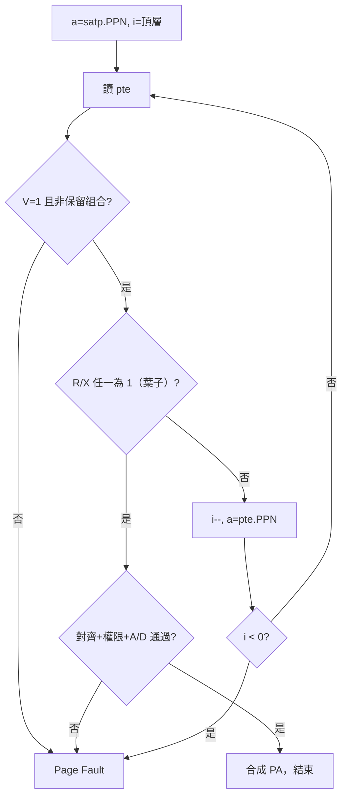

# 13.2 虛擬位址到實體位址轉換（VA → PA）演算法

## 動機：MMU 的每一步都在做什麼？

上一節認識了頁表的「靜態形狀」，本節看 MMU 的「動態舞步」：給定 `satp` 與一個 VA，硬體如何一步步走完頁表、檢查權限，最終吐出 PA 或 raising page fault。把這支演算法（page walk）吃透，缺頁異常、A/D 位元、巨頁短路等現象就全都有了著落。

## 核心講解：Sv39 Page Walk（特權規範 §4.3.2 精簡版）

設 `LEVELS=3`（Sv39），`i = LEVELS-1` 從頂層開始：

| 步驟 | 動作 |
|---|---|
| a | `a = satp.PPN × PAGESIZE`（根表基址）；`i = 2` |
| b | `pte = mem[a + VPN[i] × 8]`；若 `pte.V=0`，或 `pte.R=0 且 pte.W=1`（保留組合）→ 報頁錯誤 |
| c | 若 `pte.R=1 或 pte.X=1`（葉子）：檢查對齊（巨頁要求低位 PPN 為 0）、U/SUM/MXR 權限、A/D 更新；通過則 `PA = 高位 PPN : VPN 低位 : offset`，結束 |
| d | 若為分支（R=X=0）：`i--`；`i < 0` → 頁錯誤；否則 `a = pte.PPN × PAGESIZE`，回到步驟 b |
| e | 每次成功訪問置 `pte.A=1`；若是 store 且 `pte.D=0`：置 `D=1` 或（實作選擇）報 store page fault 讓 OS 處理 |

### 檢查清單：三種頁錯誤的觸發時機

| scause | 觸發條件 |
|---|---|
| 12（fetch page fault） | 取指走查表失敗，或葉 PTE `X=0` / U 位不合 |
| 13（load page fault） | 載入走查表失敗，或 `R=0`（除非 MXR 置位且 X=1） |
| 15（store page fault） | 存儲走查表失敗，或 `W=0`，或 `D=0` 且硬體選擇 fault |

權限速記：U-Mode 只能碰 `U=1` 的葉；S-Mode 預設只能碰 `U=0`，開 `SUM` 才可碰 `U=1`；`MXR=1` 時「可執行即視為可讀」。

## 範例：手走一趟 4KB 映射

```asm
# satp.PPN = 0x80000（根表在 PA 0x80000000）
# VA = 0x00000000_8010_1000 → VPN2=2, VPN1=0, VPN0=1, off=0
# 1) pte = mem[0x80000000 + 2*8]  → 分支，PPN=0x81000
# 2) pte = mem[0x81000000 + 0*8]  → 分支，PPN=0x82000
# 3) pte = mem[0x82000000 + 1*8]  → 葉 V|R|W|A|D，PPN=0x80101
# PA = 0x80101000
```

```c
// xv6 walk() 的軟體镜像：三級查表找葉 PTE
pte_t *walk(pagetable_t pagetable, uint64 va, int alloc) {
    for (int level = 2; level > 0; level--) {
        pte_t *pte = &pagetable[PX(level, va)];
        if (*pte & PTE_V) {
            pagetable = (pagetable_t)PTE2PA(*pte);
        } else {
            if (!alloc || !(pagetable = (pagetable_t)kalloc()))
                return 0;
            *pte = PA2PTE(pagetable) | PTE_V;
        }
    }
    return &pagetable[PX(0, va)];
}
```

## Mermaid：Page Walk 決策圖



## 本節小結

- Page walk 是「讀 PTE → 葉/枝分流 → 權限檢查」的迴圈，最多 LEVELS 次訪存。
- 葉子判定只看 `R/X`；`W=1` 必須配 `R=1`，否則保留組合直接 fault。
- `A/D` 由硬體置位（或選擇性 fault 給 OS），是換頁演算法（LRU/clock）的眼線。
- 軟體 `walk()` 與硬體 walk 是同一邏輯的兩面，xv6 建表即在模擬 MMU。

## 想一想

1. 巨頁映射在第幾步「短路」？此時低位 VPN 拼接進 PA 的哪個位置？
2. 為什麼 `pte.W=1, pte.R=0` 被定為保留？試想它若表示「只寫」，`A/D` 語意會亂成什麼樣？
3. ★★ 在 xv6 中對一個 `PTE_W=0` 的頁執行 `sw`，追蹤 `scause=15` 從 trap 到 `kill` 的完整路徑。
