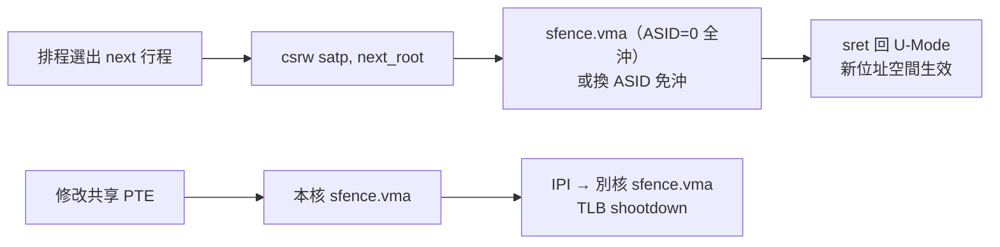

# 13.3 satp 暫存器配置與 TLB 刷新（sfence.vma）

## 動機：切換行程時，MMU 怎麼知道該看哪張表？

每個行程都有一張自己的頁表，切換行程 = 換一張表給 MMU 看。`satp`（Supervisor Address Translation and Protection，`0x180`）就是那個「當前頁表根」開關；而 MMU 內部的 TLB 快取會記住舊翻譯，切表或改表後必須用 `sfence.vma` 沖掉，否則 CPU 還活在舊世界。這兩個機制合起來，才是上下文切換的記憶體視角。

## 核心講解：`satp`（`0x180`，RV64）位元佈局

| 欄位 | 位元 | 意義 |
|---|---|---|
| PPN | 43:0 | 根頁表實體頁號（`PA = PPN << 12`） |
| ASID | 59:44 | 位址空間識別碼（行程標籤，TLB 免沖靠它） |
| MODE | 63:60 | 分頁模式：`0`=Bare（關 MMU），`8`=Sv39，`9`=Sv48，`10`=Sv57 |

寫 `satp` 切換模式時，規範要求緊接一條 `sfence.vma`（以免新舊翻譯混血）；讀 `satp` 則返回當前值。注意 `mstatus.TVM=1` 時 S-Mode 寫 `satp` 會 trap 進 M-Mode（虛擬化監控的鉤子）。

### `sfence.vma`：帶過濾器的 TLB 沖洗

| 形式 | 語意 |
|---|---|
| `sfence.vma`（`rs1=x0, rs2=x0`） | 全沖：所有 VA、所有 ASID |
| `sfence.vma rs1`（`rs2=x0`） | 只沖 `rs1` 指定的 VA（保留其餘） |
| `sfence.vma rs1, rs2` | 只沖 `VA=rs1` 且 `ASID=rs2` 的條目 |
| `sfence.vma x0, rs2` | 只沖某 ASID 的全部條目 |

ASID 的價值：切行程若換 ASID 就**不必全沖 TLB**，多行程的熱翻譯可並存——伺服器場景的效能關鍵。`G` 位（global）頁（如核心映射）則連 ASID 都不認，跨行程常駐。

## 範例：xv6 的切表兩件套

```asm
    # 切到行程頁表：satp = MODE(Sv39)=8 << 60 | ASID << 44 | PPN
    # （xv6 為簡化 ASID=0，每次切表全沖 TLB）
    csrw satp, t0
    sfence.vma zero, zero   # 全沖，確保新表生效
```

```c
// 建立核心頁表後啟用分頁（xv6 kvminit 風格）
void kvminit(void) {
    kernel_pagetable = kvmmake();
    // 之後在 scheduler 中：
    // w_satp(MAKE_SATP(kernel_pagetable));
    // sfence_vma();
}
#define MAKE_SATP(pg) (8UL << 60 | (uint64)(pg) >> 12)
```

多核注意：改了共享核心映射後，要對**每個 hart** 發 IPI 做 `sfence.vma`（Linux 稱 TLB shootdown），否則別核的 TLB 還是舊翻譯。

### MODE 欄位完整取值（RV64）

| MODE 值 | 名稱 | 意義 |
|---|---|---|
| 0 | Bare | 無分頁，VA = PA（裸機/M-Mode 語意） |
| 8 | Sv39 | 三層頁表，39 位元 VA |
| 9 | Sv48 | 四層頁表，48 位元 VA |
| 10 | Sv57 | 五層頁表，57 位元 VA（需 Sv57 擴充） |

`satp` 本身是 S 級 CSR（`0x180`）：M-Mode 不受它影響（永遠走實體位址 + PMP）；U-Mode 讀寫它直接非法指令。開機早期核心跑在 Bare，備好頁表後一次 `csrw satp` 即「開燈」進虛擬世界。

## Mermaid：上下文切換中的 satp/sfence



## 本節小結

- `satp = MODE | ASID | PPN`：MODE 選 Sv39/Sv48/Bare，PPN 指根表，ASID 標行程。
- 切表後必 `sfence.vma`；ASID 讓免沖成為可能，`G` 位讓核心映射常駐。
- 多核改表要 TLB shootdown——忘記 IPI 別核是缺頁 debugging 地獄的入口。
- `TVM` 位讓 M-Mode 能攔截 `sfence.vma/satp`，是虛擬化的監控點。

## 想一想

1. 若 OS 每次切表都用 `sfence.vma x0, x0` 全沖，效能損失在哪？ASID 如何緩解？
2. `G=1` 的 PTE 在 `sfence.vma rs1, rs2`（指定 ASID）時會被沖掉嗎？為什麼規範說不？
3. ★★ 在 QEMU 上實驗：寫 `satp` 切 Bare→Sv39 但**不**加 `sfence.vma`，觀察第一個 user load 讀到什麼怪值？
