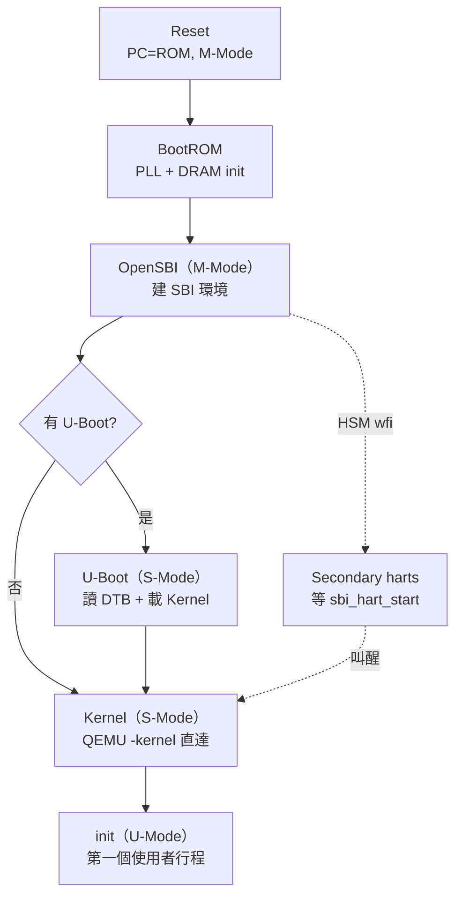

# 14.1 RISC-V 晶片開機流程（ROM → SBI → Bootloader → Kernel）

## 動機：按下電源後，第一條指令在哪？

CPU reset 後不會「自動知道」OS 在哪：PC 被硬連線到某個 ROM 位址，從那裡開始一棒接一棒——ROM 設 DRAM、SBI 建執行環境、Bootloader 找內核、Kernel 起 init。每棒權限遞減（M → S → U），每棒都只信任上一棒。這條鏈叫**開機鏈（boot chain）**，畫得出它才算懂系統啟動。

## 核心講解：四棒接力

| 階段 | 跑在哪 | 做什麼 |
|---|---|---|
| 1. Mask ROM / BootROM | M-Mode（reset 向量） | 設時鐘/PLL、初始化 DRAM、載入下一階段到 SRAM/DRAM |
| 2. SBI 韌體（OpenSBI） | M-Mode | 建 S 執行環境（trap 轉發、timer、IPI、HSM 啟動多核），打包 `next_boot`（下階段位址 + hart 狀態 + DTB 位址） |
| 3. Bootloader（U-Boot / EDK2） | S-Mode | 讀 Device Tree、初始化外設/網路/儲存，從磁碟/網路載入 Kernel + initramfs |
| 4. Kernel（Linux/xv6） | S-Mode → U-Mode | 建頁表、起排程器、掛根檔案系統、`exec init` 進 U-Mode |

QEMU `virt` 機器把流程壓縮成三段：QEMU 內建 ROM → OpenSBI（`fw_jump`，預設內嵌）→ Kernel（`-kernel` 直接當 next 階段，跳過 U-Boot；加 `-bios u-boot.bin` 則走全鏈）。

多核細節：reset 後**只有一核**（boot hart）跑全鏈，其餘 secondary hart 在 OpenSBI 的 HSM 服務裡 `wfi` 睡眠，等 Linux 用 `sbi_hart_start` 逐個叫醒（`a0=hartid, a1=start_addr, a2=opaque`）。

### 各階段可見的除錯訊號

| 階段 | 從哪看輸出 | 典型第一行 |
|---|---|---|
| BootROM | 無（或 JTAG） | 無輸出，只能量測 DRAM 時序 |
| OpenSBI | 串口（early console） | `OpenSBI v1.x …` 平台資訊 |
| U-Boot | 串口 | `U-Boot 20xx.xx … DRAM: …` |
| Kernel | 串口（earlycon） | `[ 0.000000] Linux version …` / `sbi: SBI call supported` |

開機卡住時先問「最後一行是誰印的」：停在 OpenSBI 之後無 U-Boot，多半是 `next_addr` 或 DTB 位址傳錯；停在 `booti` 之後無 Kernel log，多半是 DTB 的 `memory` 節點或 `chosen.bootargs` 寫錯。

## 範例：QEMU 全鏈 vs. 快捷鏈

```asm
# OpenSBI fw_jump 尾聲（M-Mode → S-Mode 交棒示意）：
#   mstatus.MPP=01（S），mepc=next_addr，a0=hartid，a1=dtb_addr
    csrw mepc, t0          # next_addr：U-Boot 或 Kernel
    mv   a0, t1            # hartid
    mv   a1, t2            # DTB 位址（fdt）
    li   t3, 0x1800
    csrc mstatus, t3
    li   t3, 0x800
    csrs mstatus, t3       # MPP = 01
    mret                   # 交棒！
```

```dts
/* 交棒信物：DTB 的 chosen 節點告訴 Kernel 去哪找 root/init */
chosen {
    bootargs = "console=ttyS0 root=/dev/vda rw earlycon";
    stdout-path = "serial0:115200n8";
};
```

## Mermaid：開機流程（本節必備圖）



## 本節小結

- 開機鏈四棒：ROM（硬體 init）→ SBI（M 環境）→ Bootloader（找內核）→ Kernel（起 OS）。
- 交棒三件套：`mepc`（入口）+ `a0`（hartid）+ `a1`（DTB）+ `MPP=S` 後 `mret`。
- 多核只有 boot hart 跑全鏈，其餘在 HSM 睡眠等叫醒。
- QEMU 可跳過 U-Boot 直達 Kernel，方便除錯但不是真機全貌。

## 想一想

1. 為什麼 secondary hart 不能各自獨立跑完開機鏈？試從 DRAM 初始化與競態角度回答。
2. 若 BootROM 被植入惡意碼，後面三棒（SBI/U-Boot/Kernel）有任何自保手段嗎？（關鍵詞：secure boot / measured boot。）
3. ★★ 用 QEMU 分別跑 `-bios default`（全鏈）與 `-kernel` 直達，對比串口第一行 log 的差異。
