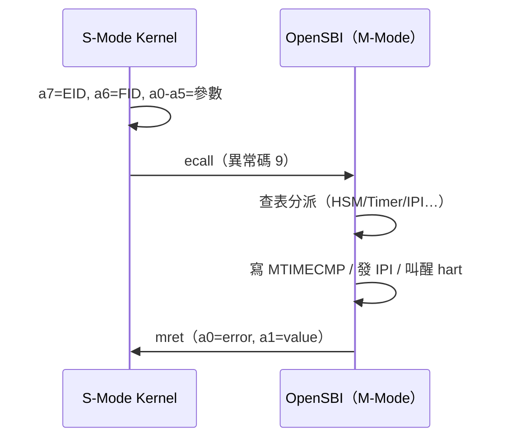

# 14.2 RISC-V SBI 規格與 OpenSBI 實作

## 動機：S-Mode 想碰 M 級硬體，唯一的門是誰？

S-Mode 不能直接寫 `MTIMECMP`、不能發核間 IPI、不能叫醒 sleeping hart——但 OS 排程處處需要這些。**SBI**（Supervisor Binary Interface）就是 M-Mode 韌體開給 S-Mode 的系統呼叫窗口：S-Mode 用 `ecall` 敲門（異常碼 9），M-Mode 韌體代辦後 `mret` 返回。**OpenSBI** 是它的參考實作，也是 QEMU `virt` 預設塞進去的那個 M-Mode 韌體。

## 核心講解：SBI 呼叫約定（v1.0/v2.0）

`ecall` 前填好：`a6`=功能號（FID），`a7`=擴充號（EID），`a0–a5`=參數；返回 `sbiret { error(a0), value(a1) }`。

| EID（擴充） | 值 | 代表功能 |
|---|---|---|
| Legacy Console Putchar | `0x01`（FID=0） | `sbi_console_putchar(ch)`，除錯印字 |
| Legacy Set Timer | `0x00`（FID=0） | `sbi_set_timer(stime_value)`，設下一個 tick |
| Base | `0x10` | `spec_version / impl_id / probe_extension` 能力探測 |
| HSM（Hart State Management） | `0x48534D`（"HSM"） | `hart_start/hart_stop/suspend` 多核啟停 |
| DBCN（Debug Console） | `0x4442434E`（"DBCN"） | 新版除錯主控台（取代 legacy putchar） |
| sBI RFENCE | `0x52464E43`（"RFNC"） | `remote_fence_i / remote_sfence_vma` 多核 TLB shootdown |
| IPI | `0x735049`（"sPI"） | `send_ipi` 核間中斷 |

`sbiret.error` 常用碼：`0`=SBI_SUCCESS，`-1`=FAILED，`-2`=NOT_SUPPORTED，`-3`=INVALID_PARAM，`-6`=ALREADY_AVAILABLE。

### OpenSBI 三種韌體形態

| 形態 | 用法 | 說明 |
|---|---|---|
| `fw_dynamic.bin` | QEMU 預設（`-bios` 內嵌） | 下階段位址由前一階段（QEMU ROM）經 `a1/a2` 傳入，最彈性 |
| `fw_jump.bin` | 固定跳轉 | 內建寫死的 `next_addr/next_mode`，適合 ROM 直燒 |
| `fw_payload.bin` | 打包內核 | 把 Kernel ELF 直接黏在韌體後面，一上電就是 OS（MCU 常見） |

Linux 開機印出的 `sbi: OpenSBI v1.x` 與 `sbi: SBI call supported` 即 Base 探測成功的證據；`riscv: SBI HSM detected` 表示多核叫醒可用。

## 範例：S-Mode 的 SBI 呼叫（C 內嵌組語）

```c
// sbiret 結構：a0=error, a1=value
struct sbiret { long error; long value; };

struct sbiret sbi_ecall(long eid, long fid,
    long a0, long a1, long a2, long a3, long a4, long a5) {
    register long r_a0 asm("a0") = a0, r_a1 asm("a1") = a1;
    register long r_a6 asm("a6") = fid, r_a7 asm("a7") = eid;
    asm volatile("ecall"           // S 級 ecall → 異常碼 9 → OpenSBI
        : "+r"(r_a0), "+r"(r_a1)
        : "r"(r_a6), "r"(r_a7),
          "r"(a2), "r"(a3), "r"(a4), "r"(a5) : "memory");
    return (struct sbiret){r_a0, r_a1};
}

// 叫醒 hart 1：HSM hart_start(hartid, start_addr, opaque)
void wake_hart1(uintptr_t entry) {
    sbi_ecall(0x48534D, 0, 1, entry, 0, 0, 0, 0);
}
```

## Mermaid：SBI 往返



## 本節小結

- SBI 是 S→M 的代辦窗口：`a7=EID, a6=FID` 敲門，`ecall(9)` 進，`mret` 回。
- Base 探測、HSM 多核、Timer/IPI、RFENCE shootdown 是 OS 最常用的四件套。
- OpenSBI 三形態：dynamic（QEMU 愛用）、jump（固定入口）、payload（韌體包內核）。
- Legacy 介面（`0x00/0x01`）已凍結，新程式用 Base/HSM/DBCN。

## 想一想

1. SBI 與 Linux syscall 有何異同？為什麼 S-Mode 的 timer 需求不能自己解決，非要 SBI 代辦？
2. `sbi_hart_start` 的三個參數（hartid/start/opaque）分別對應 14.1 交棒三件套中的哪幾樣？
3. ★★ 在 QEMU 上用 `sbi_console_putchar` 逐字印出 "hi"，再用 DBCN 重做一次，對比異同。
