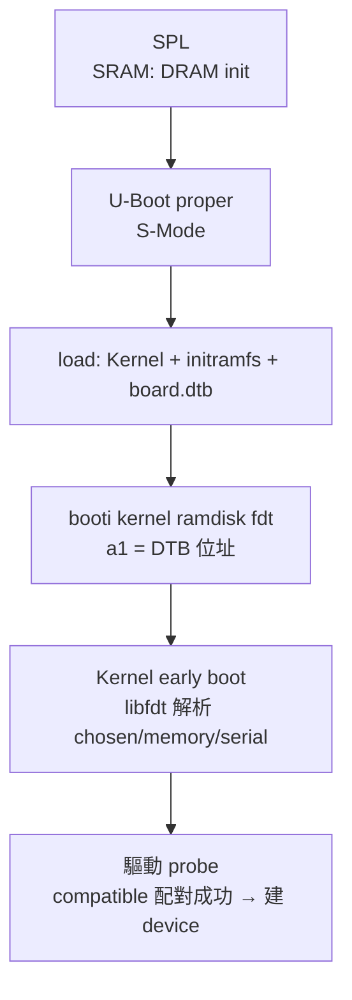

# 14.3 U-Boot 與 Device Tree（DTS / DTB）移植與解析

## 動機：同一份 Kernel，如何跑上一千種板子？

x86 有 BIOS/ACPI 統一硬體描述，ARM/RISC-V 的板子卻千奇百怪：UART 在哪個位址？記憶體多大？哪顆 hart 能開機？**Device Tree** 就是「硬體身分證」：Bootloader 把一棵描述硬體的樹（編譯後叫 DTB/FDT）交給 Kernel，Kernel 照圖施工——同一份 `Image` 跑 QEMU `virt` 與真實開發板，差的只是這棵樹。**U-Boot** 則是搬運與組裝這一切的 Bootloader 本體（含 SPL 階段）。

## 核心講解：U-Boot 兩階段 + Device Tree 三件套

| U-Boot 階段 | 跑在哪 | 職責 |
|---|---|---|
| SPL（Secondary Program Loader） | SRAM（M/S） | 極簡 init：設 DRAM 時序，把完整 U-Boot 從 Flash 搬進 DRAM |
| U-Boot proper | DRAM（S-Mode） | 初始化外設/網路，執行 `bootcmd`：載 Kernel + initramfs + DTB，下 `booti` 交棒 |

常用命令：`printenv/bootcmd` 看開機腳本，`load mmc/dhcp` 抓檔，`booti $kernel $ramdisk $fdt` 交棒（`$fdt` 即 DTB 位址，對應 `a1`）。

### DTS → DTB → FDT

| 形態 | 說明 |
|---|---|
| DTS（`.dts/.dtsi`） | 人寫的源碼，`/` 為根，`serial@10000000` 為節點，`compatible` 為驅動配對鍵 |
| DTB（`.dtb`） | `dtc` 編譯後的二進位，U-Boot 與 Kernel 實際傳遞者 |
| FDT | Kernel 啟動時對 DTB 在記憶體中唯讀視圖的稱呼（libfdt 解析） |

`compatible = "ns16550a"` 是 Kernel 找到 UART 驅動的暗號；配對失敗的裝置直接「不存在」——90% 的移植地獄都死在這一行。

## 範例：QEMU virt 的最小 DTS 片段

```dts
/dts-v1/;
/
{   #address-cells = <0x02>;
    #size-cells = <0x02>;
    compatible = "riscv-virtio";
    chosen {
        bootargs = "console=ttyS0 root=/dev/vda rw earlycon";
        stdout-path = "serial0:115200n8";
    };
    memory@80000000 {
        device_type = "memory";
        reg = <0x00 0x80000000 0x00 0x80000000>; /* 2GB @0x80000000 */
    };
    serial0: serial@10000000 {
        compatible = "ns16550a";
        reg = <0x00 0x10000000 0x00 0x100>;
        clock-frequency = <0x384000>;
    };
    cpus {
        cpu@0 { compatible = "riscv"; riscv,isa = "rv64imafdc"; };
    };
};
```

```c
/* Kernel 端：libfdt 按 compatible 找 UART（示意） */
int off = fdt_node_offset_by_compatible(fdt, -1, "ns16550a");
fdt_getprop(fdt, off, "reg", &len);  /* 取出 MMIO 位址 */
```

## Mermaid：U-Boot + DT 交棒



## 本節小結

- U-Boot = SPL（搬自己進 DRAM）+ proper（搬 Kernel 進 DRAM 並交棒）。
- Device Tree 是硬體身分證：DTS 人寫、`dtc` 編成 DTB、`a1` 交棒、libfdt 解析。
- `compatible` 是驅動配對的唯一暗號，`chosen.bootargs` 是 Kernel 第一個命令列。
- 一份 Kernel 跑遍千板，靠的就是「程式碼不動、只換 DTB」。

## 想一想

1. 為什麼交棒時 DTB 位址（`a1`）與 Kernel 入口一樣重要？Kernel 在建頁表之前如何讀到它？
2. 把 `serial0` 節點的 `compatible` 改錯一個字母，QEMU 串口輸出會怎樣？Kernel panic 訊息會指向哪裡？
3. ★★ 用 `dtc -I dtb -O dts` 反編譯 QEMU 傳給 Kernel 的 DTB，找出 `memory` 節點的實際大小。
