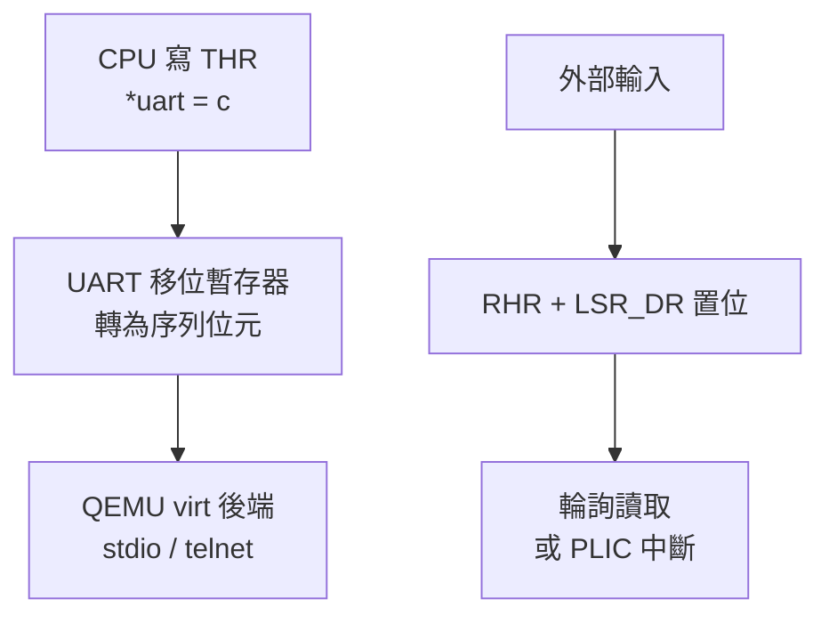

# 15.2 外設驅動開發：UART、SPI、I2C 與 MMIO

## 動機：印出 "Hello" 背後是誰在搬位元？

裸機世界沒有 `printf()`，只有記憶體映射輸出入（Memory-Mapped I/O, MMIO）：
把外設暫存器（Peripheral Register）映射到某個實體位址，讀寫指標即讀寫硬體。
本節以 QEMU `virt` 機器的 UART（通用非同步收發器，Universal Asynchronous
Receiver-Transmitter）為主，類比到 SPI（序列周邊介面）與 I2C（內部整合電路匯流排），
建立「暫存器手冊 → 結構體映射 → 輪詢（Polling）→ 中斷（Interrupt）」的驅動方法論。

核心觀念：**驅動程式就是「用 C 結構體說出資料手冊位址」的藝術**。

## 15.2.1 MMIO 與 UART：virt 機器的 0x10000000

QEMU `virt` 的 UART0 是 16550 相容裝置，基址（Base Address）`0x10000000`。
發送暫存器（THR）與接收緩衝（RHR）共用偏移 0，加行狀態暫存器（LSR, 偏移 5）
的第 5/0 位元分別表示「發送保持暫存器為空（THRE）」與「資料就緒（DR）」。

```c
// uart.c — 輪詢式 UART 驅動
#include <stdint.h>
#define UART0_BASE 0x10000000UL
#define THR 0x00  /* Transmitter Holding Register */
#define LSR 0x05  /* Line Status Register */
#define LSR_THRE (1 << 5)
#define LSR_DR   (1 << 0)

static volatile uint8_t *uart = (volatile uint8_t *)UART0_BASE;

static void uart_putc(char c) {
    while (!(uart[LSR] & LSR_THRE)) { }  /* 等待發送就緒 */
    uart[THR] = (uint8_t)c;
}
static int uart_getc(void) {
    if (uart[LSR] & LSR_DR) return uart[0];  /* 有資料才讀 */
    return -1;
}
void uart_puts(const char *s) {
    while (*s) { if (*s == '\n') uart_putc('\r'); uart_putc(*s++); }
}
```

關鍵字 `volatile` 不可省略：它阻止編譯器把「等待旗標的迴圈」優化掉，
因為旗標是由硬體、而非程式改變的。

## 15.2.2 SPI 與 I2C：同步序列匯流排的兩種哲學

| 特性 | SPI（4 線） | I2C（2 線） |
|---|---|---|
| 時脈（Clock） | 主裝置推 SCK，全雙工（Full-Duplex） | 主裝置推 SCL，半雙工 |
| 片選（Chip Select） | 每從裝置一條 CS 線 | 7 位元位址定址，無 CS |
| 暫存器模型 | TXDATA / RXDATA / CS / DIV（除頻） | CTRL / STATUS / TXDATA / ADDR |
| 適用 | Flash、螢幕、高速感測器 | EEPROM、溫濕度計、低速感測器 |

```c
// spi.c — 以 TXDATA/RXDATA 模型寫一 byte（示意）
#define SPI_BASE 0x10001000UL
struct spi_regs {
    volatile uint32_t sckdiv;   /* 0x00 除頻 */
    volatile uint32_t sckmode;  /* 0x04 模式 */
    volatile uint32_t csid;     /* 0x10 片選 ID */
    volatile uint32_t csdef;    /* 0x14 片選預設值 */
    volatile uint32_t csmode;   /* 0x18 片選模式 */
    volatile uint32_t txdata;   /* 0x48 發送（含 full 旗標 bit31） */
    volatile uint32_t rxdata;   /* 0x4C 接收（含 empty 旗標 bit31） */
};
#define TX_FULL (1u << 31)
#define RX_EMPTY (1u << 31)

uint8_t spi_transfer(volatile struct spi_regs *s, uint8_t out) {
    while (s->txdata & TX_FULL) { }
    s->txdata = out;
    while (s->rxdata & RX_EMPTY) { }
    return (uint8_t)(s->rxdata & 0xFF);
}
```

I2C 則多一步「START → 位址＋讀寫位 → ACK → 資料 → STOP」狀態機，
驅動重點是查詢 STATUS 暫存器並處理 NACK（無應答）重試。

## 15.2.3 從輪詢到中斷：別讓 CPU 空轉

```bash
# 用 QEMU 掛一個 SPI Flash 觀察 MMIO 存取（-d guest_errors 可見非法存取）
qemu-system-riscv64 -machine virt -nographic -bios none \
  -kernel uart.elf -d guest_errors
# 另開終端：telnet 連入 QEMU UART 後端，或直接看 stdio 回顯
```

輪詢（Polling）簡單但浪費 CPU；量產驅動應切換為中斷驅動（Interrupt-Driven）：
UART 收到字元 → PLIC（平台級中斷控制器）→ `mcause/scause` 判源 →
Trap Handler 把字元丟入環形緩衝（Ring Buffer）。此模式將在 15.3 與 12.4 銜接。



## 本節小結

- MMIO＝指標讀寫硬體，`volatile` 是正確性的底線。
- UART（非同步、點對點）最適合早期除錯；SPI（高速、全雙工）接 Flash；I2C（雙線、定址）接低速感測器。
- 先寫出輪詢版驅動，再升級為「中斷＋環形緩衝」版。

## 想一想

1. 若拔掉 `volatile`，`-O2` 下的 `while (!(uart[LSR] & THRE))` 會被編譯成什麼？請用 `objdump` 驗證。
2. SPI 一次傳 1 byte 需要兩次旗標等待，如何用 FIFO（先進先出佇列）或 DMA（直接記憶體存取）消除等待？
3. I2C 匯流排上兩個主裝置同時發 START 會如何仲裁（Arbitration）？誰贏？
