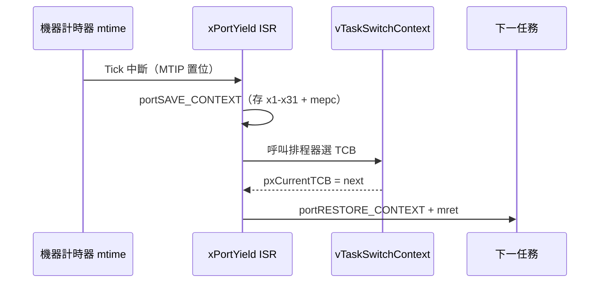

# 15.3 FreeRTOS 移植：RISC-V 上下文切換（Context Switch）實作

## 動機：單一 CPU 如何「同時」跑多個任務？

即時作業系統（Real-Time OS, RTOS）的魔法只有一句話：**定時搶走 CPU**。
機器計時器（Machine Timer, `mtime`）每隔一個節拍（Tick，通常 1 ms）觸發中斷，
核心保存舊任務的上下文（Context：全部暫存器＋`mepc`/`sepc`），載入新任務的上下文，
於是每個任務都以為自己獨佔 CPU。本節解剖 FreeRTOS RISC-V 移植層（Port Layer）
的上下文切換，這是 15.4 理解排程器的前置知識。

核心觀念：**上下文切換＝「中斷處理函式精心保存/還原暫存器」的特例**。

## 15.3.1 移植層三檔案：port.c、portASM.S、portmacro.h

| 檔案 | 職責 |
|---|---|
| `portable/GCC/RISC-V/port.c` | `xPortStartScheduler()`、`xPortSetupTimerInterrupt()`（設定 `mtimecmp`） |
| `portable/GCC/RISC-V/portASM.S` | `xPortYield()`、`xTicketISR`：純組語存取全暫存器 |
| `portable/GCC/RISC-V/chip_specific_extensions/.../portmacro.h` | `portSAVE_CONTEXT` / `portRESTORE_CONTEXT` 巨集、堆疊型別 `StackType_t` |

每個任務（Task）的堆疊在建立時被「預偽裝」成剛發生過一次中斷的樣子，
因此第一次排程只需執行一次「還原」就能跳入任務函式——這招叫「偽造異常返回幀」。

## 15.3.2 上下文切換組語：存什麼、怎麼存？

```asm
# portASM.S（簡化，M-Mode 版）— Tick 中斷入口
xPortYield:
    addi sp, sp, -128          # 32 個暫存器 x 4 byte（RV32 示意）
    sw   x1, 0(sp)             # ra
    sw   t0, 16(sp)            # 依 ABI 逐一保存 caller/callee-saved
    # ... 保存 x1..x31 ...
    csrr t0, mepc
    sw   t0, 124(sp)           # 保存返回位址
    # 呼叫 vTaskSwitchContext() 選出下一個 TCB
    call vTaskSwitchContext
    # 從新任務堆疊還原（略，與保存對稱）
    lw   t0, 124(sp)
    csrw mepc, t0
    # ... 還原 x1..x31 ...
    addi sp, sp, 128
    mret                       # 從機器模式陷阱返回
```

```c
// port.c — 設定 Tick：mtimecmp = mtime + (CPU_HZ / TICK_HZ)
void xPortSetupTimerInterrupt(void) {
    uint64_t mtime = *(volatile uint64_t *)0x200BFF8UL; /* CLINT mtime */
    *(volatile uint64_t *)0x2004000UL =                 /* CLINT mtimecmp[h0] */
        mtime + (configCPU_CLOCK_HZ / configTICK_RATE_HZ);
    /* 使能 M-Mode 計時器中斷：mie.MTIE = 1 */
    __asm__ volatile("csrs mie, %0" :: "r"(0x80));
}
```

> QEMU `virt` 的 CLINT（核心本地中斷器）基址為 `0x2000000`，
> `mtime` 偏移 `0xBFF8`、`mtimecmp` 偏移 `0x4000`，多核時每個 hart 各一份。

## 15.3.3 建置與 QEMU 驗證

```bash
# 以 FreeRTOS-Kernel 官方 demo（RV32 virt）為例
git clone https://github.com/FreeRTOS/FreeRTOS-Kernel.git
riscv64-unknown-elf-gcc -march=rv32imac -mabi=ilp32 \
  -I include -I portable/GCC/RISC-V -T virt.ld \
  -o rtos.elf main.c tasks.c queue.c port.c portASM.S
qemu-system-riscv64 -machine virt -nographic -bios none -kernel rtos.elf
# 預期：兩個任務交替印出 "Task A / Task B"，週期 = configTICK_RATE_HZ
```



## 本節小結

- FreeRTOS 移植層＝C（建任務、設 Tick）＋組語（存/取上下文）兩半。
- Tick 中斷是搶占式（Preemptive）排程的心跳；`mret` 是上下文切換的最後一躍。
- 任務堆疊初始化即「偽造一次中斷現場」，首次切換與後續切換走同一路徑。

## 想一想

1. 為何 `portSAVE_CONTEXT` 必須在關中斷下執行？若 Tick 巢套（Nested）Tick 會發生什麼？
2. RV32 與 RV64 的上下文幀（Context Frame）大小差多少？浮點暫存器 `f0–f31` 何時需要保存？
3. 合作式排程（Cooperative, `configUSE_PREEMPTION=0`）下 `xPortYield()` 何時被呼叫？Tick 還需要嗎？
