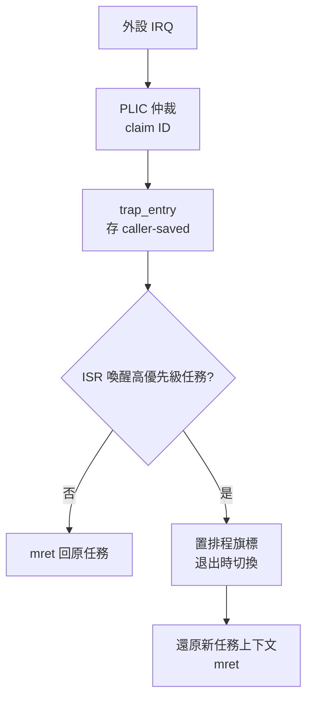

# 15.4 RT-Thread / ThreadX：多任務排程與中斷回應優化

## 動機：FreeRTOS 之外，還有更快、更像 OS 的選擇

FreeRTOS 輕量但功能精簡；國產 RT-Thread（物件導向核心＋豐富元件）與
Azure RTOS ThreadX（PICMG 高認證、極速中斷回應）代表兩種進化方向：
前者讓 MCU 開發「像寫 Linux 應用」，後者把中斷延遲（Interrupt Latency）
壓到十數個時脈週期。本節比較三者的排程（Scheduling）與中斷路徑，
並給出 RISC-V 上的中斷回應優化清單。

核心觀念：**RTOS 的快慢不在 MHz，而在「從中斷發生到任務恢復跑了幾條指令」**。

## 15.4.1 排程器對照：優先級、時間片與物件模型

| 維度 | FreeRTOS | RT-Thread | ThreadX |
|---|---|---|---|
| 排程（Scheduling） | 固定優先級搶占＋同級時間片（Time Slice） | 同左，32/256 級，位圖找最高就緒（O(1)） | 同左，搶占閾值（Preemption-Threshold）防優先級反轉 |
| 任務載體 | `TCB_t` 結構體 | 核心物件 `rt_object`＋`rt_thread`（可動態列舉） | `TX_THREAD` 控制塊，PIC（位置無關碼）建立 |
| 同步原語 | Queue/Sem/Mutex | Mailbox/MsgQueue/Event/Mutex＋SAL 套接字層 | Queue/FIFO/Sem/Event Flags/Block Pool |
| Tickless | `configUSE_TICKLESS_IDLE` | `RT_USING_TICKLESS`＋PM 睡眠 | 全天然 Tickless，按需編程 `mtimecmp` |

```c
// RT-Thread：建立並啟動執行緒（動態物件，一行搞定）
#include <rtthread.h>
static void led_entry(void *p) {
    while (1) { rt_pin_write(3, 1); rt_thread_mdelay(500);
                rt_pin_write(3, 0); rt_thread_mdelay(500); }
}
int main(void) {
    rt_thread_t tid = rt_thread_create("led", led_entry, RT_NULL,
                                       512, 10, 20);  /* 棧/優先級/時間片 */
    if (tid) rt_thread_startup(tid);
    return 0;
}
```

## 15.4.2 中斷路徑：從 PLIC 到任務喚醒有幾步？

RISC-V 中斷路徑為：外設 → PLIC（平台級中斷控制器）仲裁 →
`mcause/scause` 攜原因 → Trap Vector → OS Handler。
優化圍繞「少存暫存器、早開中斷、延遲重排程」三原則：

```asm
# 理想中斷前導（Prologue）：只存 caller-saved，中斷巢套允許後立刻開中斷
trap_entry:
    addi sp, sp, -64
    sw   ra, 0(sp); sw t0, 4(sp); sw t1, 8(sp); sw a0, 12(sp)
    # ... 僅存 ABI 規定的 caller-saved ...
    csrr a0, mcause
    call trap_handler        # C 語言分發
    # PendSV 式延遲切換：置排程旗標，中斷退出統一處理
    lw   ra, 0(sp); /* ... 還原 ... */
    mret
```

```bash
# 量測中斷延遲：GPIO 翻轉 → 示波器/邏輯分析儀，或 QEMU tracing
qemu-system-riscv64 -machine virt -nographic -bios none \
  -kernel threadx.elf -d int -D qemu_int.log
grep -c "plic.*claim" qemu_int.log   # 統計 PLIC 仲裁次數
```

## 15.4.3 優化清單：向量中斷、堆疊與 Tickless

1. 向量化陷阱（Vectored Trap, `mtvec.MODE=1`）：中斷原因直跳 Handler，
   省去一次 `mcause` 查表分發，ThreadX 預設開啟。
2. 中斷堆疊（Interrupt Stack）分離：Handler 用獨立 MSP（主堆疊），
   任務堆疊不再預留最壞中斷巢套深度，RAM 省一半。
3. Tickless Idle：空閒時把 `mtimecmp` 推到「下一個超時事件」而非下一個 Tick，
   電池裝置功耗降一個量級；喚醒後用 `mtime` 差值補償 Tick 計數。



## 本節小結

- 三 RTOS 同為優先級搶占，但 RT-Thread 勝在元件生態，ThreadX 勝在中斷延遲與認證。
- 中斷優化＝向量入口＋分離堆疊＋延遲切換＋Tickless 四招。
- 先讓系統在 QEMU `virt` 上穩定跑雙任務，再上板測真實延遲。

## 想一想

1. 搶占閾值（Preemption-Threshold）如何緩解優先級反轉（Priority Inversion）？它與天花板協議有何異同？
2. Tickless 下 `rt_thread_mdelay(500)` 的喚醒誤差來自哪裡？`mtime` 精度夠嗎？
3. 若 PLIC 同時收到 UART 與 SPI 中斷，`claim` 返回哪一個？優先級與 ID 如何共同決定？
