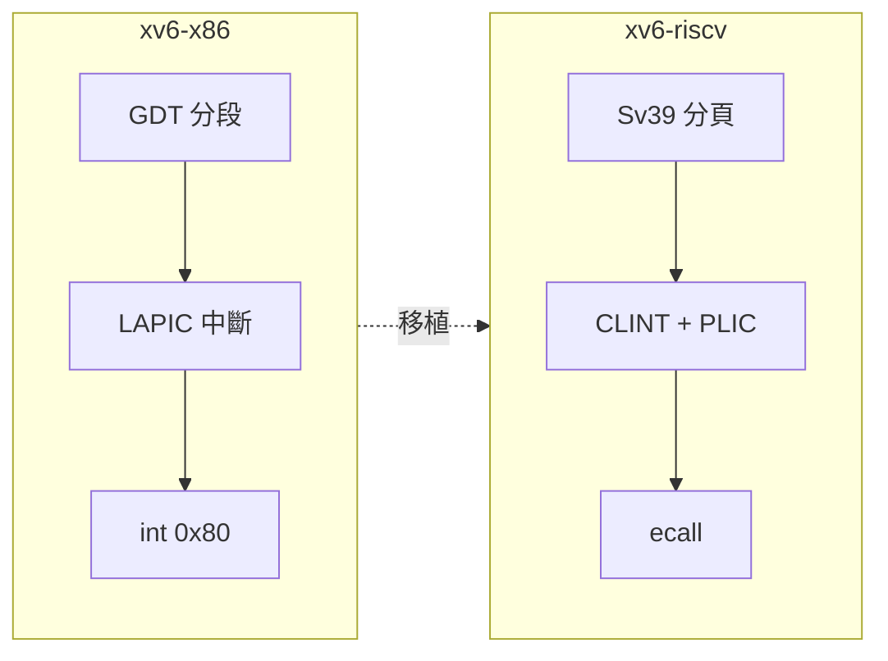

# 16.1 xv6-riscv 概覽與 x86→RISC-V 轉變

## 動機：為何用一個教學 OS 理解整顆 CPU？

xv6 是 MIT 以 ANSI C 重寫 Unix V6 的教學作業系統，僅約一萬行卻五臟俱全：
進程（Process）、分頁（Paging）、檔案系統（File System）一應俱全。
2019 年後的 xv6-riscv 把 x86 版（xv6-x86）遷移到 RISC-V，
恰好照亮兩套 ISA 的系統程式差異。本節先鳥瞰原始碼樹，再點出移植的關鍵轉變。

核心觀念：**讀懂 xv6-riscv＝同時讀懂 RISC-V 特權架構（Privileged Architecture）**。

## 16.1.1 原始碼地圖：一萬行如何分工？

| 目錄/檔案群 | 職責 | 對應本章 |
|---|---|---|
| `kernel/entry.S`、`start.c`、`main.c` | M-Mode 進入、S-Mode 初始化 | 16.2 |
| `kernel/proc.c`、`swtch.S`、`trap.c` | 進程、上下文切換、陷阱 | 16.3、16.4 |
| `kernel/vm.c`（`kvminit/uvminit`） | 核心/使用者頁表 | 16.5 |
| `kernel/spinlock.c`、`sleeplock.c` | 多核同步 | 16.6 |
| `kernel/virtio_disk.c`、`log.c`、`fs.c`、`inode.c` | 驅動與檔案系統 | 16.7 |
| `user/*.c`（`sh.c`、`ls.c`…） | 使用者程式、`ecall` 發 syscall | 16.4 |

```bash
# 取得並啟動 xv6-riscv（一條龍）
git clone https://github.com/mit-pdos/xv6-riscv.git && cd xv6-riscv
make TOOLPREFIX=riscv64-unknown-elf- qemu
# 另開終端可見 shell；Ctrl-A X 離開 QEMU
# 常用：ls / echo hi / grep hello README
```

## 16.1.2 x86→RISC-V：移植改了什麼？

1. 分段（Segmentation）消失：x86 靠 GDT/LDT 分段＋分頁，RISC-V 只有分頁（Sv39），
   `vm.c` 的 `kvminit()`/`uvminit()` 邏輯因而更乾淨。
2. 中斷控制器換血：x86 的 PIC/LAPIC/IOAPIC 變為 CLINT（計時/軟體中斷）＋ PLIC（外部中斷），
   見 `kernel/plic.c` 的 `plicinit()`/`plic_claim()`。
3. Trap 指令統一：x86 的 `int $0x80`/`syscall` 變為單一 `ecall`（環境呼叫），
   配合 `stvec/scause/sepc` 三 CSR（見 16.4）。
4. 啟動簡化：x86 的實模式→保護模式→長模式三級跳，變為 OpenSBI（M-Mode）→
   `entry.S`→ S-Mode 一條直線（見 16.2）。

```c
// user/user.h — 使用者視角的 syscall（x86 與 riscv 版介面幾乎不變！）
int fork(void);
int exit(int) __attribute__((noreturn));
int wait(int*);
int pipe(int*);
int write(int, const void*, int);
int exec(char*, char**);
```

介面不變、底層全換——這正是「系統呼叫抽象（Syscall Abstraction）」的威力，
也是移植只需重寫 `kernel/` 而 `user/` 幾乎零改動的原因。

```c
// kernel/proc.c — 即使在 RISC-V 版，fork() 的語意也與 Unix V6 一致
int fork(void) {
    // 複製父進程頁表（uvmcopy）+ 陷阱幀，子進程返回 0，父進程返回子 pid
    // 實作細節見 16.3；此處先記住：介面穩定，底層（頁表/中斷）全換。
    return -1;  // 示意，實作約 30 行
}
```



## 本節小結

- xv6-riscv 約萬行，`kernel/` 管特權、`user/` 管介面，QEMU `virt` 即開即用。
- x86→RISC-V 移植砍掉分段、三級模式切換，換上 Sv39＋CLINT/PLIC＋`ecall`。
- Syscall 介面穩定是移植成本低的關鍵。

## 想一想

1. 為何 RISC-V 可以不要分段？分段曾解決什麼歷史問題？分頁如何取代它？
2. `make qemu` 背後的 QEMU 命令列是什麼？試著手寫一條等價的 `qemu-system-riscv64 -machine virt …`。
3. 若把 xv6-riscv 搬到只有 M/U 模式的 MCU（如無 S-Mode），哪些檔案必須重寫？
