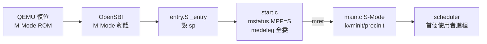

# 16.2 entry.S / main.c 與 S-Mode 進入

## 動機：核心的第一條指令在哪？誰切到 S-Mode？

QEMU 復位後跑的是 OpenSBI（M-Mode 韌體），它初始化完硬體才跳入核心。
xv6 的第一行自有程式碼是 `kernel/entry.S` 的 `_entry`，
接著 `kernel/start.c` 做 M-Mode 收尾、`kernel/main.c` 進入 S-Mode 主流程。
釐清這條鏈，才能理解 `satp`、`stvec` 何時生效。

核心觀念：**xv6 跑在 S-Mode；M-Mode 只是借道的起跑線**。

## 16.2.1 entry.S：每核的起跑槍

```asm
# kernel/entry.S — 每個 hart 都從這裡開始（a0 = hartid, a1 = dtb）
    .section .text
    .globl _entry
_entry:
    # 為 C 語言準備 4 KiB 臨時堆疊（boot stack）
    la sp, stack0
    li a0, 1024*4
    csrr a1, mhartid
    addi a1, a1, 1
    mul  a0, a0, a1
    add  sp, sp, a0
    call start          # → kernel/start.c（仍在 M-Mode）
spin:
    j spin              # start 不應返回；保險自旋
```

要點：多核（Multi-core）每核堆疊錯開 4 KiB；此時分頁尚未開啟，
用的全是實體位址（Physical Address）——連結腳本 `kernel/kernel.ld`
把核心載入在 `0x80000000`（`BASE_ADDR`）正是為此。

## 16.2.2 start.c → main.c：M-Mode 收尾與 S-Mode 移交

```c
// kernel/start.c（節選）— M-Mode 下的最後工作
void start(void) {
    // 1. 切到 S-Mode：mstatus.MPP=1（S），mstatus.MPIE 預開
    unsigned long x = r_mstatus();
    x &= ~MSTATUS_MPP_MASK;
    x |= MSTATUS_MPP_S;
    w_mstatus(x);
    w_mepc((uint64)main);       // 2. mret 的目的地 = main()
    w_satp(0);                  // 3. 仍用裸實體位址
    w_medeleg(0xffff);          // 4. 全部異常委託給 S-Mode
    w_mideleg(0xffff);
    w_sie(r_sie() | SIE_SEIE | SIE_STIE | SIE_SSIE);  // 5. 開 S 中斷
    w_mideleg(...);             // 計時器仍由 M 轉發（見 timerinit）
    timervec_init();            // 6. M-Mode 時鐘向量
    tp = r_mhartid();           // 7. hartid 存 tp，之後用
    asm volatile("mret");       // 8. 跳入 S-Mode main()
}
```

```c
// kernel/main.c（節選）— S-Mode 主流程，hart0 與其他核分流
void main(void) {
    if (cpuid() == 0) {
        consoleinit(); plicinit(); plicinithart();
        binit(); iinit(); fileinit(); virtio_disk_init();
        kvminit(); kvminithart(); procinit(); trapinit(); trapinithart();
        plicinithart(); bcache_test(); printf("xv6 kernel is booting\n");
        __sync_synchronize(); started = 1;
    } else {
        while (started == 0) { }  // 次核自旋等待
        kvminithart(); trapinithart(); plicinithart();
    }
    scheduler();  // → 永不返回（見 16.3）
}
```

## 16.2.3 QEMU 重現：看到 "xv6 kernel is booting"

```bash
# 用 -bios default（OpenSBI）+ -kernel 載入 xv6
qemu-system-riscv64 -machine virt -nographic \
  -bios default -kernel kernel/kernel -drive file=fs.img,if=none,format=raw,id=x0 \
  -device virtio-blk-device,drive=x0,bus=virtio-mmio-bus.0
# 預期輸出：… hart 1 starting … xv6 kernel is booting … init: starting sh $
```



## 本節小結

- `_entry` 只做一件事：給 C 語言一個可用的 `sp`。
- `start.c` 是 M→S 的單向門：`mepc=main`＋`mret`，此後不再回 M-Mode（除時鐘）。
- `main.c` 用 `started` 旗標協調多核，hart0 建構世界，次核隨後加入。

## 想一想

1. `w_satp(0)` 若漏寫會發生什麼？`mret` 之後取指用的是虛擬還是實體位址？
2. `medeleg=0xffff` 把所有異常委託給 S-Mode，有無安全疑慮？M-Mode 保留了什麼？
3. 多核同時執行 `_entry` 時 `stack0` 如何避免互踩？算式中 `mhartid+1` 的 `+1` 有何用？
