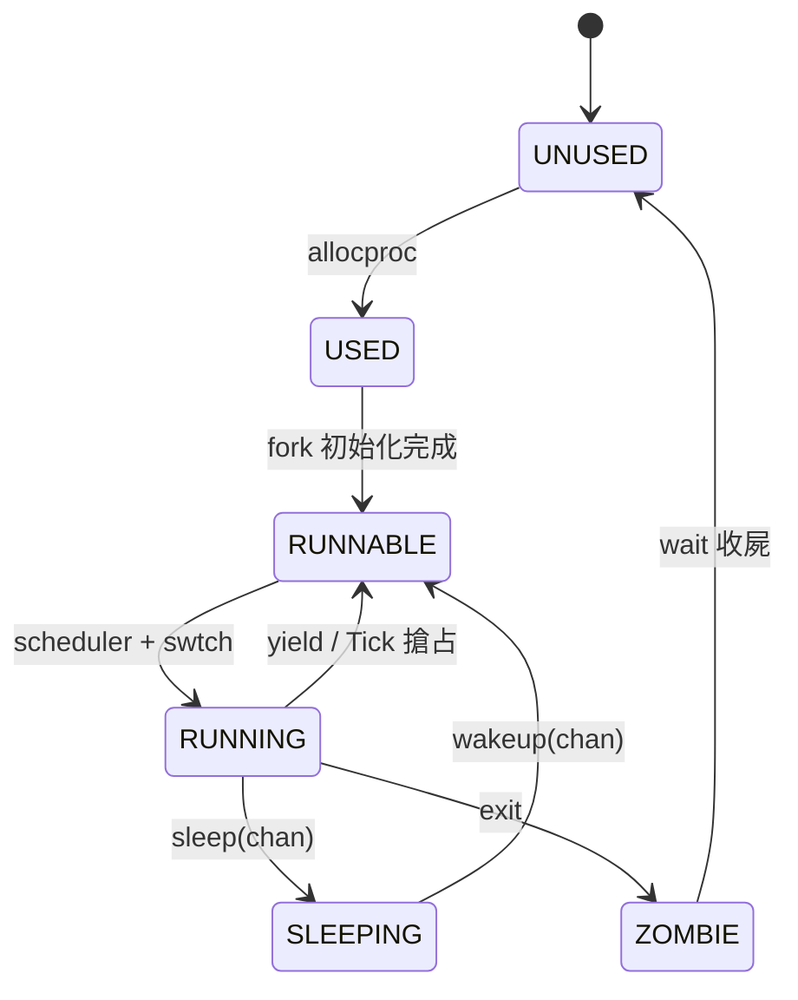

# 16.3 進程管理與上下文切換：struct proc、swtch.S 與排程器

## 動機：進程（Process）到底是 C 結構體還是暫存器集合？

答案是：兩者都是。`kernel/proc.h` 的 `struct proc` 是進程的「戶籍資料」
（狀態、pid、頁表、陷阱幀），而 `kernel/swtch.S` 切換的是「活的暫存器」。
排程器（Scheduler, `kernel/proc.c:scheduler()`）則是永動機：
不斷尋找 `RUNNABLE` 進程、`swtch()` 切過去、等其讓出再回來。本節一次串起三者。

核心觀念：**`struct proc` 是靜態描述，`swtch.S` 是動態靈魂**。

## 16.3.1 struct proc / struct context：進程的兩張臉

```c
// kernel/proc.h（節選）
struct context {           // swtch.S 只存 callee-saved + ra/sp
    uint64 ra, sp;
    uint64 s0, s1, s2, s3, s4, s5, s6, s7, s8, s9, s10, s11;
};
struct proc {
    struct spinlock lock;
    enum procstate state;  // UNUSED/USED/SLEEPING/RUNNABLE/RUNNING/ZOMBIE
    int pid;
    pagetable_t pagetable; // 使用者頁表（見 16.5）
    struct trapframe *trapframe;  // ecall/中斷用的完整幀（含 sepc、a0-a7）
    struct context context;       // 核心態 swtch 用的精簡幀
    uint64 kstack;         // 核心堆疊頂
    char name[16];
    struct file *ofile[NOFILE];
};
```

為何兩套幀？`trapframe` 存**全部**使用者暫存器（進出 U/S 模式），
`context` 只存 callee-saved（S 模式內核執行緒間切換，caller-saved 由編譯器保證）。
這是 xv6 最值得抄的省指令技巧。

## 16.3.2 swtch.S：14 個暫存器的乾坤大挪移

```asm
# kernel/swtch.S — void swtch(struct context *old, struct context *new)
    .globl swtch
swtch:
    sd ra, 0(a0);  sd sp, 8(a0)
    sd s0, 16(a0); sd s1, 24(a0); sd s2, 32(a0); sd s3, 40(a0)
    sd s4, 48(a0); sd s5, 56(a0); sd s6, 64(a0); sd s7, 72(a0)
    sd s8, 80(a0); sd s9, 88(a0); sd s10, 96(a0); sd s11, 104(a0)
    ld ra, 0(a1);  ld sp, 8(a1)      # 換堆疊 = 換世界
    ld s0, 16(a1); # ... 依序還原 s1..s11 ...
    ld s11, 104(a1)
    ret                              # 回到新進程上次離開處
```

```c
// kernel/proc.c — scheduler() 永動機（每 CPU 一份）
void scheduler(void) {
    struct proc *p; struct cpu *c = mycpu();
    c->proc = 0;
    for (;;) {
        intr_on();                       // 開中斷等工作
        for (p = proc; p < &proc[NPROC]; p++) {
            acquire(&p->lock);
            if (p->state == RUNNABLE) {  // 找到可跑的
                p->state = RUNNING;
                c->proc = p;
                swtch(&c->context, &p->context);  // 切過去！
                c->proc = 0;             // 被換回來後從這裡繼續
            }
            release(&p->lock);
        }
    }
}
```

## 16.3.3 動手：追蹤一次 fork + 切換

```bash
# QEMU 跑 xv6，user 端 fork 炮打響第一槍
qemu-system-riscv64 -machine virt -nographic -bios default \
  -kernel kernel/kernel -drive file=fs.img,if=none,format=raw,id=x0 \
  -device virtio-blk-device,drive=x0,bus=virtio-mmio-bus.0
# 在 shell 下：sh -c 'echo fork-test' 觀察 pid 變化；GDB 可 b swtch 看 ra/sp
```



## 本節小結

- `struct proc` 記身份，`trapframe` 管 U↔S，`context` 管 S↔S。
- `swtch.S` 只存 14 個暫存器（ra/sp/s0–s11），靠 ABI 省掉一半工作。
- `scheduler()` 是死迴圈找 `RUNNABLE`，`yield/sleep/exit` 是三種讓出方式。

## 想一想

1. `swtch()` 不存 `t0–t6/a0–a7` 安全嗎？請從 RISC-V ABI 的 caller/callee-saved 分工論證。
2. 若 `scheduler()` 忘記 `intr_on()`，系統會卡在哪種狀態？為何？
3. `fork()` 的子進程第一次 `swtch` 進去後從哪裡 `ret`？追蹤 `allocproc()` 設的 `ra=forktrap`。
