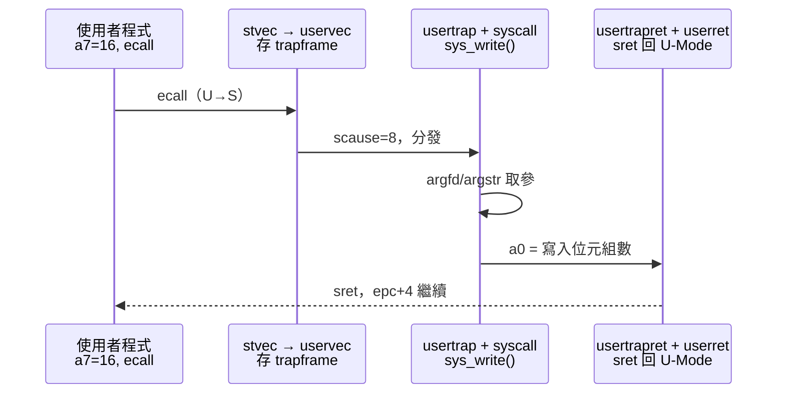

# 16.4 系統呼叫（Syscall）：ecall 觸發、Trap 與參數傳遞

## 動機：使用者程式如何請核心幫忙？

使用者程式（User Program）跑在 U-Mode，不能直接碰磁碟與頁表。
它把系統呼叫號（Syscall Number）放入 `a7`、參數放入 `a0–a5`，
執行一條 `ecall`（環境呼叫）——CPU 立刻陷入 S-Mode 的 `stvec` 向量，
由 `kernel/trap.c:usertrap()` 分發到 `kernel/syscall.c:syscall()`。
本節追完這條「一進一出」的完整路徑。

核心觀念：**`ecall` 是 U-Mode 唯一合法的「上訪」通道**。

## 16.4.1 使用者端：usys.pl 產生的跳板

```asm
# user/usys.S 由 user/usys.pl 生成（節選）：每個 syscall 一個 stub
    .globl fork
fork:
    li a7, 1           # SYS_fork = 1（見 kernel/syscall.h）
    ecall
    ret
    .globl write
write:
    li a7, 16          # SYS_write = 16
    ecall
    ret
```

```c
// user/sh.c — 使用者視角：與 Unix 幾乎相同
int main(void) {
    char buf[128];
    while (1) {
        write(1, "$ ", 2);          // a7=16, a0=1(fd), a1=buf, a2=len
        int n = read(0, buf, 128);  // a7=5
        if (fork() == 0) { exec(buf, 0); }  // a7=2, a7=7
        wait(0);
    }
}
```

ABI 約定（呼叫慣例）：`a7`= 呼叫號、`a0–a5`= 參數、`a0`= 返回值，
與函式呼叫共用暫存器，這正是 `ecall` 設計精妙處——Trap Handler
直接讀 `trapframe->a0..a7` 即得全部資訊。

## 16.4.2 核心端：usertrap → syscall → usertrapret

```c
// kernel/trap.c:usertrap()（節選）
void usertrap(void) {
    if (r_scause() == 8) {           // 8 = U-Mode ecall
        p->trapframe->epc += 4;      // 跳過 ecall 本身！
        intr_on();
        syscall();                   // → kernel/syscall.c
    } else if (devintr() != 0) { /* 計時/外部中斷 */ }
    usertrapret();                   // 返回 U-Mode
}
// kernel/syscall.c（節選）
void syscall(void) {
    int num = p->trapframe->a7;
    if (num < NELEM(syscalls) && syscalls[num])
        p->trapframe->a0 = syscalls[num]();  // 返回值寫回 a0
}
uint64 sys_write(void) {             // 取參：argfd/argstr/argint
    int n; uint64 p;
    argfd(0, 0, &fd); argstr(1, &s); argint(2, &n);
    return filewrite(fd, s, n);
}
```

注意 `epc += 4`：`ecall` 是 4 byte（非壓縮），返回時必須跳過，
否則會無窮重入同一個 `ecall`——新手除錯第一坑。

## 16.4.3 動手：新增一個 syscall

```bash
# 實驗：在 kernel/syscall.h 加 #define SYS_hello 23，
# kernel/syscall.c 註冊 sys_hello()，user 加 stub，QEMU 驗證
qemu-system-riscv64 -machine virt -nographic -bios default \
  -kernel kernel/kernel -drive file=fs.img,if=none,format=raw,id=x0 \
  -device virtio-blk-device,drive=x0,bus=virtio-mmio-bus.0
# shell 下執行你的 hello 測試程式，觀察 a0 返回值
```



## 本節小結

- 使用者端：`a7`= 號、`a0–a5`= 參、`ecall` 陷入、`a0`= 返回值。
- 核心端：`uservec` 存現場 → `usertrap` 判 `scause=8` → `syscall()` 查表 → `usertrapret` 經 `sret` 返回。
- `epc+=4` 是 ecall 路徑不可忘的一行。

## 想一想

1. `argstr()` 為何不能直接解引用使用者指標？`copyin()`/`copyinstr()` 解決了什麼安全問題？
2. 若惡意程式把 `a7` 設成超界大數，`syscall()` 如何防禦？查表前檢查了什麼？
3. `fork()` 的子進程返回 0、父進程返回子 pid——同一個 `sys_fork()` 如何讓兩個進程看到不同 `a0`？
