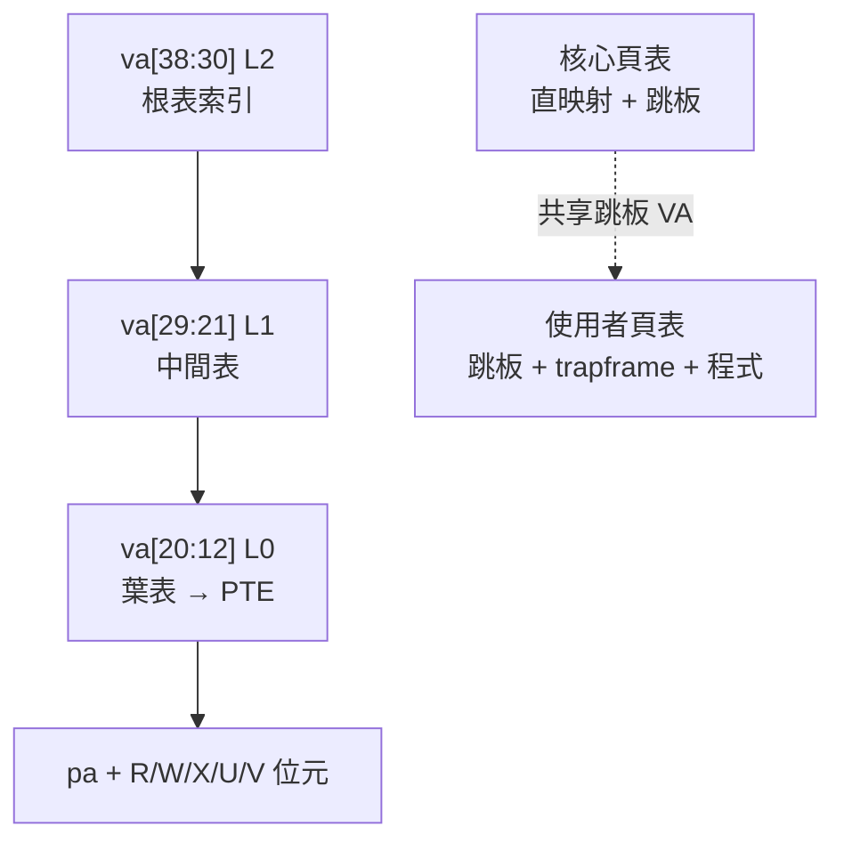

# 16.5 虛擬記憶體與分頁：kvminit()、uvminit() 與頁表隔離

## 動機：核心與使用者如何「住同屋卻不互看」？

xv6-riscv 跑 Sv39 三層頁表（Page Table）：每個進程一張使用者頁表，
外加全系統共用的一張核心頁表。`kernel/vm.c` 的 `kvminit()` 建核心頁表、
`uvminit()` 建使用者頁表，`kvminithart()` 寫入 `satp` 啟用。
隔離（Isolation）的關鍵是：使用者頁表含跳板（Trampoline）＋陷阱幀映射，
核心頁表直映射（Direct Map）全部實體記憶體——兩張表在跳板頁重合，
才能在切換 `satp` 的一瞬間不迷路。

核心觀念：**跳板頁是兩張頁表唯一的共同語言**。

## 16.5.1 kvminit：核心頁表的直映射江山

```c
// kernel/vm.c:kvminit()（節選）— 只執行一次（hart0）
void kvminit(void) {
    kernel_pagetable = (pagetable_t)kalloc();  // 分一頁當根
    memset(kernel_pagetable, 0, PGSIZE);
    // UART0 / VIRTIO0 / PLIC / CLINT：裝置 MMIO 直映射
    kvmmap(kernel_pagetable, UART0, UART0, PGSIZE, PTE_R | PTE_W);
    kvmmap(kernel_pagetable, VIRTIO0, VIRTIO0, PGSIZE, PTE_R | PTE_W);
    kvmmap(kernel_pagetable, PLIC, PLIC, 0x400000, PTE_R | PTE_W);
    // 核心程式碼 + 實體記憶體：KERNBASE(0x80000000) → PHYSTOP 直映射 RWX
    kvmmap(kernel_pagetable, KERNBASE, KERNBASE,
           (uint64)PHYSTOP - KERNBASE, PTE_R | PTE_W | PTE_X);
    // 跳板：虛擬最高頁 TRAMPOLINE ↔ 實體 trampoline 符號
    kvmmap(kernel_pagetable, TRAMPOLINE, (uint64)trampoline,
           PGSIZE, PTE_R | PTE_X);
}
// 每核啟用：satp = MAKE_SATP(kernel_pagetable) + sfence.vma
void kvminithart(void) {
    w_satp(MAKE_SATP(kernel_pagetable));
    sfence_vma();
}
```

直映射（Identity/Direct Mapping）意即 VA＝PA，核心程式不需重定位即可跑，
`sfence.vma`（沖刷 TLB）則是切表後的標準收尾。

## 16.5.2 uvminit：使用者世界的精裝修

```c
// kernel/vm.c:uvminit()（節選）— 為每個進程建表並載入 initcode
pagetable_t uvminit(char *initcode, int sz) {
    pagetable_t pg = uvmcreate();          // 空表
    uvminit_map(pg, TRAMPOLINE, (uint64)trampoline,  // 1. 跳板（與核心表同 VA）
                PTE_R | PTE_X);
    uvminit_map(pg, TRAPFRAME, (uint64)p->trapframe, // 2. 陷阱幀（每進程私有）
                PTE_R | PTE_W);
    uvmcopy(...);                          // 3. 載入程式段（ELF → mappages）
    uvmalloc(pg, 0, sz);                   // 4. 使用者堆疊 sbrk 區
    return pg;
}
```

| 映射 | VA | 權限 | 說明 |
|---|---|---|---|
| 跳板（Trampoline） | `TRAMPOLINE`（最高頁） | R-X | U/S 共用，`uservec/userret` 所在地 |
| 陷阱幀（Trapframe） | `TRAPFRAME`（次高頁） | RW | 每進程私有，存 `epc/a0–a7` |
| 程式＋堆疊 | `0 … sz` | RWX/RW | ELF 段＋`sbrk` 成長區，使用者可見 |

## 16.5.3 動手：看見頁表

```bash
# 在 kernel/vm.c 加 vmprint()（官方實驗），啟動後印核心頁表
qemu-system-riscv64 -machine virt -nographic -bios default -kernel kernel/kernel \
  -drive file=fs.img,if=none,format=raw,id=x0 \
  -device virtio-blk-device,drive=x0,bus=virtio-mmio-bus.0
# 預期：page table 0x000...878，4 級縮排顯示 PTE 的 R/W/X/V 位元
```



## 本節小結

- `kvminit()` 一次建核心直映射表；`kvminithart()` 每核寫 `satp`＋`sfence.vma`。
- `uvminit()` 每進程建表：跳板（共享）＋陷阱幀（私有）＋程式段。
- 跳板是切換 `satp` 不迷路的關鍵；U 位元（User）是隔離的硬體底線。

## 想一想

1. 若使用者頁表漏映射跳板頁，`ecall` 進入 `uservec` 第一步就會 fault——為什麼？（提示：`stvec=TRAMPOLINE`。）
2. `kvmmap` 裝置區為何不設 X（可執行）？W^X（寫異或執行）原則防什麼攻擊？
3. `sbrk()` 成長堆積（Heap）時，`uvmalloc()` 如何與陷阱幀的固定 VA 避免碰撞？
