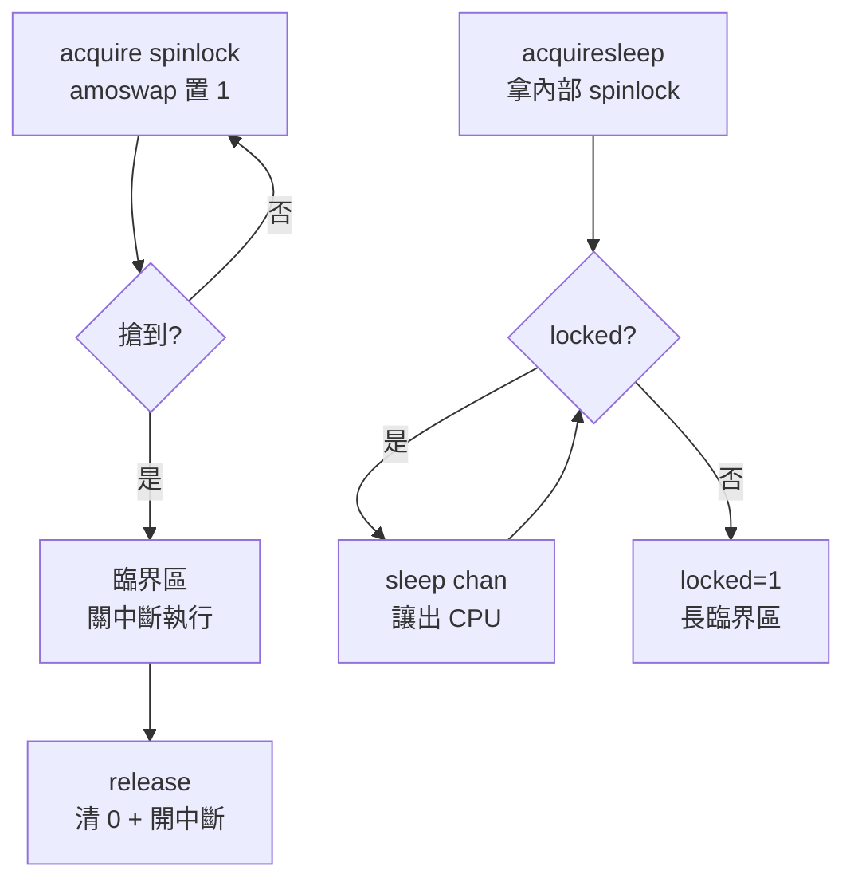

# 16.6 鎖與多核心同步：Spinlock 與 Sleeplock

## 動機：8 個 CPU 同時 `kalloc()`，空閒鏈表會斷成幾截？

QEMU `virt` 預設多核（`-smp 4` 即 4 個 hart），所有核共享核心資料結構。
若兩核同時從空閒頁鏈表取頁、不加鎖，鏈表指標互相覆寫——記憶體分配器當場崩潰。
xv6 用自旋鎖（Spinlock, `kernel/spinlock.c`）保護短臨界區，
用睡眠鎖（Sleeplock, `kernel/sleeplock.c`）保護長等待（如磁碟 I/O）。
本節是 RISC-V 原子指令（Atomic, A 擴充）的最佳實戰場。

核心觀念：**短轉等用自旋，長等待用睡眠；拿著自旋鎖絕不睡覺**。

## 16.6.1 Spinlock：amoswap 的 busy-wait

```c
// kernel/spinlock.c（節選）
void acquire(struct spinlock *lk) {
    push_off();                       // 關中斷，禁死鎖（見下）
    if (holding(lk)) panic("acquire");
    while (__sync_lock_test_and_set(&lk->locked, 1) != 0)
        ;                             // amoswap.w.aq 自旋
    __sync_synchronize();             // 記憶體屏障
    lk->cpu = mycpu();
}
void release(struct spinlock *lk) {
    lk->cpu = 0;
    __sync_synchronize();
    __sync_lock_release(&lk->locked); // amoswap.w.rl 清零
    pop_off();                        // 恢復中斷
}
```

底層即 A 擴充的 `amoswap.w.aq/rl`（帶獲取/釋放語意的原子交換）；
`push_off/pop_off` 關中斷是為了避免「拿鎖→被中斷→中斷處理函式再拿同一把鎖」的
單核死鎖（Deadlock）。規則：**中斷處理函式與進程上下文共享的鎖，必須關中斷拿**。

## 16.6.2 Sleeplock：拿著票去睡，不空轉 CPU

```c
// kernel/sleeplock.c（節選）— 長臨界區（檔案系統）用
void acquiresleep(struct sleeplock *lk) {
    acquire(&lk->lk);                 // 內部仍有一把 spinlock 保護狀態
    while (lk->locked) {
        sleep(lk, &lk->lk);           // 釋放 spinlock，去睡，等待 wakeup
    }
    lk->locked = 1;
    lk->pid = myproc()->pid;
    release(&lk->lk);
}
void releasesleep(struct sleeplock *lk) {
    acquire(&lk->lk);
    lk->locked = 0; lk->pid = 0;
    wakeup(lk);                       // 喚醒等待者
    release(&lk->lk);
}
```

| 鎖 | 等待方式 | 可否在持有時 `sleep` | 典型用處 |
|---|---|---|---|
| Spinlock | 原地空轉（不讓出 CPU） | 絕對不行 | `kalloc`、`console`、`plic` 短操作 |
| Sleeplock | `sleep(chan)` 讓出 CPU | 正是為此而生 | `inode`、`log`、磁碟隊列長操作 |

## 16.6.3 動手：製造並觀察競爭

```bash
# QEMU 多核啟動 xv6，跑 usertests 的並發測試
qemu-system-riscv64 -machine virt -smp 4 -nographic -bios default \
  -kernel kernel/kernel -drive file=fs.img,if=none,format=raw,id=x0 \
  -device virtio-blk-device,drive=x0,bus=virtio-mmio-bus.0
# shell 下：usertests -q（觀察 forktest、sbrktest 在多核下的通過率）
# 實驗：把 kalloc 的 acquire 註解掉一行，重跑，看鏈表如何損毀
```



## 本節小結

- Spinlock＝`amoswap` 自旋＋關中斷，守短臨界區；持有時禁 `sleep`。
- Sleeplock＝spinlock 管狀態＋`sleep/wakeup` 讓 CPU，守長臨界區。
- 多核除錯第一招：先懷疑缺鎖，再用 `-smp 1` 對照確認競爭。

## 想一想

1. `acquire()` 中 `push_off()` 與 `pop_off()` 為何要用計數器巢套（`noff`），而非單一開關？
2. 若在持有 Spinlock 時呼叫 `sleep()`，為何整個系統可能凍結？（提示：`scheduler()` 也要拿 `proc.lock`。）
3. RISC-V 的 `lr/sc`（載入保留/條件儲存）與 `amoswap` 各適合實現什麼樣的同步原語？
