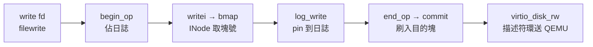

# 16.7 檔案系統與驅動程式：VirtIO、Log 機制與 INode

## 動機：`echo hi > x` 背後，位元組如何落到「虛擬磁碟」？

xv6-riscv 的磁碟是 QEMU 模擬的 VirtIO 塊裝置（Block Device）：
驅動（`kernel/virtio_disk.c`）用描述符環（Descriptor Ring）送讀寫請求，
日誌層（Logging, `kernel/log.c`）保證崩潰原子性（Crash Atomicity），
INode 層（`kernel/fs.c`、`inode.c`）把位元組流變成「檔案」。
本節自底向上走完寫檔三級跳。

核心觀念：**檔案系統＝「把隨機掉電變成要麼全寫、要麼全沒寫」的魔術**。

## 16.7.1 VirtIO 磁碟：描述符環送請求

```c
// kernel/virtio_disk.c（節選）— virtio_blk 讀寫一塊（1024 byte）
void virtio_disk_rw(struct buf *b, int write) {
    // 1. 三描述符鏈：buf 頭 → 資料頁 → 狀態位元組
    VRING_DESC *d0 = &disk.desc[idx[0]];
    d0->addr = (uint64)&disk.info[idx]; d0->len = sizeof(disk.info[idx]);
    d0->flags = VRING_DESC_F_NEXT; d0->next = idx[1];
    // 2. 資料描述符：讀寫方向決定 flags（WRITE 表示 guest→device）
    // 3. 投遞到 avail ring，敲 MMIO 門鈴（VIRTIO_MMIO_QUEUE_NOTIFY）
    *(volatile uint32 *)(VIRTIO0 + VIRTIO_MMIO_QUEUE_NOTIFY) = 0;
    while ((b->flags & (B_VALID | B_DIRTY)) != (B_VALID | B_DIRTY))
        sleep(b, &disk.vdisk_lock);  // 等中斷喚醒
}
```

```bash
# QEMU 掛載 virtio-blk 磁碟（xv6 標準姿勢）
qemu-system-riscv64 -machine virt -nographic -bios default \
  -kernel kernel/kernel -drive file=fs.img,if=none,format=raw,id=x0 \
  -device virtio-blk-device,drive=x0,bus=virtio-mmio-bus.0
# shell 下：echo hello > h.txt; cat h.txt（走完整 write→log→virtio 路徑）
```

## 16.7.2 Log 機制：崩潰一致性的 write-ahead

`log.c` 實現預寫日誌（Write-Ahead Logging, WAL）：檔案操作先寫日誌區，
`end_op()` 提交（Commit）時一次性刷入目的塊。規則是
「提交前掉電＝什麼都沒發生；提交後掉電＝重播即完整」。

| 函式 | 時機 | 作用 |
|---|---|---|
| `begin_op()` | 系統呼叫開始 | 佔日誌位，等待日誌空間 |
| `log_write(b)` | 修改元數據塊 | 把塊 pin 在日誌，不直接寫盤 |
| `end_op()` | 系統呼叫結束 | 引用計數歸零→提交刷盤＋解 pin |

## 16.7.3 INode：檔名如何變成塊號？

```c
// kernel/fs.h（節選）— 磁碟上的 dinode + 間接塊（indirect block）
#define NDIRECT 12
struct dinode {
    short type;            // T_FILE / T_DIR / T_DEVICE
    short nlink;           // 硬連結計數
    uint size;             // 位元組數
    uint addrs[NDIRECT+1]; // 12 直接塊 + 1 一級間接塊
};
// bmap(): 邏輯塊號 → 磁碟塊號（跨 NDIRECT 即走間接塊）
```



## 本節小結

- VirtIO 驅動＝描述符三元鏈＋MMIO 門鈴＋中斷喚醒。
- `log.c` 的 WAL 把多塊更新變成原子提交，掉電不爛檔。
- INode 以 12 直接＋1 間接塊定址，`bmap()` 是檔名到磁碟的最後翻譯。

## 想一想

1. 日誌區滿時 `begin_op()` 會 `sleep(log)`——若所有進程都在等日誌，會死鎖嗎？`MAXOPBLOCKS` 如何預防？
2. `B_VALID/B_DIRTY` 兩位元如何與 `bread/bwrite/brelse` 的緩衝快取（Buffer Cache）協作？
3. 直接塊 12＋間接塊 1 的最大檔案是多大？（塊 1 KiB，塊號 4 byte。）為何夠教學用卻不夠量產？
