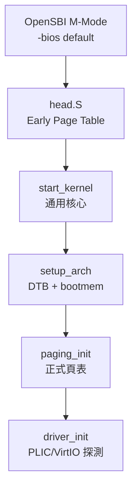

# 17.1 Linux Kernel RISC-V 架構程式碼結構（arch/riscv）

## 動機：在 3000 萬行核心中找到 RISC-V 的家

Linux 核心把各 ISA 的差異收斂在 `arch/<isa>/` 目錄，
RISC-V 的家就是 `arch/riscv/`。讀懂它的子目錄分工，
就掌握了「通用核心（Generic Core）如何呼叫架構相關（Arch-Specific）程式碼」的邊界。
本節是一張尋寶圖，後三節（17.2–17.4）將逐區深入。

核心觀念：**`arch/riscv/` 是 Linux 與 RISC-V 硬體簽的契約書**。

## 17.1.1 目錄地圖：誰管開機、誰管中斷、誰管驅動？

| 路徑 | 職責 |
|---|---|
| `arch/riscv/kernel/head.S`、`setup.c` | 最早開機：跳板頁表、DTB 解析入口 |
| `arch/riscv/kernel/entry.S`、`trap.c` | 陷阱向量、異常/中斷分發 |
| `arch/riscv/kernel/sys_riscv.c`、`syscall_table.c` | 系統呼叫表與架構相關 syscall（見 17.3） |
| `arch/riscv/mm/init.c`、`fault.c`、`tlbflush.c` | 記憶體初始化、缺頁異常、TLB 沖刷（見 17.2） |
| `arch/riscv/boot/dts/` | 裝置樹源（DTS）：QEMU `virt` 與各開發板描述 |
| `arch/riscv/kvm/`、`crypto/`、`lib/`、`net/` | 虛擬化、加速、函式庫、網路卸載 |
| `drivers/irqchip/irq-riscv-intc.c`、`irq-sifive-plic.c` | CLINT/PLIC 驅動（呼應第 12 章） |

```bash
# 下載並清點 arch/riscv（以 v6.x 為例）
git clone --depth 1 https://github.com/torvalds/linux.git && cd linux
find arch/riscv -maxdepth 2 -type d | sort
ls arch/riscv/kernel/ | head -40
grep -rn "riscv_sys_call" arch/riscv/kernel/ | head
```

## 17.1.2 Kconfig 與 defconfig：如何裁出 RISC-V 核心？

```bash
# 交叉編譯 RISC-V 通用核心（defconfig 即最小可用配置）
export ARCH=riscv CROSS_COMPILE=riscv64-linux-gnu-
make defconfig            # = arch/riscv/configs/defconfig
make -j$(nproc) Image     # 產出 arch/riscv/boot/Image（未壓縮）
ls -lh arch/riscv/boot/   # Image / Image.gz（+ EFI stub）
```

`Kconfig` 的關鍵選項：`RISCV_ISA_C`（壓縮指令）、`RISCV_SBI_V01`（舊 SBI）、
`RISCV_ALTERNATIVE`（執行期 CPU 勘誤修補）、`NUMA`/`HUGETLB`（大系統）。
用 `make menuconfig` 可見「ISA 擴充開關如何長成核心 feature」。

## 17.1.3 從 OpenSBI 到 head.S：第一行 C 在哪？

```c
// arch/riscv/kernel/setup.c（節選）— S-Mode C 語言入口附近
void __init setup_arch(char **cmdline_p) {
    *cmdline_p = boot_command_line;
    setup_bootmem();          // 依 DTB 劃出可用記憶體
    parse_early_param();      // earlycon 等早期參數
    sbi_init();               // 探測 SBI 版本（見 14.2）
    paging_init();            // 換正式頁表（見 17.2）
    unflatten_device_tree();  // 展開 DTB 為 device_node 樹
}
```

啟動鏈：QEMU `-bios default`（OpenSBI, M-Mode）→ `head.S`（S-Mode 組語，
建 Early Page Table）→ `start_kernel()`（通用）→ `setup_arch()`（回架構相關）。
與 xv6 的 `entry.S→start→main`（16.2）是同一旋律的交響版。



## 本節小結

- `arch/riscv/kernel/` 管陷阱與開機，`mm/` 管分頁，`boot/dts/` 描述硬體。
- `ARCH=riscv make defconfig && make Image` 是最短可用的核心建置路徑。
- 啟動鏈 M→S→通用→架構，與 xv6 同構，只是規模大百倍。

## 想一想

1. 為何 Linux 要把裝置描述放在 DTB（裝置樹二進位）而非核心寫死？QEMU `-dtb` 與 `-machine virt` 如何配合？
2. `head.S` 建 Early Page Table 時 MMU 是開是關？它跑的是 VA 還是 PA？
3. 在 `drivers/irqchip/` 中，`intc`（CLINT）與 `plic` 驅動如何級聯（Cascade）？誰先收到中斷？
