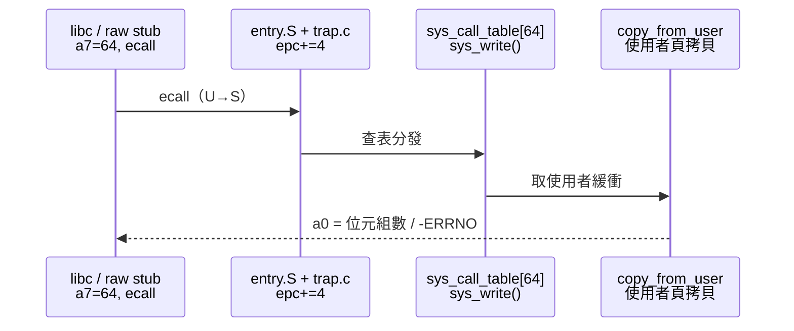

# 17.3 系統呼叫表（Syscall Table）與 ABI 規範

## 動機：`write(fd, buf, n)` 的位元組如何穿越 U/S 邊界？

RISC-V Linux 只有一套系統呼叫 ABI（`asm-generic/unistd.h`＋RISC-V 表），
不像 x86 有 `int 0x80`/`syscall/sysenter` 三代包袱。
規則極簡：`a7`= 呼叫號、`a0–a5`= 參數、`a0/a1`= 返回值、`ecall` 陷入。
本節對照 xv6（16.4）的同構設計，看清「Linux 把什麼變複雜了、為什麼值得」。

核心觀念：**ABI 是使用者與核心的契約；`a7+ecall` 是契約的簽名處**。

## 17.3.1 呼叫慣例：暫存器分工表

| 暫存器 | 角色 | 說明 |
|---|---|---|
| `a7` | 呼叫號（Syscall Number） | 如 `__NR_write = 64` |
| `a0–a5` | 參數 1–6 | 超過 6 個用結構體打包 |
| `a0`（出） | 返回值（Return Value） | 負值 `-ERRNO` 表示錯誤 |
| `t0–t6` | 被核心摧毀（Clobbered） | 使用者 stub 須假設全毀 |
| `sepc` | 返回位址 | 核心 `+4` 跳過 `ecall`（同 xv6） |

```c
// user 端直調 write（不經 libc，教學用）
#include <unistd.h>
#include <sys/syscall.h>
long raw_write(int fd, const void *buf, unsigned long n) {
    register long a7 asm("a7") = __NR_write;   // 64
    register long a0 asm("a0") = fd;
    register long a1 asm("a1") = (long)buf;
    register long a2 asm("a2") = n;
    asm volatile("ecall"
                 : "+r"(a0) : "r"(a7), "r"(a1), "r"(a2)
                 : "memory", "t0", "t1", "t2", "t3", "t4", "t5", "t6");
    return a0;
}
```

## 17.3.2 核心端：syscall_table 與分發

```c
// arch/riscv/kernel/syscall_table.c（概念）+ entry.S 分發
// syscalls[] 以呼叫號索引，NR 未使用處填 sys_ni_syscall（返回 -ENOSYS）
asmlinkage long sys_write(unsigned int fd, const char __user *buf, size_t n);
// kernel/entry.S（RISC-V）：trap → do_trap_ecall_u → syscall_handler
// arch/riscv/kernel/trap.c（節選概念）
void do_trap_ecall_u(struct pt_regs *regs) {
    regs->epc += 4;                       // 跳過 ecall（同 xv6！）
    regs->a0 = do_syscall(regs->a7, regs->a0, regs->a1,
                          regs->a2, regs->a3, regs->a4, regs->a5);
}
```

關鍵差異在 `__user` 指標：核心須經 `copy_from_user()/copy_to_user()` 搬運，
並處理缺頁（Page Fault）與 `access_ok()` 檢查——xv6 的 `copyin()` 正是其雛形。

## 17.3.3 動手：strace 看穿一切

```bash
# QEMU + BusyBox 根檔系統下追蹤 syscall
qemu-system-riscv64 -machine virt -nographic -bios default \
  -kernel arch/riscv/boot/Image \
  -append "console=ttyS0 root=/dev/vda ro" \
  -drive file=rootfs.ext2,if=none,format=raw,id=hd0 \
  -device virtio-blk-device,drive=hd0,bus=virtio-mmio-bus.0
# 進入 shell 後：
strace -c echo hello        # 統計各 syscall 次數與耗時
strace -e write echo hello  # 只看 write：a0=1, a7=64
```



## 本節小結

- RISC-V Linux 單一 syscall ABI：`a7` 號、`a0–a5` 參、`ecall` 陷入、`a0` 回傳。
- 核心端＝查表分發＋`copy_*_user` 安全搬運＋`-ERRNO` 錯誤編碼。
- `strace` 是學習 ABI 的 X 光機，先會看再會寫。

## 想一想

1. `sys_ni_syscall` 返回 `-ENOSYS`——使用者如何區分「呼叫不存在」與「呼叫失敗」？`errno` 扮演什麼角色？
2. 為何 6 個以上參數要用結構體打包？這與 RISC-V 有 8 個 `a` 暫存器（`a0–a7`）有何關係？
3. `seccomp`（安全計算模式）如何在查表前攔截 syscall？它讀的是哪個暫存器？
