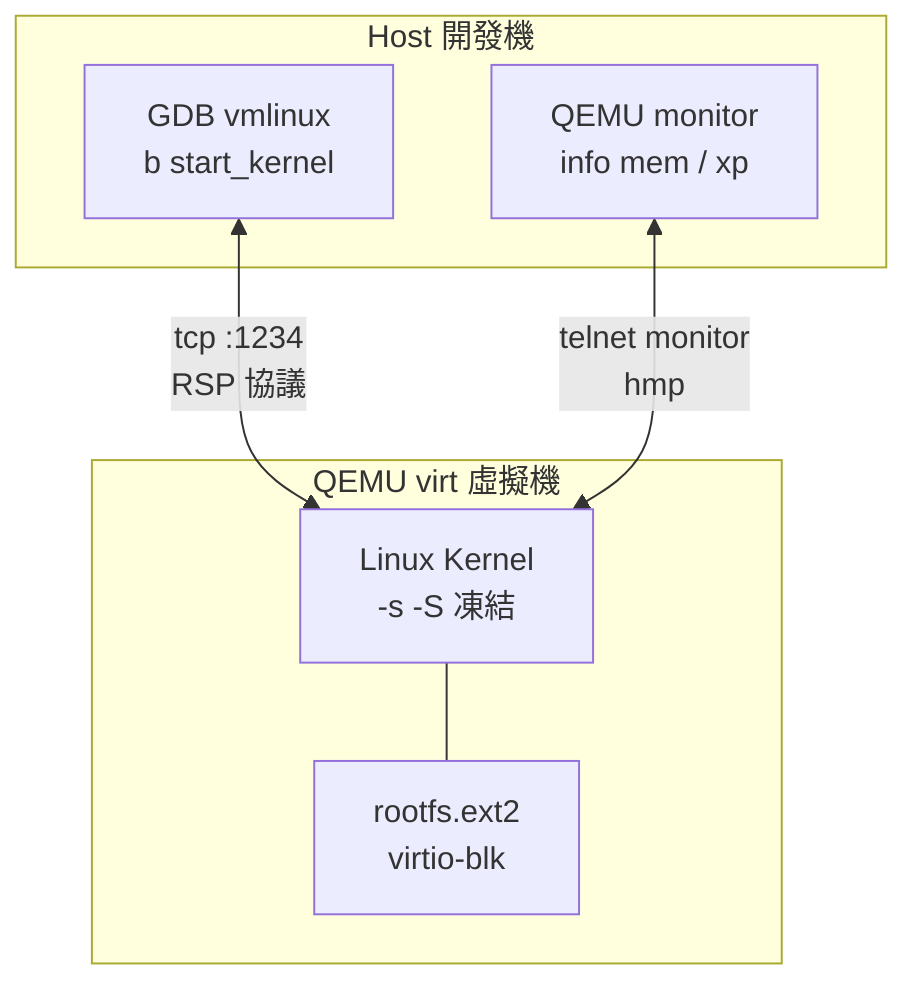

# 17.4 QEMU 模擬器環境搭建與 Linux 內核 GDB 除錯實戰

## 動機：核心當機（Panic）時，如何像除錯應用程式一樣單步？

`printk` 是黑盒除錯；`QEMU + GDB` 才是白盒手術刀：
QEMU 的 `-s -S` 把整個虛擬機變成 GDB Stub，
`riscv64-linux-gnu-gdb vmlinux` 可在 `start_kernel` 下斷點、單步組語、
看 `satp/stvec` CSR、追 `page_fault`。本節給出一套可重現的除錯 SOP。

核心觀念：**QEMU 是時光機，GDB 是顯微鏡，兩者相加等於核心除錯自由**。

## 17.4.1 環境搭建：工具鏈＋核心＋根檔系統

```bash
# 1. 工具鏈與依賴（Debian/Ubuntu）
sudo apt install gcc-riscv64-linux-gnu gdb-multiarch qemu-system-misc
# 2. 編譯核心
export ARCH=riscv CROSS_COMPILE=riscv64-linux-gnu-
make defconfig && make -j$(nproc) Image
# 3. 準備根檔系統（BusyBox 或現成 rootfs.ext2）
qemu-system-riscv64 -machine virt -nographic -bios default \
  -kernel arch/riscv/boot/Image \
  -append "console=ttyS0 root=/dev/vda ro" \
  -drive file=rootfs.ext2,if=none,format=raw,id=hd0 \
  -device virtio-blk-device,drive=hd0,bus=virtio-mmio-bus.0
# 看到 "Freeing unused kernel image memory" 即完成開機
```

## 17.4.2 GDB 連線：凍結虛擬機，下斷點

```bash
# 終端 A：凍結開機（-S）並暴露 GDB stub（-s = -gdb tcp::1234）
qemu-system-riscv64 -machine virt -nographic -bios default \
  -kernel arch/riscv/boot/Image \
  -append "console=ttyS0 root=/dev/vda ro nokaslr" \
  -drive file=rootfs.ext2,if=none,format=raw,id=hd0 \
  -device virtio-blk-device,drive=hd0,bus=virtio-mmio-bus.0 \
  -s -S
# 終端 B：連線除錯（nokaslr 讓符號位址與 vmlinux 一致！）
riscv64-linux-gnu-gdb ./vmlinux
(gdb) target remote :1234
(gdb) b start_kernel
(gdb) c
(gdb) b paging_init
(gdb) p/x $satp
(gdb) stepi            # 單步組語，追 head.S 跳高位
(gdb) info registers a0 a7 sepc stvec
```

常用斷點：`start_kernel`、`setup_arch`、`paging_init`、
`do_page_fault`、`do_trap_ecall_u`。`nokaslr`（關位址隨機）是新手第一坑：
不加它，符號位址全錯，斷點永遠不停。

## 17.4.3 實戰劇本：追一次缺頁異常

```bash
# GDB 腳本版：自動追缺頁（可存為 debug.gdb，用 -x 載入）
# file ./vmlinux
# target remote :1234
# b do_page_fault
# c
# bt          # 進程堆疊回溯
# p/x $stval  # 出錯 VA（Bad Address）
# p/x $scause # 12=指令缺頁，13=讀缺頁，15=寫缺頁
# monitor info mem  # QEMU monitor 看記憶體映射
```

| 技巧 | 命令 | 用途 |
|---|---|---|
| 看頁表 | `monitor info mem` / `xp` | QEMU 視角的 VA→PA |
| 看 CSR | `p/x $satp`、`p/x $stvec` | 確認分頁/向量是否切換 |
| 看裝置樹 | `p/x $a1`（開機時 DTB 位址） | 對照 `setup_arch` 參數 |
| 非停機追蹤 | `-d int,mmu -D qemu.log` | 不凍結，只記錄中斷與 MMU 事件 |



## 本節小結

- 三件套：交叉工具鏈＋`Image`＋`rootfs`，QEMU `virt`＋`-bios default` 跑起來。
- `-s -S`＋`target remote :1234`＋`nokaslr` 是 GDB 除錯的標準起手式。
- 斷點看流程（`start_kernel/paging_init`），`stval/scause` 看異常，`monitor` 看硬體視角。

## 想一想

1. 為何除錯核心一定要 `nokaslr`，而除錯使用者程式通常不必？KASLR（核心位址隨機化）防什麼？
2. `stepi` 單步 `head.S` 時，GDB 顯示的位址是 VA 還是 PA？`satp` 切換前後有何變化？
3. `monitor info mem` 看到的映射與核心內 `cat /proc/iomem` 有何視角差異？誰更接近硬體真相？
