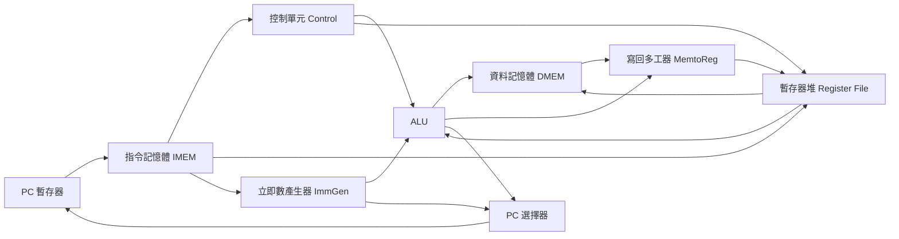

# 5.1 單週期處理器與資料路徑

單週期處理器（Single-Cycle Processor）是最直觀的 RISC-V 硬體實作：每條指令在一個時脈週期（Clock Cycle）內走完「取指—解碼—執行—存取—寫回」全程。它是理解資料路徑（Datapath）與控制單元（Control Unit）的起點，也是後續管線化（Pipelining）的對照基準。

## 5.1.1 動機：為何先學單週期？

初學者常問：既然沒人用單週期做產品，為何要學？答案有三：第一，單週期把指令集架構（ISA）到硬體的對應關係攤開，一條 `add` 如何驅動暫存器堆（Register File）與算術邏輯單元（ALU）一目了然；第二，控制訊號（Control Signals）的真值表在此最完整，管線只是把它切開加暫存器；第三，效能瓶頸在此最誠實——時脈週期（Cycle Time）由最慢的指令決定。

> 核心觀念：單週期的 CPI（Cycles Per Instruction）恆為 1，但時脈只能配合最慢路徑，整體效能反而最差。

## 5.1.2 核心講解：五大元件與控制訊號

單週期資料路徑由五大元件組成：程式計數器（PC）、指令記憶體（Instruction Memory）、暫存器堆（Register File）、ALU、資料記憶體（Data Memory），外加立即數產生器（Immediate Generator）與控制單元。

| 元件 | 功能 | 關鍵輸入 / 輸出 |
|------|------|-----------------|
| PC（Program Counter） | 保存目前指令位址 | 輸入 `PCNext`，輸出 `PC` |
| 指令記憶體（IMEM） | 以 PC 取出 32-bit 指令 | 輸入 `PC`，輸出 `instr` |
| 暫存器堆（Register File） | 32 個通用暫存器（x0–x31） | 讀出 `RD1/RD2`，寫入 `WD3` |
| 立即數產生器（ImmGen） | 由 opcode 展開立即數 | R/I/S/B/U/J 格式解碼 |
| ALU（Arithmetic Logic Unit） | 算術邏輯運算與分支比較 | `ALUControl` 選擇運算 |
| 資料記憶體（DMEM） | Load/Store 的記憶體 | `MemWrite` 控制寫入 |

控制單元根據 `opcode` 產生 9 個控制訊號，其真值表如下：

| 指令 | `RegWrite` | `ALUSrc` | `MemWrite` | `MemRead` | `MemtoReg` | `Branch` | `Jump` | `ALUOp` |
|------|------------|----------|------------|-----------|------------|----------|--------|---------|
| R-type（`add`） | 1 | 0 | 0 | 0 | 0 | 0 | 0 | 10 |
| `lw` | 1 | 1 | 0 | 1 | 1 | 0 | 0 | 00 |
| `sw` | 0 | 1 | 1 | 0 | x | 0 | 0 | 00 |
| `beq` | 0 | 0 | 0 | 0 | x | 1 | 0 | 01 |
| `jal` | 1 | x | 0 | 0 | 2 | 0 | 1 | xx |

以下虛擬碼（Pseudo-code）展示單週期如何用組合邏輯（Combinational Logic）走完一條指令：

```text
// 單週期指令執行虛擬碼：每個週期執行一次
PCNext = PC + 4
instr = IMEM[PC]
(rs1, rs2, rd, imm) = Decode(instr)
if RegWrite: RD1 = RF[rs1], RD2 = RF[rs2]
ALUIn2 = (ALUSrc) ? imm : RD2
(ALUResult, Zero) = ALU(RD1, ALUIn2, ALUControl)
if MemRead:  ReadData = DMEM[ALUResult]
if MemWrite: DMEM[ALUResult] = RD2
if Branch & Zero: PCNext = PC + imm
if Jump:         PCNext = (instr is JALR) ? (RD1+imm)&~1 : PC + imm
if RegWrite: RF[rd] = select(MemtoReg, ALUResult, ReadData, PC+4)
PC = PCNext
```

## 5.1.3 Verilog 範例：頂層資料路徑組裝

下面是單週期 RV32I 頂層模組的骨架，展示各子模組如何以線網（Wire）串接：

```verilog
// 單週期 RV32I 頂層：single_cycle_top
module single_cycle_top (
  input  wire        clk, rst_n,
  output wire [31:0] pc_o, alu_result_o
);
  wire [31:0] pc, pc_next, instr, rd1, rd2, imm, alu_b, alu_out, rdata, wd3;
  wire [3:0]  alu_ctrl;
  wire        reg_write, alu_src, mem_write, mem_read, zero;
  wire [1:0]  mem_to_reg, alu_op;
  wire        branch, jump;

  pc_reg u_pc (.clk(clk), .rst_n(rst_n), .d(pc_next), .q(pc));
  imem     u_imem (.addr(pc), .instr(instr));
  control  u_ctrl (.opcode(instr[6:0]), .reg_write(reg_write),
                   .alu_src(alu_src), .mem_write(mem_write),
                   .mem_read(mem_read), .mem_to_reg(mem_to_reg),
                   .branch(branch), .jump(jump), .alu_op(alu_op));
  regfile  u_rf (.clk(clk), .ra1(instr[19:15]), .ra2(instr[24:20]),
                 .wa(instr[11:7]), .wd(wd3), .we(reg_write),
                 .rd1(rd1), .rd2(rd2));
  immgen   u_imm (.instr(instr), .imm(imm));
  alu      u_alu (.a(rd1), .b(alu_b), .ctrl(alu_ctrl),
                  .result(alu_out), .zero(zero));
  dmem     u_dm (.clk(clk), .addr(alu_out), .wdata(rd2),
                 .we(mem_write), .rdata(rdata));
  // 次態邏輯：分支與跳躍決定下一個 PC
  assign alu_b   = alu_src ? imm : rd2;
  assign pc_next = jump ? pc + imm : (branch & zero) ? pc + imm : pc + 4;
  assign wd3     = (mem_to_reg == 2'b01) ? rdata :
                   (mem_to_reg == 2'b10) ? pc + 4 : alu_out;
  assign pc_o = pc;
  assign alu_result_o = alu_out;
endmodule
```

另一個必備小模組是硬連線零（Hard-wired Zero）的暫存器堆寫入保護：

```verilog
// 暫存器堆：x0 恆為零，寫入 x0 直接丟棄
always @(posedge clk) begin
  if (we && (wa != 5'd0)) rf[wa] <= wd;
end
```

## 5.1.4 資料路徑圖



上圖的關鍵路徑（Critical Path）是 `PC → IMEM → RF → ALU → DMEM → MUX → RF`，它決定了時脈週期下限。任何想超頻的嘗試都會在這條鏈上失敗。

> 對應範例：[`_code/ch05/`](_code/ch05/README.md) 有可模擬的單週期核心（`singlecycle.v`＋自檢 testbench），`make -C _code/ch05` 應印出 `PASS`。

## 5.1.5 本節小結

- 單週期用「一指令一週期」換取最簡單的控制邏輯，是硬體入門的最佳模型。
- 資料路徑五元件 + 立即數產生器 + 控制單元，足以執行完整 RV32I 整數指令。
- CPI = 1 不代表快：時脈週期被 `lw`（取指＋讀暫存器＋ALU＋讀記憶體＋寫回）綁死。
- 下一步是把這條長路徑切成五段，亦即 5.2 節的五階管線。

## 5.1.6 想一想

1. 若 `lw` 的關鍵路徑為 8ns，其餘指令皆短於 6ns，單週期最高時脈為何？平均 CPI 為 1 時，每秒能執行幾條指令？
2. 試在紙上追蹤 `add x3, x1, x2`：列出 `RegWrite`、`ALUSrc`、`MemtoReg` 的值，並指出寫回資料來源。
3. ★★ 實作題：用 Icarus Verilog 完成 `alu.v` 與 `immgen.v`，以 `addi x1, x0, 42` 做單元測試。
