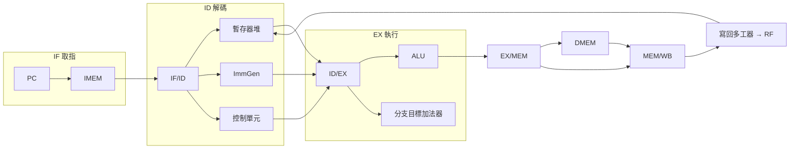

# 5.2 五階管線架構

經典五階管線（Classic 5-Stage Pipeline）把單週期的長路徑切成 IF、ID、EX、MEM、WB 五級，讓五條指令重疊執行，理想吞吐率（Throughput）提升五倍。它是 MIPS 與早期 RISC-V 教學核心的標準骨架。

## 5.2.1 動機：從洗衣店理解管線

管線的直覺是洗衣店：洗衣（IF）、烘乾（ID）、摺疊（EX）、包裝（MEM）、取件（WB）可同時服務五位客人。處理器同理：當第一條指令在執行（EX）時，下一條已在解碼（ID），再下一條正在取指（IF）。吞吐率上升，但單條指令的延遲（Latency）並未縮短——這是初學者最易誤解之處。

> 核心觀念：管線提升的是吞吐率（Throughput），不是單條指令延遲；速度由最慢的一級決定。

## 5.2.2 核心講解：五級職責與管線暫存器

五級之間插入管線暫存器（Pipeline Registers）`IF/ID`、`ID/EX`、`EX/MEM`、`MEM/WB`，每級職責如下：

| 階段 | 縮寫 | 職責 | 關鍵硬體 |
|------|------|------|----------|
| 取指（Instruction Fetch） | IF | `PC+4`，從 IMEM 取指令 | PC、IMEM、加法器 |
| 解碼（Instruction Decode） | ID | 讀暫存器堆、產生立即數、解控制訊號 | RF、ImmGen、Control |
| 執行（Execute） | EX | ALU 運算、分支目標計算 | ALU、分支比較器 |
| 記憶體（Memory Access） | MEM | Load/Store 存取 DMEM | DMEM |
| 寫回（Write Back） | WB | 寫回暫存器堆 | 寫回多工器 |

各級耗時若不平衡，管線時脈仍受最慢級限制：

| 設計 | IF | ID | EX | MEM | WB | 管線時脈 | 5 條指令耗時 |
|------|----|----|----|-----|----|----------|--------------|
| 單週期等效 | — | — | — | — | — | 8.0ns | 40ns |
| 平衡管線 | 1.6ns | 1.8ns | 2.0ns | 2.0ns | 1.2ns | 2.0ns | 14ns（5+4 級填管） |

管線控制的虛擬碼展示每級暫存器的推進（Advance）語意：

```text
// 五階管線每週期行為（無冒險時）
MEM/WB <= (ReadData, ALUResult_MEM, rd_MEM, RegWrite_MEM)
EX/MEM <= (ALUResult, WriteData, rd_EX, MemWrite_EX, MemRead_EX)
ID/EX  <= (RD1, RD2, imm, rs1, rs2, rd, Ctrl_ID)
IF/ID  <= (instr, PC+4)
PC     <= PC + 4   // 無分支時
```

分支與跳躍在此需要特別處理：最早可在 ID 級比對（Compare）出 `beq` 結果，代價是多一組比較器；若放在 EX 級，則誤測懲罰（Mispredict Penalty）多一個週期。

## 5.2.3 Verilog 範例：管線暫存器與級間傳遞

管線暫存器的本質是帶使能（Enable）與清除（Flush）的 D 暫存器陣列：

```verilog
// ID/EX 管線暫存器：stall 時保持，flush 時清空控制訊號
module id_ex_reg (
  input  wire        clk, rst_n, stall, flush,
  input  wire [31:0] rd1_in, rd2_in, imm_in, pc_in,
  input  wire [4:0]  rs1_in, rs2_in, rd_in,
  input  wire [8:0]  ctrl_in,   // 打包的控制訊號
  output reg  [31:0] rd1_out, rd2_out, imm_out, pc_out,
  output reg  [4:0]  rs1_out, rs2_out, rd_out,
  output reg  [8:0]  ctrl_out
);
  always @(posedge clk or negedge rst_n) begin
    if (!rst_n) begin
      {rd1_out, rd2_out, imm_out, pc_out} <= 0;
      {rs1_out, rs2_out, rd_out} <= 0;
      ctrl_out <= 9'b0;                 // flush 等效：插入 NOP
    end else if (flush) begin
      ctrl_out <= 9'b0;
    end else if (!stall) begin
      rd1_out <= rd1_in; rd2_out <= rd2_in;
      imm_out <= imm_in; pc_out <= pc_in;
      rs1_out <= rs1_in; rs2_out <= rs2_in; rd_out <= rd_in;
      ctrl_out <= ctrl_in;
    end
    // stall 時：保持原值，相當於插入氣泡上游停頓
  end
endmodule
```

EX 級的 ALU  Datapath  只需把運算元改接管線暫存器輸出：

```verilog
// EX 級組合邏輯：運算元來自 ID/EX，而非直接 RF
assign alu_a = rd1_ex;                          // 無 forwarding 時
assign alu_b = alu_src_ex ? imm_ex : rd2_ex;
alu u_alu (.a(alu_a), .b(alu_b), .ctrl(alu_ctrl_ex),
           .result(alu_result), .zero(zero_ex));
assign branch_target = pc_ex + imm_ex;
assign branch_taken  = branch_ex & (zero_ex ^ branch_inv_ex);
```

## 5.2.4 五階管線資料路徑圖



理想情況下每週期完成一條指令（CPI = 1）；一旦發生冒險（Hazard，見 5.3 節），就必須插入氣泡（Bubble）或停頓（Stall），CPI 隨之惡化。

## 5.2.5 本節小結

- 五階管線以四組管線暫存器換取指令級並行（ILP），理想加速比趨近級數。
- 每級職責單一，控制訊號隨指令逐級攜帶，`flush` 即把控制訊號清零為 NOP。
- 管線深度加深會放大分支懲罰與 forwarding 路徑，這正是 5.3 節要處理的代價。
- 記住：延遲沒變小，只是重疊了；效能公式變成「時間＝指令數 × CPI × 週期」。

## 5.2.6 想一想

1. 若 MEM 級需 3ns、其餘各 1.5ns，管線時脈為何？此時加深管線還有意義嗎？
2. 為何 `flush` 只需清除控制訊號，而不需清除資料欄位？
3. ★★ 實作題：為你的單週期處理器插入 `IF/ID` 與 `ID/EX`，先做成兩級管線並用 `addi` 序列驗證。
