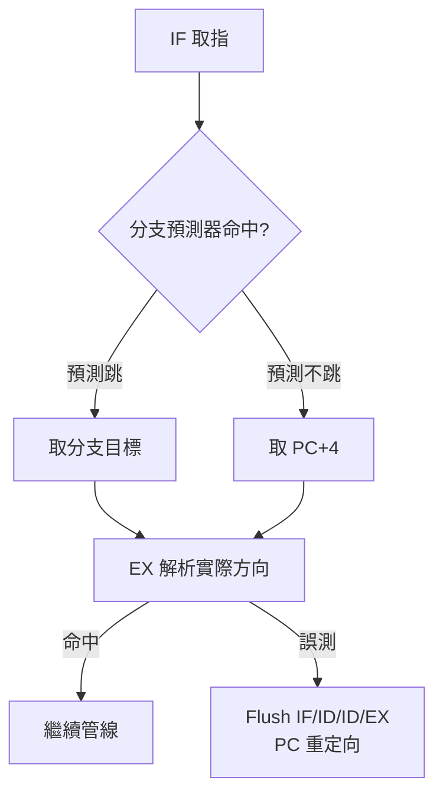

# 5.3 管線冒險與 Forwarding/分支預測

管線冒險（Pipeline Hazards）是管線化唯一的敵人：相鄰指令的資料相依（Data Dependence）、資源衝突與分支改寫 PC，都會破壞「每週期一條指令」的美夢。本節分類三大冒險，並給出轉發（Forwarding）與分支預測（Branch Prediction）的標準解法。

## 5.3.1 動機：為何管線總是停下來？

考慮連續三條指令 `add x1,… / sub x2,x1,… / lw x3,0(x2)`：第二條需要的 `x1` 還在 EX/MEM 裡，第三條需要的 `x2` 甚至還沒算出來。若不處理，管線會讀到舊值而算錯。更糟的是 `beq`：要到 EX 級才知道跳不跳，後面兩條已取進來了。冒險處理就是在正確性與效能之間做取捨的藝術。

> 核心觀念：冒險分三類——缺資源叫結構冒險，缺資料叫資料冒險，PC 被改寫叫控制冒險。

## 5.3.2 結構冒險（Structural Hazards）

結構冒險指兩條指令同時搶同一硬體資源。經典案例是單一記憶體同時服務 IF 取指與 MEM 存取：

```text
// 週期 t：instr[i] 在 MEM 存取 DMEM，同時 instr[i+3] 在 IF 取指
MEM: lw x5, 0(x6)   -> 需要 Memory port
IF : add x7, x8, x9 -> 也需要 Memory port  // 衝突！
```

| 成因 | 典型案例 | 解法 | 代價 |
|------|----------|------|------|
| 取指與訪存共用記憶體埠 | 單埠 SRAM 同時 IF/MEM | 哈佛架構（Harvard）：IMEM/DMEM 分離 | 面積加倍 |
| 暫存器堆讀寫埠不足 | ID 讀與 WB 寫同週期同暫存器 | 寫入優先旁路（Write-first Bypass） | 多一組多工器 |
| 除法器等長延遲單元被占用 | 連續 `div` 指令 | 流水線化功能單元或記分板停頓 | 設計複雜度 |

Verilog 上最常見的是暫存器堆「同週期寫後讀」旁路：

```verilog
// 暫存器堆讀埠：同位址同週期寫入時直接旁路寫入資料
assign rd1 = (we && (wa == ra1) && (wa != 5'd0)) ? wd : rf[ra1];
assign rd2 = (we && (wa == ra2) && (wa != 5'd0)) ? wd : rf[ra2];
```

## 5.3.3 資料冒險（Data Hazards）與轉發

資料冒險來自真實相依（RAW, Read After Write），分三種處理等級：編譯器排程（Scheduling）、轉發（Forwarding）、停頓（Stall）。轉發把 EX/MEM 與 MEM/WB 的結果直接送回 ALU 輸入：

| 相依距離 | 範例 | 解法 | 氣泡數 |
|----------|------|------|--------|
| EX → EX（距離 1） | `add x1 / sub x2,x1` | EX/MEM → ALU 轉發 | 0 |
| MEM → EX（距離 2） | `add x1 / nop / sub x2,x1` | MEM/WB → ALU 轉發 | 0 |
| Load-use（載入後立即用） | `lw x1 / add x2,x1` | 轉發來不及，必須停頓一拍 | 1 |
| 距離 ≥3 | 中間隔兩條以上 | 暫存器堆自然寫回，無需處理 | 0 |

轉發單元（Forwarding Unit）的虛擬碼是每本教科書的必考題：

```text
// ForwardA / ForwardB 決策（EX 級）
if (RegWrite_MEM && rd_MEM != 0 && rd_MEM == rs1_EX) ForwardA = 2'b10
else if (RegWrite_WB && rd_WB != 0 && rd_WB == rs1_EX) ForwardA = 2'b01
else ForwardA = 2'b00
// rs2 同理得到 ForwardB；MEM 優先於 WB（較新的值優先）
```

對應的 Verilog 多工器如下：

```verilog
// EX 級 ALU 運算元選擇：00=RF, 10=EX/MEM, 01=MEM/WB
always @(*) begin
  case (forward_a)
    2'b10:   alu_a = alu_result_mem;
    2'b01:   alu_a = writeback_data;
    default: alu_a = rd1_ex;
  endcase
end
```

而 load-use 冒險必須由冒險偵測單元（Hazard Detection Unit）插入停頓：

```verilog
// Load-use 偵測：ID 級發現 EX 級是 lw 且暫存器相依 -> stall
assign load_use = mem_read_ex &&
  ((rd_ex == rs1_id) || (rd_ex == rs2_id)) && (rd_ex != 5'd0);
assign stall = load_use;   // PC 與 IF/ID 保持，ID/EX 插入 NOP
```

## 5.3.4 控制冒險（Control Hazards）與分支預測

控制冒險來自 PC 突變：`beq`/`jal`/`jalr` 要到 EX（或 ID）才知目標，期間取進的指令可能全錯。解法由簡到繁：

| 策略 | 做法 | 誤測懲罰（5 級管線） | 適用場景 |
|------|------|----------------------|----------|
| 停頓（Stall） | 遇到分支就等 | 2–3 氣泡 | 教學模型 |
| 預測不跳（Predict-Not-Taken） | 預設 PC+4，錯了再 flush | 命中 0、誤測 2 | 簡單核心 |
| 分支目標緩衝（BTB）+ 2-bit 飽和計數器 | 查表預測方向與目標 | 誤測 2，但命中率高 | 超純量前端 |
| 延遲分支（Delayed Branch） | 分支後一槽恆執行（MIPS 做法） | 0（需編譯器填槽） | 歷史方案，RISC-V 不用 |

2-bit 飽和計數器（Saturating Counter）的狀態機虛擬碼：

```text
// 2-bit 分支預測器：00 強不跳，11 強跳
state in {SN(00), WN(01), WT(10), ST(11)}
if (branch_taken)  state = min(state + 1, ST)
else               state = max(state - 1, SN)
prediction = (state >= WT) ? TAKEN : NOT_TAKEN
```



## 5.3.5 解法總表

| 冒險類型 | 偵測位置 | 解法 | 硬體單元 |
|----------|----------|------|----------|
| 結構冒險 | 設計期 | IMEM/DMEM 分離、寫入優先旁路 | 雙記憶體埠 |
| 資料冒險（ALU 相依） | EX 級 | 轉發（Forwarding） | Forwarding Unit + 2 組 MUX |
| 資料冒險（Load-use） | ID 級 | 停頓一拍（Stall + Bubble） | Hazard Detection Unit |
| 控制冒險 | IF/ID/EX | 預測不跳 / BTB + 2-bit 計數器 + Flush | Branch Predictor、沖刷邏輯 |

## 5.3.6 本節小結

- 結構冒險靠加資源根治，資料冒險靠轉發消除一大半，剩 load-use 一拍停頓無法避免。
- 控制冒險的本質是「PC 猜錯」，預測器把平均懲罰壓低，但誤測沖刷（Flush）永遠存在。
- 記住優先順序口訣：轉發先看 MEM（新值），再看 WB（舊值）；停頓只對 load-use。
- 下一章超純量會把這些問題放大 N 倍：多發射意味著多組相依檢查。

## 5.3.7 想一想

1. 為何 load-use 無法用轉發解決？畫出 `lw` 的 MEM 級與下一條 EX 級的時序重疊說明之。
2. 2-bit 計數器為何比 1-bit 更能容忍迴圈最後一次跳出？以 `for(i=0;i<10;i++)` 追蹤狀態變化。
3. ★★★ 實作題：在你的五階管線加入 Forwarding Unit，用 `add/sub/xor` 相依鏈與 `lw/add` 序列驗證氣泡數。
