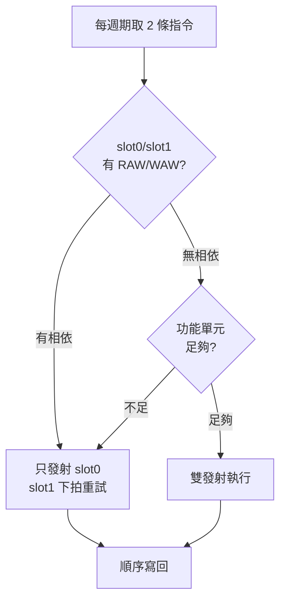

# 6.1 超純量與多發射

超純量（Superscalar）處理器每個週期取指、解碼、發射（Issue）多條指令，靠指令級並行（ILP, Instruction-Level Parallelism）突破「每週期一條」的上限。發射寬度（Issue Width）為 N 的核心，理想 IPC（Instructions Per Cycle）可達 N。

## 6.1.1 動機：單條管線跑到盡頭了

五階管線的 CPI 下限是 1，但加深管線會放大分支懲罰，加快時脈會撞上功耗牆。超純量的思路是「加寬而非加深」：同一個時脈下做更多事。伺服器與手機 SoC 的高效能核心（如 Cortex-X、Apple Avalanche）皆為 4–8 發射寬度，RISC-V 的 BOOM 與 XiangShan 亦然。

> 核心觀念：超純量用硬體動態找相依指令之外的並行；寬度加倍，旁路網路與相依檢查以平方成長。

## 6.1.2 核心講解：發射、相依檢查與順序發射

雙發射（2-way）管線每週期從取指佇列拿兩條指令，需檢查三類相依：

| 相依類型 | 意義 | 範例 | 解法 |
|----------|------|------|------|
| 真相依（RAW） | 後讀先寫的結果 | `add x1 / sub x2,x1` | 同拍轉發或順序發射 |
| 反相依（WAR） | 後寫蓋掉先讀 | `add x2,x1 / add x1,x3` | 暫存器更名（Renaming，見 6.2） |
| 輸出相依（WAW） | 兩寫同一暫存器 | `add x1 / mul x1` | 更名或順序寫回 |

順序發射（In-order Issue）是最簡單的超純量：按程式順序發射，若第二條與第一條相關則整拍停頓。其虛擬碼如下：

```text
// 雙發射順序發射邏輯（每週期）
(slot0, slot1) = Fetch2(PC)
if (hasRAW_WAR_WAW(slot0, slot1)) {
  issue(slot0); stall(slot1); PC += 4;
} else if (functionalUnitAvailable(slot0, slot1)) {
  issue(slot0, slot1); PC += 8;
} else {
  issue(slot0); stall(slot1); PC += 4;  // 結構冒險：功能單元不足
}
```

功能單元（Functional Units）通常不對稱配置：兩條 ALU 管線但只有一條 Load/Store 與一條分支管線：

| 管線 | 可執行指令 | 數量（典型 3 發射） |
|------|------------|---------------------|
| ALU-0 / ALU-1 | R/I-type 算術邏輯 | 2 |
| LSU（Load Store Unit） | Load/Store、位址產生 | 1 |
| BRU（Branch Unit） | Branch/Jump、分支預測 | 與 ALU 複用或獨立 1 |

## 6.1.3 Verilog 範例：雙發射相依檢查與發射選擇

```verilog
// 雙發射相依檢查：slot1 是否與 slot0 相關？
module dual_issue_check (
  input  wire [4:0] rd0, rs1_1, rs2_1, rd1,
  input  wire       reg_write0, reg_write1,
  input  wire       mem_read0, mem_write1,
  output wire       stall_slot1
);
  wire raw = reg_write0 && (rd0 != 5'd0) &&
             ((rd0 == rs1_1) || (rd0 == rs2_1));
  wire waw = reg_write0 && reg_write1 && (rd0 != 5'd0) && (rd0 == rd1);
  wire war = reg_write1 && (rd1 != 5'd0) &&
             ((rd1 == 5'd0) ? 1'b0 : 1'b0); // 順序發射下 WAR 自然滿足，保留檢查點
  wire struct_hazard = mem_read0 && (mem_write1 || mem_read1_inside());
  assign stall_slot1 = raw | waw | struct_hazard;
  function mem_read1_inside; // 簡化：slot1 是否為訪存指令由外部傳入
    input dummy; mem_read1_inside = dummy;
  endfunction
endmodule
```

發射後的寫回仲裁（Arbitration）也需處理雙寫埠：

```verilog
// 雙寫埠暫存器堆：兩槽同時寫不同暫存器；同暫存器時 slot1（較新）優先
always @(posedge clk) begin
  if (we0 && (wa0 != 5'd0)) rf[wa0] <= wd0;
  if (we1 && (wa1 != 5'd0)) rf[wa1] <= wd1; // 後寫覆蓋，保證程式順序
end
```

## 6.1.4 發射流程圖



## 6.1.5 本節小結

- 超純量以硬體複雜度換 IPC：2 發射約需 2 倍旁路與相依檢查邏輯，但很少拿到 2 倍效能。
- 順序超純量無法消除 WAR/WAW 造成的假相依（False Dependence），必須靠 6.2 節的暫存器更名。
- 記憶體相依（Memory Dependence）與分支誤測是寬發射真正的殺手，LSU 需配備 Store Queue。
- 設計口訣：先量 ILP（基本塊平均長度），再定寬度；編譯器展開迴圈（Unrolling）與超純量是天作之合。

## 6.1.6 想一想

1. 若基本塊（Basic Block）平均 5 條指令、分支誤測率 10%，4 發射核心的實際 IPC 上限約多少？
2. 為何雙發射通常配 2 個 ALU 卻只配 1 個 LSU？從指令混合（Instruction Mix）比例解釋。
3. ★★ 實作題：為五階管線加第二條 ALU 管線，只處理 `add/sub/and/or`，統計 `rv32ui` 測試的雙發射成功率。
