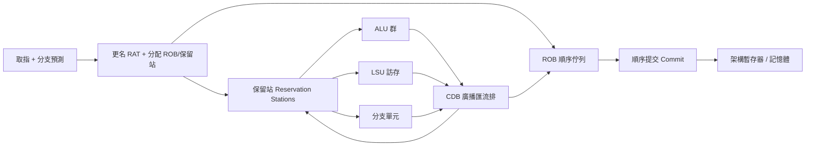

# 6.2 亂序執行與保留站

亂序執行（Out-of-Order Execution, OoO）允許指令繞過停頓的先行指令先執行，再按程式順序提交（Commit），從而挖出超純量看不到的並行。保留站（Reservation Stations）與重排序緩衝器（ROB, Re-Order Buffer）是 Tomasulo 演算法的兩大支柱。

## 6.2.1 動機：為何順序發射不夠？

典型卡ROW 序列：`lw x1,0(x2)`（快取未命中，罰數十週期）後面跟著無關的 `add x5,x6,x7`。順序核心只能乾等，功能單元閒置。OoO 讓 `add` 繞過 `lw` 先執行，等 `lw` 回來再提交，記憶體延遲被計算覆蓋（Overlap）。現代高效能 RISC-V（如 BOOM、XiangShan）皆為 OoO。

> 核心觀念：執行（Execute）可亂序，但提交（Commit）必須順序——中斷與異常看到的永遠是精確狀態（Precise State）。

## 6.2.2 核心講解：Tomasulo 三步與暫存器更名

Tomasulo 流程分為發射（Issue）、執行（Execute）、寫回（Write-back/Commit）三步，關鍵是暫存器更名（Register Renaming）消除 WAR/WAW 假相依：

| 機制 | 解決的問題 | 做法 |
|------|------------|------|
| 保留站（Reservation Station） | RAW 等待操作數 | 操作數未就緒先在保留站等，廣播（Broadcast）到齊即發射 |
| 暫存器更名（Renaming） | WAR / WAW 假相依 | 架構暫存器（x1–x31）映射到更多實體暫存器（Physical Registers），由 RAT（Register Alias Table）記錄 |
| ROB（Re-Order Buffer） | 順序提交與精確異常 | 指令按取指順序入 ROB，按順序提交，誤測或異常時清空後續項 |
| 公共資料匯流排（CDB） | 結果廣播 | 功能單元結果同時寫 ROB、保留站與 RAT，喚醒等待者 |

以下虛擬碼展示更名與發射：

```text
// 更名 + 發射（簡化，實體暫存器池 P0..P63）
// 假設 RAT[x] 記錄架構暫存器 x 目前對應的實體暫存器
rename(instr):
  ps1 = RAT[rs1]; ps2 = RAT[rs2]          // 讀映射（WAR/WAW 在此斷開）
  pd  = allocPhysical() if rd != x0       // 分配新實體暫存器
  rob.push({instr, pd, old_pd = RAT[rd]}) // 記錄舊映射以便誤測回復
  if rd != x0: RAT[rd] = pd
  rs_entry = {op, ps1, ps2, pd, ready = checkReady(ps1, ps2)}
execute: 當保留站操作數 ready 且功能單元空閒 -> 發射執行
commit: ROB 頭指令完成且無異常 -> 寫架構狀態，回收 old_pd
```

保留站等待與喚醒的本質是標籤比較（Tag Compare），對應 Verilog 見下節。

## 6.2.3 Verilog 範例：保留站喚醒邏輯

```verilog
// 保留站條目：等待 CDB 廣播的標籤（tag），到齊即就緒
module reservation_entry (
  input  wire        clk, rst_n,
  input  wire        alloc,          // 分配此條目
  input  wire [5:0]  tag_dst_in,     // 本指令結果標籤（ROB 編號）
  input  wire [5:0]  tag1_in, tag2_in,
  input  wire        ready1_in, ready2_in,
  input  wire [31:0] val1_in, val2_in,
  input  wire        cdb_valid,      // 公共資料匯流排有效
  input  wire [5:0]  cdb_tag,
  input  wire [31:0] cdb_data,
  output reg         ready_out,      // 兩操作數皆就緒
  output reg  [31:0] op1_out, op2_out
);
  reg [5:0] tag1, tag2;
  reg       rdy1, rdy2;
  reg [31:0] val1, val2;
  always @(posedge clk or negedge rst_n) begin
    if (!rst_n) begin
      {rdy1, rdy2, ready_out} <= 0;
    end else if (alloc) begin
      tag1 <= tag1_in; tag2 <= tag2_in;
      rdy1 <= ready1_in; rdy2 <= ready2_in;
      val1 <= val1_in;  val2 <= val2_in;
    end else begin
      if (cdb_valid && (cdb_tag == tag1)) begin rdy1 <= 1'b1; val1 <= cdb_data; end
      if (cdb_valid && (cdb_tag == tag2)) begin rdy2 <= 1'b1; val2 <= cdb_data; end
    end
  end
  always @(*) begin
    ready_out = rdy1 & rdy2;
    op1_out = val1; op2_out = val2;
  end
endmodule
```

ROB 提交端的順序保證可用簡單的頭指標（Head Pointer）實現：只有頭項完成才提交，分支誤測時清空（Flush）所有 younger 項並從 RAT 檢查點（Checkpoint）回復。

```verilog
// ROB 提交判斷：頭項完成且無異常才提交
assign can_commit = rob_valid[head] & rob_done[head] & ~rob_exception[head];
assign flush_rob  = branch_mispredict | exception_taken;
```

## 6.2.4 亂序執行資料路徑圖



## 6.2.5 本節小結

- 保留站解決 RAW 等待，更名解決 WAR/WAW，ROB 解決順序提交，三者合體即 Tomasulo。
- CDB 是 OoO 的心臟也是瓶頸：發射寬度加倍，標籤比較埠與廣播線數平方成長。
- Load/Store 需額外的載入佇列（Load Queue）與儲存佇列（Store Queue）做記憶體相依推測（Memory Disambiguation）。
- 下一步的記憶體階層（6.3/6.4）決定了 `lw` 延遲的期望值，也就決定 OoO 視窗要開多大。

## 6.2.6 想一想

1. 為何 ROB 必須順序提交？試舉 `div x1`（很慢）後接 `sw x1` 再接外部中斷的例子說明精確異常。
2. 更名前後：`add x1,x2,x3 / sub x2,x1,x4 / mul x1,x5,x6` 有幾組真假相依？更名後剩幾組？
3. ★★★ 實作題：用 Python 模擬 4 項 ROB + 2 保留站，跑 `lw/add/sub` 序列，統計繞過執行節省的週期數。
