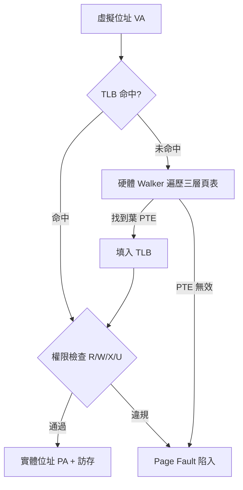

# 6.3 MMU 與 TLB

記憶體管理單元（MMU, Memory Management Unit）把虛擬位址（VA, Virtual Address）翻譯為實體位址（PA, Physical Address），是多工、保護與虛擬記憶體的分界線。轉譯後備緩衝器（TLB, Translation Lookaside Buffer）則是快取頁表轉譯結果的專用快取。

## 6.3.1 動機：為何不能直接用實體位址？

若程式直接操作實體位址，A 程式當機可踩爛 B 程式的記憶體，`malloc` 稍大就需連續實體塊。虛擬記憶體讓每個行程擁有獨立連續的位址空間，作業系統以分頁（Paging）映射到零散實體頁框（Page Frame），並以權限位（R/W/X、U/S）隔離。MMU 就是這層映射的硬體執行者。

> 核心觀念：MMU 管翻譯與檢查，頁表（Page Table）管政策，TLB 管速度；缺失（Miss）一律陷入軟體或硬體 Walker 處理。

## 6.3.2 核心講解：Sv39 三層頁表遍歷

RISC-V Sv39（39-bit VA、56-bit PA）用三層頁表，每層 9-bit 索引（512 項 × 8B = 4KB 一頁表頁）：

| 欄位 | 位元 | 說明 |
|------|------|------|
| VPN[2] / VPN[1] / VPN[0] | VA[38:30] / [29:21] / [20:12] | 三層索引 |
| offset | VA[11:0] | 頁內偏移（4KB 頁） |
| PTE（Page Table Entry） | 64-bit | 含 PPN、R/W/X、U、A/D 位 |
| `satp`（Supervisor Address Translation and Protection） | CSR | 模式（MODE）+ 根頁表 PPN（PPN）+ ASID |

頁表遍歷（Page Table Walk）虛擬碼：

```text
// Sv39 硬體 Walker 簡化流程（a = satp.PPN << 12）
pte_addr = satp.PPN * PAGESIZE + VPN[2] * 8
for level in {2, 1, 0}:
  pte = MEM[pte_addr]              // 讀 PTE
  if !pte.V:  page_fault()         // 有效位為 0
  if pte.R or pte.X:               // 找到葉 PTE（可為 1GB/2MB/4KB 頁）
    check_permission(pte, access)  // R/W/X + U/S + PMP 疊加檢查
    PA = {pte.PPN, offset(level)}  // 大頁保留低位 VPN 作偏移
    update_A_D_bits(pte)           // Accessed / Dirty
    return PA
  else: // 非葉節點，繼續下一層
    pte_addr = pte.PPN * PAGESIZE + VPN[level-1] * 8
page_fault()
```

權限檢查是常見考點：取指需 X，讀需 R，寫需 W（且 W=1 時 R 必須為 1，規範保留組合）；U=0 的頁在 S-Mode 需 `SUM` 才可存取。

## 6.3.3 Verilog 範例：全相連 TLB 查詢與 `sfence.vma`

```verilog
// 全相連 TLB：組合查詢 + 命中回傳 PPN 與權限
module tlb_cam #(
  parameter ENTRIES = 16
)(
  input  wire        clk, rst_n,
  input  wire [26:0] vpn_in,        // Sv39: VPN[2:0] 共 27-bit
  input  wire [15:0] asid_in,
  input  wire        flush_all,      // sfence.vma x0, x0
  input  wire        flush_vpn,      // sfence.vma rs1 != x0
  input  wire [26:0] flush_vpn_in,
  input  wire        fill_en,        // Walker 填入
  input  wire [26:0] fill_vpn,
  input  wire [43:0] fill_ppn,
  input  wire [7:0]  fill_flags,     // R/W/X/U/A/D...
  output wire        hit,
  output wire [43:0] ppn_out,
  output wire [7:0]  flags_out
);
  reg [26:0] tag [0:ENTRIES-1];
  reg [43:0] ppn [0:ENTRIES-1];
  reg [7:0]  flags [0:ENTRIES-1];
  reg        valid [0:ENTRIES-1];
  // 查詢：全相連比對（此處略去 ASID 全域頁簡化）
  wire [ENTRIES-1:0] match;
  genvar i;
  generate for (i = 0; i < ENTRIES; i = i+1) begin : g_match
    assign match[i] = valid[i] && (tag[i] == vpn_in);
  end endgenerate
  assign hit = |match;
  assign ppn_out = ppn[onehot_to_idx(match)];
  assign flags_out = flags[onehot_to_idx(match)];
  // 刷新與填入（時序邏輯，略去替換策略 LRU/隨機細節）
  always @(posedge clk or negedge rst_n) begin
    if (!rst_n) begin
      integer k; for (k = 0; k < ENTRIES; k = k+1) valid[k] <= 1'b0;
    end else if (flush_all) begin
      integer k; for (k = 0; k < ENTRIES; k = k+1) valid[k] <= 1'b0;
    end
    // flush_vpn / fill_en 處理依序補上
  end
  function [7:0] onehot_to_idx; input [ENTRIES-1:0] oh; integer j;
    begin onehot_to_idx = 0; for (j = 0; j < ENTRIES; j = j+1)
      if (oh[j]) onehot_to_idx = j; end
  endfunction
endmodule
```

軟體面切換位址空間時必須刷新 TLB：

```c
// Supervisor 切换页表：寫 satp 後刷新 TLB（RISC-V 特權指令序列）
// satp = (MODE_Sv39 << 60) | (ASID << 44) | root_ppn
csrw satp, t0
sfence.vma zero, zero   // 全量刷新：新頁表全域生效
```

## 6.3.4 轉譯流程圖



## 6.3.5 本節小結

- Sv39 遍歷最多 3 次記憶體存取，未命中懲罰巨大——TLB 命中率直接決定系統效能。
- TLB 是「帶權限的轉譯快取」：除了 VPN→PPN，還快取 R/W/X/U/A/D，`sfence.vma` 負責一致性。
- 大頁（Megapage 2MB、Gigapage 1GB）用「一項覆蓋更大範圍」緩解 TLB 壓力，是 HPC 與資料庫的常用優化。
- MMU 之上還有 PMP（Physical Memory Protection）做最後一道實體檢查，兩層疊加才完整。

## 6.3.6 想一想

1. 為何 `satp` 切換後必須 `sfence.vma`？若用 ASID 區分行程，能否只刷新部分 TLB？
2. 4KB 頁的 TLB 有 64 項，最多覆蓋多少記憶體？改用 2MB 大頁後覆蓋多少？這解釋了什麼？
3. ★★ 實作題：在 Spike 或 QEMU 下寫一個 S-Mode 小程式，配置兩級映射並故意觸發 Store Page Fault，觀察 `scause/stval`。
