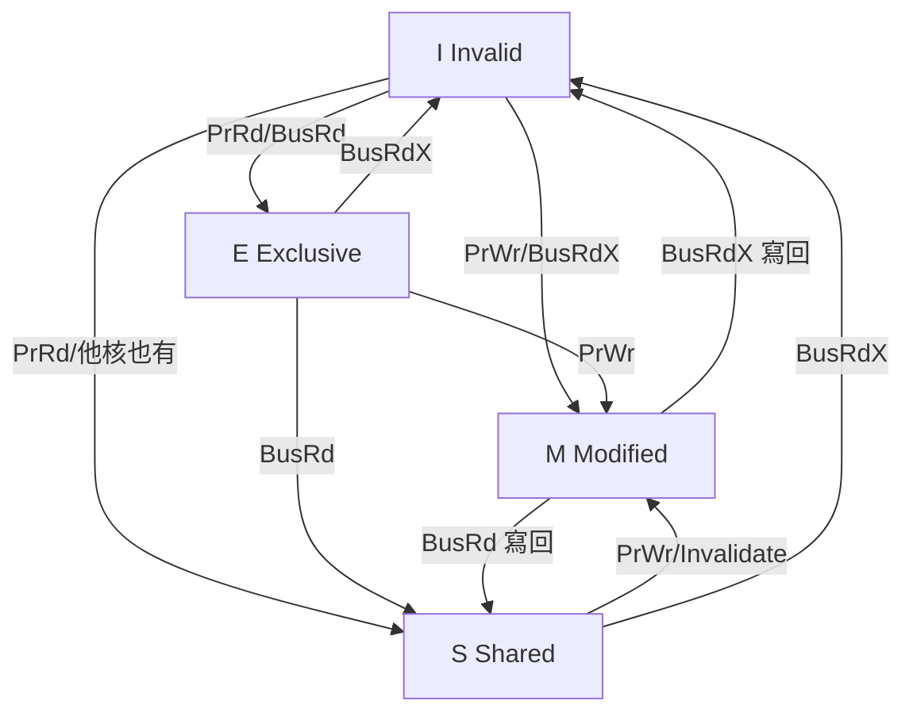

# 6.4 Cache 與一致性

快取（Cache）用 SRAM 彌補 CPU 與 DRAM 的速度鴻溝；多核心下每核的私有快取又帶來一致性（Coherence）問題。本節從組相連映射講到 MESI 協定，給出可直接動手的 Verilog 骨架。

## 6.4.1 動機：記憶體牆

CPU 週期以 GHz 計，DRAM 存取動輒上百週期，落差即記憶體牆（Memory Wall）。解法是階層（Hierarchy）：L1（32KB、1 週期）→ L2（512KB、十週期）→ LLC（數 MB）→ DRAM。時間局部性（Temporal Locality）與空間局部性（Spatial Locality）保證命中率超過九成，平均存取時間（AMAT）公式為 `HitTime + MissRate × MissPenalty`。

> 核心觀念：快取大小、相連度、區塊大小三者互斥；一致性協定的本質是「寫了別人的副本必須讓對方知道」。

## 6.4.2 核心講解：映射、寫策略與效能

位址切分為標籤（Tag）+ 索引（Index）+ 偏移（Offset）：

| 參數 | 公式 | 32KB / 4-way / 64B 行為例 |
|------|------|---------------------------|
| 行數 / 組數 | 大小 / (相連度 × 行大小) | 32768 / (4×64) = 128 組 |
| Offset 位寬 | log2(行大小) | 6-bit |
| Index 位寬 | log2(組數) | 7-bit |
| Tag 位寬 | 位址寬 − Index − Offset | 32−7−6 = 19-bit |

寫策略（Write Policy）對照：

| 策略 | 寫命中 | 寫未命中 | 優缺點 |
|------|--------|----------|--------|
| 寫直達（Write-Through）+ 寫不分配（No-Allocate） | 同時寫快取與記憶體 | 直接寫記憶體 | 簡單、一致性好；寫頻寬壓力大 |
| 寫回（Write-Back）+ 寫分配（Write-Allocate） | 只寫快取、標髒位（Dirty） | 先載入行再寫 | 頻寬省、效能高；需處理逐出行寫回 |

替換策略（Replacement）常用偽 LRU（Pseudo-LRU）或 Tree-PLRU 近似真 LRU；隨機（Random）在高相連度下表現意外地好且面積小。

```text
// 直接映射讀取虛擬碼：命中判斷一行搞定
index  = addr[12:6]    // 以 32KB/直接映射/64B 行為例
tag    = addr[31:13]
entry  = cache[index]
if entry.valid && entry.tag == tag: return entry.data[offset]  // Hit
else: // Miss：載入整行、逐出（若 dirty 先寫回）、更新 tag/valid
```

## 6.4.3 Verilog 範例：直接映射 L1 行為級模型

```verilog
// 直接映射 L1 Data Cache 行為模型：4096 行 x 16B（示意參數）
module dcache_direct (
  input  wire        clk, rst_n,
  input  wire [31:0] addr,
  input  wire [31:0] wdata,
  input  wire        ren, wen,
  output reg  [31:0] rdata,
  output reg         hit
);
  localparam LINES = 256, LINEW = 128; // 256 行 x 16B（簡化示意）
  reg [LINEW-1:0] data [0:LINES-1];
  reg [19:0]      tag  [0:LINES-1];
  reg             valid [0:LINES-1];
  reg             dirty [0:LINES-1];
  wire [7:0]  index  = addr[11:4];
  wire [19:0] tag_in = addr[31:12];
  wire [3:0]  word   = addr[3:2];
  always @(*) begin
    hit = valid[index] && (tag[index] == tag_in);
    rdata = hit ? data[index][word*32 +: 32] : 32'b0;
  end
  always @(posedge clk or negedge rst_n) begin
    if (!rst_n) begin
      integer k; for (k = 0; k < LINES; k = k+1) valid[k] <= 1'b0;
    end else if (wen && hit) begin
      data[index][word*32 +: 32] <= wdata;
      dirty[index] <= 1'b1;             // 寫回策略：標髒，逐出時寫回
    end
    // Miss 填入與逐出寫回由上層狀態機銜接 AXI/TileLink，此處省略
  end
endmodule
```

## 6.4.4 快取一致性：MESI 狀態表

多核各持副本時，寫入必須經由匯流排（Bus）或目錄（Directory）廣播失效（Invalidate）或更新（Update）。MESI 是四狀態失效式協定的標準答案：

| 狀態 | 全稱 | 意義 | 可否靜默寫？ |
|------|------|------|--------------|
| M（Modified） | 已修改 | 本核獨有且髒，與記憶體不一致 | 可（無需匯流排） |
| E（Exclusive） | 獨佔乾淨 | 本核獨有且乾淨 | 可（轉 M，無需匯流排） |
| S（Shared） | 共享 | 多核持有乾淨副本 | 否（需發 Invalidate 轉 M） |
| I（Invalid） | 無效 | 本核無有效副本 | 否（需發 BusRd 取行） |

典型轉移（匯流排事件 BusRd/BusRdX + 本地讀寫）：

| 現態 | 本地讀（PrRd） | 本地寫（PrWr） | 收到 BusRd | 收到 BusRdX（他核寫） |
|------|---------------|---------------|------------|----------------------|
| I | 發 BusRd → E/S | 發 BusRdX → M | — | — |
| S | 命中 | 發 Invalidate → M | 回應共享 | 失效 → I |
| E | 命中 | 靜默 → M | 降級 → S | 失效 → I |
| M | 命中 | 命中 | 寫回並降級 → S | 寫回並失效 → I |



## 6.4.5 本節小結

- AMAT 決定一切：L1 未命中率降 1%，效果常勝過主頻提升 10%。
- 寫回 + 寫分配是高效能標配，寫直達只留在 I/O 與簡單 MCU。
- MESI 用「獨佔態」省掉乾淨獨佔行的匯流排流量，MOESI 再加 Owned 態省髒共享行的寫回。
- RISC-V 的 TileLink/AXI 承載這些一致性訊息，下一節的 Rocket/BOOM 皆建於其上。

## 6.4.6 想一想

1. 寫直達 + 寫分配為何是糟糕組合？從「分配了行卻每次都寫穿」角度解釋。
2. 兩核同時 `sw` 同一位址，MESI 如何保證最終只有一核為 M？誰發的 Invalidate先生效？
3. ★★ 實作題：用 Verilator 跑通上面的 `dcache_direct`，統計 `memcpy` 4KB 的命中率，並改 2-way 看差異。
