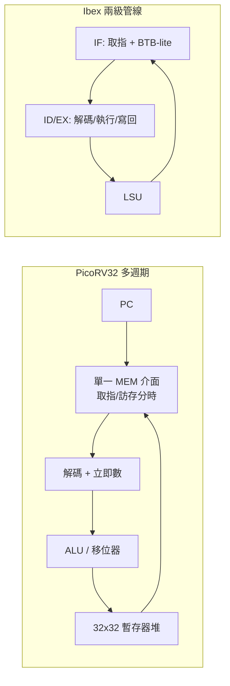

# 7.1 Ibex/PicoRV32

Ibex（前身 zero-riscv）與 PicoRV32 是最適合入門的兩顆開源 RV32 順序小核心：前者是 lowRISC 維護的工業級嵌入式核心，後者是 Clifford Wolf 一人寫就的極簡教學核心。讀懂它們，就讀懂了「夠用就好」的工程取捨。

## 7.1.1 動機：大核心學不動，從小核心下手

BOOM 動輒數十萬行 Chisel，初學者無從下手。Ibex（約 2 級管線）與 PicoRV32（多週期、非管線）加起來不到萬行，一個週末可通讀；兩者皆有 FPGA 上板紀錄，Verilator 模擬開箱即用，是本書後續實驗（ Bare-Metal、FreeRTOS） 的預設硬體目標。

> 核心觀念：小核心比的不是 IPC，而是面積（Area）、功耗與可驗證性；每一級管線都是成本。

## 7.1.2 核心講解：架構對照

| 項目 | Ibex | PicoRV32 |
|------|------|----------|
| ISA | RV32IMC + 部分特權（M/U） | RV32I/E + M/C（參數可配） |
| 微結構（Microarchitecture） | 2 級管線（IF / ID+EX），順序 | 多週期狀態機（Multi-cycle），無管線 |
| 分支 | ID 級比對，誤測沖刷 1 拍 | 執行期重定向，多拍懲罰 |
| 乘除法 | 參數三選一：慢速迭代 / 快速單週期 / 無 | 可選 DSP 推論或軟體模擬 |
| 中斷 / 異常 | CLIC 相容、精確異常 | 簡易 `irq` 介面 + `ebreak` |
| 介面 | TileLink / 簡易 SRAM 介面 | Wishbone / AXI-Lite / 原生 MEM 介面 |
| 語言 / 驗證 | SystemVerilog + UVM（RISCV-DV） | Verilog（單檔 `picorv32.v`）+ 形式化驗證（SymbiYosys） |
| 典型面積（Sky130） | 約 20–30 kGE（含 M 擴充） | 約 2–5 kGE（最小配置，iCE40 可塞） |

取指範例：兩者皆用簡單的 `valid/ready` 握手（Handshake），以下為 PicoRV32 風格的記憶體介面虛擬碼：

```text
// PicoRV32 原生記憶體介面：單一主埠分時取指/訪存
mem_valid = 1; mem_instr = (state == FETCH)
mem_addr  = (state == FETCH) ? pc : alu_out
mem_wstrb = (state == MEM && is_store) ? byte_mask : 0
mem_wdata = rs2_value
// 等待 mem_ready 後鎖存 mem_rdata，再前進狀態機
```

## 7.1.3 Verilog 範例：實例化與 PicoRV32 參數配置

```verilog
// PicoRV32 最小系統實例化：關 M 擴充、啟 barrel shifter 與壓縮指令解碼
picorv32 #(
  .ENABLE_COUNTERS(1),
  .ENABLE_MUL(0),          // 無硬體乘法：面積最小
  .ENABLE_FAST_MUL(0),
  .ENABLE_DIV(0),
  .ENABLE_IRQ(1),          // 啟用簡易中斷
  .ENABLE_COMPRESSED(1),   // C 擴充：程式碼密度
  .BARREL_SHIFTER(1),
  .CATCH_MISALIGN(1),      // 非對齊存取陷入
  .CATCH_ILLINSN(1)
) u_rv (
  .clk(clk), .resetn(rst_n),
  .mem_valid(mem_valid), .mem_instr(mem_instr),
  .mem_ready(mem_ready), .mem_addr(mem_addr),
  .mem_wdata(mem_wdata), .mem_wstrb(mem_wstrb),
  .mem_rdata(mem_rdata),
  .irq(irq_vector), .eoi(eoi)
);
```

Ibex 的取指則走 TileLink/SRAM 轉接，SoC 整合時注意 `instr_req_o/instr_gnt_o` 與資料側 `data_req_o` 為獨立雙埠，建議接獨立 IMEM/DMEM 以避開 5.3 節的結構冒險。

## 7.1.4 小核心資料路徑圖



## 7.1.5 本節小結

- PicoRV32 是「一檔走天下」的教學極簡主義，適合 FPGA 面積受限與形式化驗證入門。
- Ibex 是「可上產品」的小核心：ECC、睜眼閉眼都要算的資料完整性（Data Integrity）與 PMP 才是它與教學核的差距。
- 選型口訣：做實驗選 PicoRV32（易讀），做產品原型選 Ibex（生態完整，有 OpenTitan 背書）。
- 下一節 Rocket Chip 把可組態（Configurability）推到極致：核心不再是固定 RTL，而是一個產生器。

## 7.1.6 想一想

1. PicoRV32 單一記憶體埠同時服務取指與訪存，屬於哪種冒險？它用什麼代價（幾拍）換掉雙埠 SRAM？
2. Ibex 的 2 級管線為何分支懲罰只有 1–2 拍？對照 5.2 節五階管線說明之。
3. ★★ 實作題：用 Verilator + `riscv-tests` 跑通 PicoRV32 最小配置，關閉 `ENABLE_MUL` 後統計 `rv32ui` 通過率變化。
