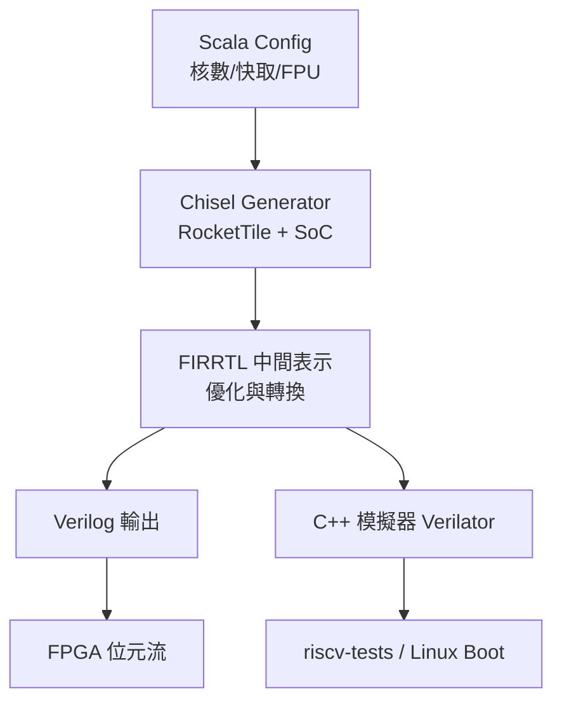

# 7.2 Rocket Chip

Rocket Chip 不是一顆固定的核心，而是一個用 Chisel（Scala 內嵌硬體語言）寫成的核心產生器（Generator）：以物件導向參數拼出從 MCU 到 Linux 級 SoC 的各種組態，並以 TileLink 互連（Interconnect）黏合快取、內核與外設。它是 Berkeley 架構組送給開源社群最重要的方法學禮物。

## 7.2.1 動機：為何用程式產生硬體？

傳統 Verilog 靠 `parameter` 與 `` `ifdef `` 做組態，乘法器有無、快取大小、核心數量一多就分岔失控。Chisel 把硬體當 Scala 物件：快取是類別（Class），核心是帶參數的建構子，SoC 是把 Tile（核心+快取）與外設 diplomatic 連接的圖。改一行 Config 就能從單核 RV64G 變四核帶 FPU，C++ 模擬器（Verilator）與 FPGA 位元流同源產生。

> 核心觀念：Rocket Chip 賣的是產生器 + SoC 框架（ diplomacy + TileLink），Rocket 核心本身只是預設展示品。

## 7.2.2 核心講解：Rocket 核心管線與 SoC 拼圖

Rocket 是 5 級順序（In-order）單發射 RV64G 核心，標配分支預測（BTB + BHT + RAS）與非阻塞 L1（Non-blocking D$）：

| 項目 | 說明 |
|------|------|
| 管線 | 5 級（IF/ID/EX/MEM/WB），EX 含 ALU + 分支解析，訪存經 TLB + L1 D$ |
| ISA | RV64IMAFD + C（可配），M/S/U 特權，Sv39，PMP |
| 浮點 | FPU（共用執行管線，支援單雙精度） |
| L1 | 16–64KB 4-way，VIPT，MESI 子集（TileLink 承載一致性） |
| 互連 | TileLink（TL-UH 無快取 / TL-C 帶快取一致性）經 diplomacy 自動協商位寬與時脈 |
| 協同 | RoCC（Rocket Custom Coprocessor）介面掛自訂加速器（見 19 章） |

SoC 產生流程虛擬碼（Scala/Chisel 風格示意）：

```scala
// Rocket Chip 組態示意：Diplomacy 圖 + 參數化 Tile
class MySoC(implicit p: Parameters) extends LazyModule {
  val tile  = LazyModule(new RocketTile(tileParams)) // RV64G + L1
  val l2    = LazyModule(new TLCache(l2Params))      // 共享 L2
  val xbar  = LazyModule(new TLXbar)                 // TileLink 交叉開關
  val uart  = LazyModule(new TLUART)                 // MMIO 外設
  // diplomacy 連接：自動處理位寬/時脈/一致性協商
  tile.masterNode := xbar.masterNode
  xbar.masterNode := l2.masterNode
  l2.masterNode   := TLFragmenter(...) := memory
}
```

常用 SBT（Scala Build Tool）指令：

```bash
# 產生單核 Rocket Verilog + 模擬器（路徑為 rocket-chip 倉庫）
sbt "runMain freechips.rocketchip.system.Generator \
  -td‚Äč./generated-src -T MyTop --target-dir ./vsim"
# Verilator 模擬 + 跑 riscv-tests
make -C vsim run CONFIG=DefaultRV64Config BINARY=rv64ui-p-add
```

## 7.2.3 架構參數對照表

| 參數 | Rocket（本節） | Ibex（7.1） | BOOM（7.3） |
|------|---------------|-------------|-------------|
| ISA 位寬 | RV64G（可配 RV32） | RV32IMC | RV64GC |
| 發射 / 順序 | 1 發射，順序 | 1 發射，順序 | 2–4 發射，亂序 |
| 管線深度 | 5 級 | 2 級 | 10+ 級 |
| L1 I/D | 16–64KB，可配 | 外部 SRAM（無內建 $） | 32KB + 非阻塞 + 預取 |
| 特權 / VM | M/S/U + Sv39 + PMP | M/U 為主 | M/S/U + Sv39 + PMP |
| 互連 | TileLink + diplomacy | TileLink-lite / SRAM | TileLink（同 Rocket 框架） |
| 產生器語言 | Chisel（Scala） | SystemVerilog | Chisel（Scala） |
| 適用場景 | Linux SoC 原型、教學全棧 | MCU / 安全飛地 | 高效能研究、IPC 競賽 |

## 7.2.4 產生器流程圖



## 7.2.5 本節小結

- 學 Rocket Chip 學的是兩層：內層 Rocket 順序核心（驗證 6 章概念），外層 diplomacy + TileLink SoC 方法學。
- RoCC 介面是銜接第 19 章自訂指令的橋樑：加速器掛上去即享虛擬記憶體與一致性。
- 代價是工具鏈重量：Scala/SBT/FIRRTL 的學習曲線遠陡於 Verilog，小專案勿為炫技引入。
- 下一節 BOOM 站在同一框架上，把 Rocket 的順序後端換成亂序，見證「框架複用」的威力。

## 7.2.6 想一想

1. 為何 TileLink 要分 TL-UH（無一致性）與 TL-C（有一致性）？UART 與 L2 分別該用哪種？
2. 改 Config 把 D$ 從 16KB 加到 64KB，除了容量還需注意 VIPT 的什麼別名（Aliasing）問題？
3. ★★★ 實作題：用預設 `DefaultRV64Config` 產生 Verilog，在 Verilator 上 boot Linux 至 login，並記錄 L1 D$ 未命中率。
