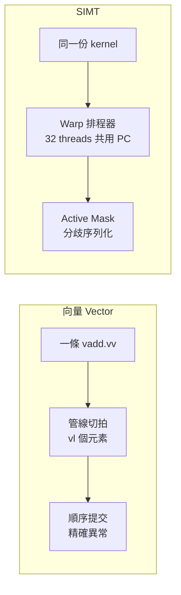

# 8.1 Vector vs GPU（SIMT）本質差異

> 向量（Vector）靠一條指令驅動多筆資料，SIMT 靠上千條執行緒（Thread）各自跑同一份程式——看似都是資料平行（Data Parallelism），硬體契約完全不同。

## 動機：為什麼都叫平行卻不能混用

初學者常把 RISC-V V 擴充（Vector Extension）與 GPU 相提並論：兩者都能一次算很多浮點數，為何還要兩套模型？答案在於抽象層級與可擴展方式不同。

向量是 ISA 層的顯式資料平行：程式設計師（或編譯器自動向量化 Auto-vectorization）用一條 `vadd.vv` 觸發一條硬體管線處理 `VLEN/SEW` 筆資料，硬體保證順序語義（In-order Semantics），異常（Exception）與記憶體排序行為明確。

SIMT（Single Instruction, Multiple Threads）則是執行模型層的平行：程式設計師寫的是純量執行緒程式（Scalar Thread Program），硬體在執行期把數十條執行緒綑成 warp（Warp）共用取指（Fetch）與解碼（Decode），用執行緒遮罩（Active Mask）維持「看似各自獨立」的假象。

釐清這點，是理解後續 RV64X、Vortex 為何要另起一套暫存器與排程器的起點。

## 核心講解：五個維度的對照

### 1. 程式設計模型（Programming Model）

向量：單一控制流（Single Control Flow）+ 向量長度暫存器 `vl` 控制本輪處理幾個元素；迴圈剝離（Strip-mining）由軟體負責。
SIMT：數萬個邏輯執行緒各有 `threadIdx`，硬體負責把執行緒映射到實體 lane，軟體只管寫「一個執行緒該做什麼」。

### 2. 硬體執行（Execution）

向量：深度管線（Pipelined Functional Unit）+ 鏈接（Chaining），一個 lane 可切多節拍消化長向量。
SIMT：多個純量核心 lockstep 執行，warp 內共享程式計數器（Program Counter, PC），分歧（Divergence）時以遮罩序列化。

### 3. 對照表

| 面向 | 向量 Vector（RVV） | SIMT（GPU / Vortex） |
|------|-------------------|----------------------|
| 基本單位 | 元素 Element（`vl` 決定個數） | 執行緒 Thread（`threadIdx` 區分） |
| 控制流 | 單一 PC，硬體順序完成 | Warp 共享 PC + Active Mask 模擬多 PC |
| 暫存器視角 | 向量暫存器檔 Vector Register File（`v0`–`v31`） | 每執行緒私有純量暫存器 + 謂詞（Predicate） |
| 分歧成本 | `v0.mask` 遮罩仍是單一指令流，成本低 | Warp 分歧需雙路徑序列化（見 8.3 節） |
| 記憶體語義 | 單位步幅 /  gather-scatter 由 `vl` 界定，順序精確異常 | 合併存取（Coalescing）決定頻寬利用率，異常較寬鬆 |
| 適用場景 | CPU 內建加速（AI kernel、DSP、HPC 向量化迴圈） | 高吞吐量（Throughput）圖形、CUDA kernel、大規模平行 |
| 與 RISC-V 關係 | 標準 V 擴充，主 CPU 直接執行 | 需 RV64X 等自訂擴充或獨立 GPGPU（如 Vortex） |

### 4. 效能直覺：延遲 vs 吞吐量

向量優化延遲（Latency）：讓單一執行緒更快算完一陣列。
SIMT 優化吞吐量：用海量 warp 切換（Warp Switching）掩蓋記憶體延遲，單一執行緒反而慢。這就是 GPU 時脈低、核心多仍能贏 CPU 的原因。

### 5. Host-side vs Device-side 預告

本節談的是 Device-side（裝置端執行模型）的差異：RISC-V CPU 若只加 V 擴充，仍是 Host 視角的加速；若要當 GPU 用（Vortex），必須引入 SIMT 排程器。兩者不可混為一談，9.1 節會正式拆開雙重維度。

## 範例：同一段 SAXPY，兩種寫法

向量版由編譯器自動向量化，程式仍是單執行緒迴圈；CUDA 版則是每個執行緒算一個 `i`。

```c
// SAXPY: y[i] = a * x[i] + y[i]
// (A) RISC-V 向量思維：單一迴圈，硬體一次吃 vl 個元素
void saxpy_vector(float *x, float *y, float a, int n) {
    for (int i = 0; i < n; i++)
        y[i] = a * x[i] + y[i]; // -march=rv64gcv 由 LLVM 自動向量化為 vadd/vfmacc
}

// (B) SIMT 思維：寫一個執行緒的程式，由 threadIdx 區分工作
__global__ void saxpy_simt(float *x, float *y, float a, int n) {
    int i = blockIdx.x * blockDim.x + threadIdx.x; // 每個 thread 算一個 i
    if (i < n) y[i] = a * x[i] + y[i];
}
// 啟動：saxpy_simt<<<(n+255)/256, 256>>>(x, y, a, n);
```

```bash
# RISC-V 向量版編譯觀察自動向量化
clang --target=riscv64 -march=rv64gcv -O2 -c saxpy.c -o saxpy.o
llvm-objdump -d saxpy.o | grep -E "vsetvli|vle32|vfmacc"
```

## Mermaid：執行流程對比



## 本節小結

- 向量是 ISA 級單指令流平行，語義精確、適合 CPU 內加速。
- SIMT 是執行期多執行緒假象，靠 warp + 遮罩換取超高吞吐量。
- 選型關鍵：延遲敏感走 V 擴充，吞吐量敏感走 GPU（RV64X / Vortex）。
- Host（CPU 配 GPU）與 Device（RISC-V 當 GPU）是不同維度，後續章節分開處理。

## 想一想

1. 若把 `if-else` 寫進向量 intrinsic 與 CUDA kernel，兩者的硬體開銷有何不同？哪個需要序列化？
2. 用 `clang -march=rv64gcv` 編譯一個含條件的迴圈，觀察產生的 mask 指令，對照 warp active mask 有何異同？
3. 為什麼向量適合做 CPU 的 L1 友善迴圈，而 SIMT 需要數千執行緒才能餵飽頻寬？
