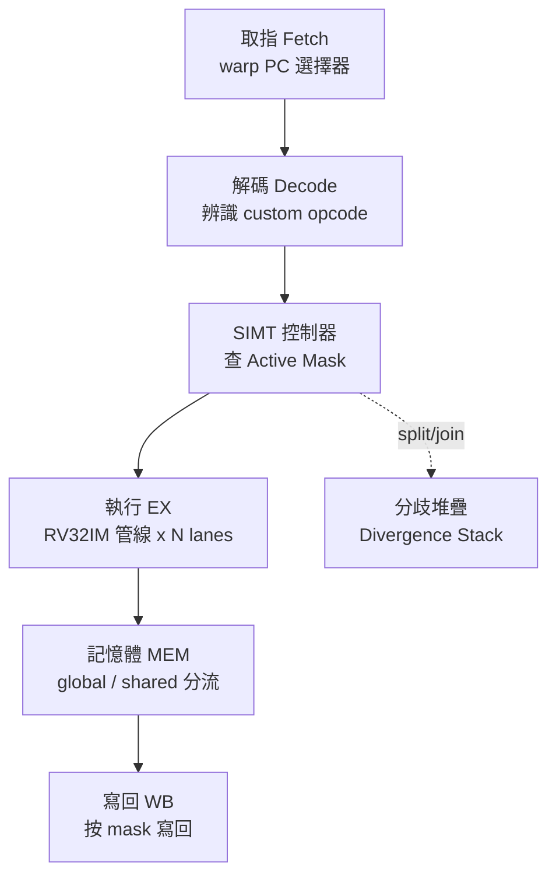

# 8.2 RV64X / Vortex 擴充規範

> RV64X 回答一個問題：若想在 RISC-V 上長出 NVIDIA PTX 那樣的 GPU 語義，最少需要加哪些暫存器（Register）與指令（Instruction）？

## 動機：標準 GPR 不夠用

RV64G 只有 32 個整數暫存器與順序語義，表達不了「上千執行緒各自有 ID、分歧時要記遮罩、barrier 要同步」這些 GPU 原語（Primitive）。硬塞只會讓編譯器處處 spill，也無法做 warp 級排程。

於是有兩條路線：一是學術提案 RV64X（亦稱 RV64G+X）：在 RV64G 旁加 GPU 專用狀態；二是實作派 Vortex：在標準 RISC-V 核心外掛 SIMT 前端（Frontend）與排程器，用自訂操作碼（Custom Opcode）實現。前者是規範（Spec），後者是可跑的開源 GPGPU。

## 核心講解：RV64X 加了什麼

### 1. 新增硬體狀態

- 執行緒識別：`threadIdx` / `blockIdx` / `blockDim` / `gridDim` 不再是 CUDA 執行期的變數，而是可讀的硬體 CSR 或特殊暫存器。
- Warp 遮罩：每 warp 一份執行遮罩（Execution Mask）與分歧堆疊（Divergence Stack），`split` / `join` 指令負責壓棧切換。
- 同步原語：`barrier`（block 內同步）、`tex` / `surf` 紋理取樣狀態（Vortex 簡化為特殊 load）。

### 2. 指令擴充一覽與對照

| 類別 | RV64X / Vortex 新增概念 | 對應 CUDA 語義 | 說明 |
|------|------------------------|----------------|------|
| ID 讀取 | `tmc` / CSR 讀執行緒 ID | `threadIdx.x` | 每 thread 開機即有唯一 ID |
| Warp 控制 | `wspawn`, `split`, `join` | warp spawn / `__syncwarp` | 產生 warp、分歧壓棧與合流（Reconvergence） |
| 同步 | `bar.sync` | `__syncthreads()` | block 內所有 warp 到齊才放行 |
| 記憶體 | shared load/store、紋理 load | `__shared__`、紋理記憶體 | 見 8.4 節，位址空間（Address Space）分開編碼 |
| 原子 | warp 級原子加 | `atomicAdd` | 保證同一 block 內可見順序 |

### 3. 編碼策略：不破壞 Base

RV64X 使用 `custom-0 / custom-1` 操作碼空間（opcode `0001011`、`0101011`），標準工具鏈（Toolchain）不認識時可當非法指令 trap，由模擬器（Simulator）接手。這讓 Vortex 能在 Spike / 自家模擬器上先跑，再談標準化。

### 4. Vortex 的務實取捨

Vortex 不求一次到位：整數管線沿用 RV32IM，只加 SIMT 控制器（Controller）、warp 排程器（Scheduler）與 shared memory。它把一個「RISC-V 核心」複製多份組成運算叢集（Cluster），前端假裝自己是 GPU。這種「CPU 管線 + GPU 前端」的混血正是 Device-side（RISC-V 當 GPU 本體）的典型。

## 範例：Vortex 上跑一個 kernel 的工具鏈

```bash
# 1. 下載 Vortex 並編譯 SIMT 核心模擬器
git clone https://github.com/vortexgpgpu/vortex.git
cd vortex && make -j$(nproc)

# 2. 用 Vortex 版 LLVM 編譯 CUDA 風格 kernel（POCL / Vortex driver）
riscv32-unknown-elf-gcc -march=rv32im -O3 saxpy_kernel.c -o saxpy.elf
./simv saxpy.elf --cores 4 --warps 4 --threads 32

# 3. 觀察新增 CSR（thread ID、warp mask）
riscv32-unknown-elf-objdump -d saxpy.elf | grep -E "tmc|bar\.sync|wspawn"
```

```c
// Vortex kernel 風格：ID 來自硬體，不再是函式參數
__kernel__ void vecadd(int *a, int *b, int *c) {
    int tid = get_thread_id();   // 底層是讀特殊 CSR，不是算出來的
    c[tid] = a[tid] + b[tid];
    bar_sync();                  // 對應 bar.sync 指令
}
```

## Mermaid：RV64X 在管線中的位置



## 本節小結

- RV64X 的本質是把 CUDA 執行期狀態（ID、mask、barrier）硬體化。
- 用 custom opcode 避開標準凍結，先求可跑（Vortex）再求標準。
- Vortex 證明 Device-side 可行：RISC-V 管線 + SIMT 前端即 GPGPU。
- Host-side（RISC-V CPU 外掛 NVIDIA 卡）完全不需要這些擴充，兩條路線勿混淆。

## 想一想

1. 為什麼 `threadIdx` 要做成硬體 CSR 而不是編譯器算出來的變數？與 warp 調度有何關係？
2. 查 Vortex 文件，列出它實際支援的 custom 指令，與本節表格對照缺了哪些？
3. 若你是工具鏈維護者，會如何讓 `riscv32-unknown-elf-gcc` 認得 `bar.sync`？（提示：intrinsic vs inline asm）
