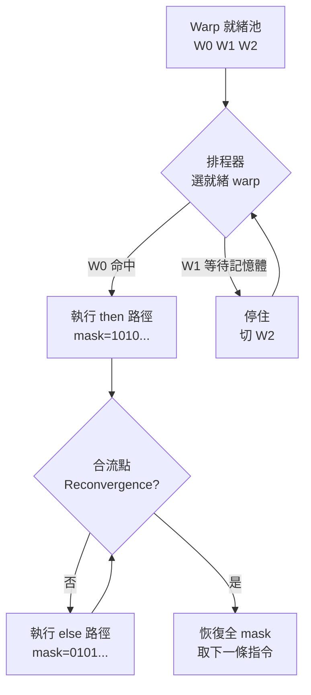

# 8.3 SIMT 執行模型：Thread / Warp / Block 與分歧處理

> CUDA 寫的是純量程式，硬體跑的是 warp——理解 SIMT 就是理解這層「善意的謊言」如何維持又不穿幫。

## 動機：為何要三層階級

GPU 一次要養數萬執行緒，若每個 thread 各自取指，解碼器（Decoder）會爆炸。解法是分層：Thread（執行緒，程式設計單位）→ Warp（經緯，執行單位，典型 32 threads 共用 PC）→ Block（區塊，排程與同步單位，共享 shared memory）→ Grid（網格，整個 kernel）。

warp 是硬體與軟體的契約邊界：軟體假裝 thread 獨立，硬體保證 warp 內 lockstep（步調一致）。分歧（Divergence）處理就是這份契約破裂時的補救流程。

## 核心講解：從映射到分歧

### 1. ID 映射公式

每個 thread 由三維 ID 定位，線性化公式為：

`tid = threadIdx.x + blockDim.x * (blockIdx.x + gridDim.x * blockIdx.y ...)`，硬體 warp 排程器（Warp Scheduler）再把連續 32 個 tid 綁成同一 warp。這就是為何 block 大小常取 128 / 256（warp 的整數倍）。

### 2. 排程器：掩蓋延遲的魔術

SM（Streaming Multiprocessor，串流多處理器）上常駐多個 warp，當某 warp 等待記憶體時，排程器零開銷切到就緒 warp。這叫延遲掩蓋（Latency Hiding）：thread 越多，記憶體越慢也沒關係。

### 3. 對照表

| 層級 | 軟體視角 | 硬體行為 | 關鍵限制 |
|------|----------|----------|----------|
| Thread | 獨立 PC、獨立變數 | warp 內共享 PC，以 mask 模擬獨立 | 不可假設執行順序 |
| Warp（32） | 隱形，效能單位 | lockstep 取指/解碼，原子排程 | 分歧即序列化，效能減半或更糟 |
| Block（可達 1024） | `__syncthreads()` 同步域 | 常駐同一 SM，共享 shared memory | 過大會降低佔用率（Occupancy） |
| Grid | 整個問題規模 | 分散到多 SM，可擴展（Scalable） | block 間無同步保證 |

### 4. 分歧處理：split / join

遇到 `if (tid % 2)`，warp 內一半走 then、一半走 else。硬體壓入分歧堆疊（Divergence Stack）：先執行 then 路徑（else lane 被遮蔽），再執行 else 路徑（then lane 被遮蔽），最後在合流點（Reconvergence Point）恢復全 mask。這段序列化期間，有一半 lane 永遠閒置。

## 範例：分歧好壞對比

```c
// 壞：warp 內交錯分歧，兩條路徑都要跑
__global__ void bad(float *a) {
    int i = blockIdx.x * blockDim.x + threadIdx.x;
    if (i % 2 == 0) a[i] = a[i] * 2.0f;   // 偶數 lane 動
    else a[i] = a[i] + 1.0f;              // 奇數 lane 動 → 序列化
}

// 好：以 warp 為粒度分歧，整個 warp 同路
__global__ void good(float *a) {
    int i = blockIdx.x * blockDim.x + threadIdx.x;
    if ((i >> 5) % 2 == 0) a[i] = a[i] * 2.0f; // warp 0 全走 then，warp 1 全走 else
    else a[i] = a[i] + 1.0f;
}
```

```bash
# 用 NVIDIA Nsight Compute 觀察分歧（Host-side 量測，概念通用 Vortex）
ncu --metrics smsp__thread_inst_executed_per_inst_executed ./vecadd
# 比值接近 32 表示無分歧；接近 16 表示一半 lane 被遮蔽
```

## Mermaid：Warp 排程與分歧序列化



## 本節小結

- Thread 是軟體假象，warp 才是硬體真相；block 是同步與共享記憶體的邊界。
- 排程器靠海量 warp 掩蓋延遲，佔用率（Occupancy）是第一效能指標。
- 分歧不改正確性、只傷效能：warp 內同路即免費，交錯即付序列化稅。
- 本節談的是 Device-side 執行語義；Host-side（RISC-V CPU 如何啟動 kernel）留待 9.2 節。

## 想一想

1. 為何 block 內可以 `__syncthreads()`，grid 內卻不行？從 SM 硬體結構解釋。
2. 把 block 大小從 256 改為 33，在 Vortex 或 NVIDIA 上各會發生什麼？（提示：warp 對齊）
3. 重寫一個含 `switch` 的 kernel，讓每個 warp 只走一個 case，量測前後 `thread_inst_executed` 比值。
