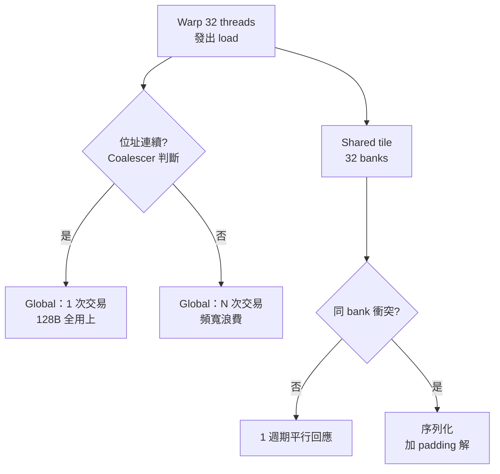

# 8.4 GPU 記憶體階層：Shared Memory 與 Coalescing

> GPU  kernel 常不是算不快，而是餵不飽——記憶體階層（Memory Hierarchy）決定你是吃到飽還是餓到停。

## 動機：頻寬牆比算力牆更硬

現代 GPU 算力動輒數十 TFLOPS，但 HBM 頻寬僅 TB/s 等級：每個浮點運算分不到一個 byte。CPU 靠大快取（Cache）與低延遲取勝，GPU 則反其道而行：暴露階層，讓程式設計師顯式搬運（Explicit Data Movement），用 shared memory（共享記憶體）與合併存取（Coalesced Access）把頻寬榨乾。

在 RISC-V GPGPU（Vortex）上亦然：global、shared、private 三個位址空間（Address Space）是硬體分開的 SRAM，不是編譯器假裝的。

## 核心講解：三層記憶體契約

### 1. 階層速覽

暫存器（Register）：每 thread 私有，最快；放溢（Spill）即掉速。
Shared memory：每 block 共享，約 L1 速度，由程式顯式管理，bank（記憶體庫）交錯存放。
Global memory：所有 thread 可見，容量大、延遲數百週期，必須合併存取才有效率。

### 2. 對照表

| 層級 | 可見範圍 | 生命週期 | 速度 / 容量 | 典型陷阱 |
|------|----------|----------|-------------|----------|
| Private / Local | 單一 thread | thread 存活期 | 暫存器快；溢出進 DRAM 極慢 | 陣列索引非常數即溢出 |
| Shared | 同一 block | block 存活期 | ~20 週期、數十 KB | bank conflict（庫衝突）序列化 |
| Global | 全部 threads + Host | 程式存活期 | ~400 週期、GB 級 | 非合併存取浪費 32 倍頻寬 |

### 3. Coalescing：warp 的集體票

warp 內 32 個 thread 若存取連續 128 bytes，硬體合併成一次交易（Transaction）；若各取分散位址，則拆成 32 次。這就是「連續即正義」：轉置（Transpose）、 halo 交換都要先搬進 shared memory 重排再寫回。

### 4. Bank Conflict 補充

shared memory 由 32 個 bank 輪流編址，warp 內同時存取同一 bank 不同位址即衝突。解法是填充（Padding）：`__shared__ float tile[32][33]` 多一欄即可錯開。

## 範例：矩陣轉置的 shared memory  tiling

```c
// 不良版：寫回時跨步存取，global 寫入無法合併
__global__ void transpose_naive(float *in, float *out, int N) {
    int x = blockIdx.x * blockDim.x + threadIdx.x;
    int y = blockIdx.y * blockDim.y + threadIdx.y;
    out[x * N + y] = in[y * N + x];
}

// 改良版：先讀進 tile（合併讀），__syncthreads 後再合併寫
__global__ void transpose_tiled(float *in, float *out, int N) {
    __shared__ float tile[32][33]; // 33 避開 bank conflict
    int x = blockIdx.x * 32 + threadIdx.x;
    int y = blockIdx.y * 32 + threadIdx.y;
    tile[threadIdx.y][threadIdx.x] = in[y * N + x]; // 合併讀
    __syncthreads();
    x = blockIdx.y * 32 + threadIdx.x;
    y = blockIdx.x * 32 + threadIdx.y;
    out[y * N + x] = tile[threadIdx.x][threadIdx.y]; // 合併寫
}
```

```bash
# 檢查 Vortex shared memory 配置（Device-side 視角）
./vortex_sim --config shared_32KB.json --dump-mem-stats transpose.elf
# 觀察 coalesced_txns vs total_txns，比值越接近 1 越好
```

## Mermaid：記憶體路徑



## 本節小結

- GPU 記憶體是顯式階層：快不快看你放哪層、怎麼排。
- Coalescing 決定 global 效率，padding 決定 shared 效率。
- Vortex 等 RISC-V GPGPU 原樣繼承這套契約，優化技巧可直接移植。
- 這仍是 Device-side 議題；Host 如何配置這片記憶體（pinned memory、DMA）屬 9.2 節。

## 想一想

1. 為何 `tile[32][32]` 會有 bank conflict 而 `[32][33]` 不會？畫出 bank 編號驗證。
2. 在 Vortex 上跑轉置兩版本，比較 `coalesced_txns` 計數差異，推算省了多少頻寬。
3. 若 kernel 是計算密集（Arithmetic Intensity 高），shared memory tiling 還值得嗎？用 roofline 模型解釋。
