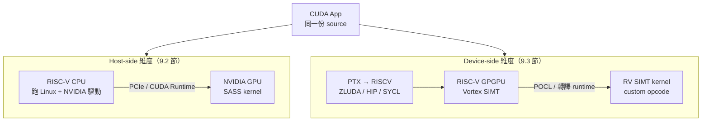

# 9.1 CUDA on RISC-V 雙重維度：Host-side vs Target-side

> 「RISC-V 跑 CUDA」有兩種完全不同的意思：當主人（Host）外掛 NVIDIA 卡，或當工人（Device）自己算 kernel——混淆兩者，後面全部白讀。

## 動機：一句話兩種工程

新聞常寫「某某 RISC-V 晶片支援 CUDA」，讀者以為能在 RISC-V GPU 上跑 `kernel<<<>>>`，實際多半是「RISC-V CPU 當 Host，PCIe 上插一張 NVIDIA GPU」。前者是驅動與生態問題，後者是編譯器與硬體問題，難度、廠商、工具鏈完全不同。本節先立座標系，9.2、9.3 節再各走一維。

## 核心講解：雙維度座標系

### 1. 定義

Host-side（主機端）：RISC-V CPU 跑 Linux + NVIDIA 驅動，透過 PCIe 指揮 NVIDIA GPU。CUDA kernel 照樣編譯成 PTX / SASS 在 NVIDIA 卡上跑，RISC-V 只負責 `cudaMalloc`、`cudaMemcpy`、`kernel launch`。
Device-side（裝置端）：RISC-V 本體就是 GPU（Vortex 等），CUDA / OpenCL kernel 被轉譯（Translate）成 RISC-V SIMT 指令在 RISC-V 硬體上執行，沒有 NVIDIA 卡。

### 2. 對照表（本書最重要的一張表）

| 面向 | Host-side（RISC-V 當 CPU） | Device-side（RISC-V 當 GPU） |
|------|---------------------------|------------------------------|
| 硬體組成 | RISC-V SoC + NVIDIA GPU（PCIe） | Vortex / 自研 GPGPU，無 NVIDIA |
| kernel 跑在哪 | NVIDIA SM（SASS） | RISC-V SIMT lane（RV32IM + SIMT 擴充） |
| 關鍵軟體 | NVIDIA 驅動（Driver）、CUDA Runtime、PCIe / IOMMU | PTX 轉譯器、POCL / Vortex runtime、 wee LLVM 後端 |
| CUDA 相容度 | 原生（Native）：`nvcc` 成果直接跑 | 近似（Compatible）：ZLUDA / HIP / SYCL 轉譯，有覆蓋缺口 |
| 瓶頸 | 驅動移植、PCIe、記憶體一致性 | 編譯器覆蓋率、shared memory、warp 排程效能 |
| 代表案例 | Milk-V Megrez（RISC-V + RTX）、Tenstorrent 類 Host 方案 | Vortex GPGPU、ZLUDA on RISC-V 實驗 |

### 3. 為何必須分開

兩維度的「支援 CUDA」驗收標準不同：Host-side 跑得動 `nvidia-smi` + `vectorAdd` 即達標；Device-side 要跑得動 Rodinia / SHOCG benchmark 才算數。把 Host 的 `lspci` 成功當成 Device 突破，是常見的誤讀。

### 4. 混合現實

實務系統常兩維並存：RISC-V CPU（Host）指揮 Vortex GPGPU（Device），中間走自家驅動而非 NVIDIA 驅動。這正是 10.1 節 Vortex 軟硬體棧的定位。

## 範例：同一台機器，兩種確認指令

```bash
# (A) Host-side 驗收：RISC-V CPU 看得到 NVIDIA 卡嗎？
uname -m            # 期望 riscv64
lspci | grep -i nvidia
nvidia-smi          # 驅動正常即列出 GPU
./vectorAdd         # NVIDIA 官方 sample，kernel 跑在 SASS 上

# (B) Device-side 驗收：RISC-V 本體算 kernel 嗎？
./vortex_sim saxpy.elf --cores 8   # kernel 跑在 Vortex SIMT lane 上
riscv32-unknown-elf-objdump -d saxpy.elf | grep -c "bar.sync"
```

```c
// 同一份 CUDA host code，兩維度含義不同：
// Host-side：cudaLaunchKernel 觸發 NVIDIA 驅動 → PCIe → SASS。
// Device-side：kernel 被轉譯為 RV SIMT ELF，由 Vortex runtime 載入。
cudaMemcpy(d_x, h_x, bytes, cudaMemcpyHostToDevice);
saxpy<<<blocks, 256>>>(d_x, d_y, a, n); // 跑在哪？看你是 A 還是 B
cudaDeviceSynchronize();
```

## Mermaid：雙維度架構圖（必讀）



## 本節小結

- Host-side 回答「RISC-V 能否指揮 NVIDIA 卡」，Device-side 回答「RISC-V 能否取代 NVIDIA 卡」。
- 前者靠驅動與 PCIe，後者靠轉譯器與 SIMT 硬體，驗收方式完全不同。
- 後續閱讀守則：看到 CUDA on RISC-V，先問是哪一維。

## 想一想

1. 若某新聞寫「RISC-V 支援 CUDA 12」，列出三個問題幫你判斷它是 Host 還是 Device。
2. 同一份 `saxpy.cu`，在 Host-side 與 Device-side 下 `nvcc` / `clang` 的編譯目標有何不同？
3. 為什麼混合系統（RISC-V CPU + Vortex）兩維都沾一點？它的驅動是 NVIDIA 的嗎？
