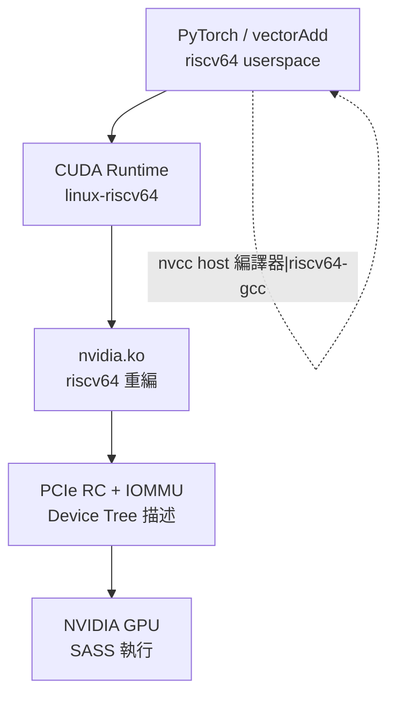

# 9.2 RISC-V 作為 CUDA Host（CPU + NVIDIA GPU）

> 讓 `riscv64` 的電腦插上 NVIDIA 卡、跑起 `nvidia-smi`——這是 Host-side（主機端）維度的全部戰場，沒有自研 GPU，只有驅動與匯流排。

## 動機：最短抵達 CUDA 生態的路

重寫一個 Device-side GPU 要數年，但把 RISC-V CPU 做成 CUDA Host 只需三件事：PCIe 能 enumerate、Linux 驅動能編過、CUDA userspace 能跑。這條路讓 RISC-V 立刻吃到 NVIDIA 生態（cuBLAS、TensorRT、PyTorch），是伺服器與桌面 RISC-V 的必經之路。

注意：本節的 kernel 仍是 NVIDIA SASS，RISC-V 只是發號施令的 CPU。不要與「RISC-V 算 kernel」混淆。

## 核心講解：三層打通戰

### 1. PCIe 與平台層

RISC-V SoC 需提供 PCIe RC（Root Complex）、MSI/MSI-X 中斷、IOMMU（或至少一致性互連）。Device Tree（裝置樹）要正確描述 `pcie@...` 節點，否則 `lspci` 連卡都看不到。64-bit DMA 定址（DMA Addressing）與快取一致性（Coherence）是地雷區：不一致就得靠 `dma_map_*` 彈跳緩衝，頻寬腰斬。

### 2. 驅動與工具鏈層

NVIDIA 驅動分核心模組（`nvidia.ko`）與 userspace（CUDA Runtime、NVML）。核心模組需針對 `riscv64` 重編，重點是頁表（Sv39/Sv48）、記憶體屏障（`fence`）與原子語義對齊。CUDA Toolkit 需有 `linux-riscv64` target——目前靠社群與廠商（如 Milk-V、RIVAS）移植，`nvcc -arch=sm_80` 產 SASS 不變，只是 host compiler 從 `x86_64` 換成 `riscv64-gcc`。

### 3. 對照表：Host 移植檢查清單

| 層級 | x86 Host 現況 | RISC-V Host 要補的功課 | 驗收指令 |
|------|--------------|------------------------|----------|
| 硬體匯流排 | PCIe 成熟 | RC、MSI-X、IOMMU、一致性 | `lspci -vv`, `dmesg \| grep -i pcie` |
| 核心驅動 | 官方支援 | 重編 `nvidia.ko`，修 fence / atomic | `nvidia-smi` 有輸出 |
| Userspace | CUDA Toolkit 完整 | `linux-riscv64` runtime、cuBLAS 可用 | `./deviceQuery` 通過 |
| 應用框架 | PyTorch 現成 | 重編 Torch（host 端純 CPU 部分） | `python -c "import torch; torch.cuda.is_available()"` |
| 效能 | H2D 頻寬滿血 | pinned memory、NUMA、DMA 一致性調優 | `bandwidthTest` 對齊 x86 八成 |

### 4. 記憶體模型提醒

`cudaMallocManaged`（統一記憶體 Unified Memory）在 RISC-V 上最脆弱：需 OS 缺頁（Page Fault）+ GPU 缺頁協同，若 IOMMU 或 ATS（Address Translation Services）不到位，只能退回顯式 `cudaMemcpy`。新手先用顯式拷貝，再碰 managed。

## 範例：RISC-V Host 點亮流程

```bash
# 1. 確認平台：riscv64 + PCIe 看得到卡
uname -m && lspci | grep -i nvidia
dmesg | grep -i -E "pcie|nvidia|iommu"

# 2. 安裝（或重編）驅動與 toolkit（以廠商提供版為準）
sudo apt install nvidia-driver-riscv64 cuda-toolkit-riscv64
nvidia-smi && nvcc --version

# 3. 跑官方 sample：kernel 在 NVIDIA 卡上，host 在 RISC-V
nvcc -o vectorAdd vectorAdd.cu -arch=sm_80
./vectorAdd
./bandwidthTest --memory=pinned  # 對比 pageable，看 DMA 差異
```

```c
// Host 端程式與 x86 完全相同：重點是它編譯成 riscv64 執行
// kernel（<<<>>> 部分）仍由 nvcc 編成 SASS，不含一行 RISC-V SIMT
#include <cuda_runtime.h>
int main() {
    float *d_x; cudaMalloc(&d_x, 1 << 20);
    saxpy<<<(1<<12), 256>>>(d_x, d_x, 2.0f, 1 << 18); // 發射到 NVIDIA SM
    cudaDeviceSynchronize();
    return 0;
}
```

## Mermaid：Host-side 軟體堆疊



## 本節小結

- Host-side 不造 GPU，只讓 RISC-V CPU 取得指揮 NVIDIA 卡的資格。
- 打通順序：PCIe → `nvidia.ko` → Toolkit → 頻寬調優，`nvidia-smi` 是第一里程碑。
- kernel 生態零成本繼承，代價是驅動與一致性全看 SoC 廠商功力。
- 與 Device-side 無關：這裡沒有 PTX 轉譯，也沒有 Vortex。

## 想一想

1. 在 RISC-V Host 上 `bandwidthTest` 的 pinned vs pageable 差距為何比 x86 更大？從 IOMMU / 快取一致性推測。
2. 若 `lspci` 看得到卡但 `nvidia-smi` 失敗，可能卡在哪兩層？各用什麼 log 定位？
3. 為什麼統一記憶體（Unified Memory）是 RISC-V Host 最後才碰的功能？列出它依賴的硬體前提。
