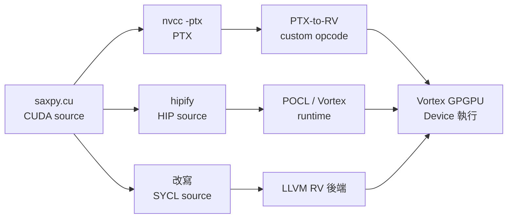

# 9.3 CUDA Kernel 轉譯至 RISC-V Device

> 沒有 NVIDIA 卡，也想跑 `<<<>>>`？Device-side（裝置端）維度的答案是轉譯（Translation）：把 CUDA 語義搬到 RISC-V SIMT 硬體上。

## 動機：生態綁架的逃生梯

CUDA 的護城河是數百萬行 kernel。若 RISC-V GPGPU 要求重寫 OpenCL，等於放棄生態。轉譯路線反其道而行：保留 CUDA source（原始碼），在編譯器層攔截——PTX（Parallel Thread Execution，中間碼）→ RISC-V SIMT、HIP（Heterogeneous-Compute Interface）→ portable、SYCL（單源 C++ 並行）→ LLVM 後端，讓舊 kernel 無痛（或微痛）上車。

本節是 Device-side 核心，與 9.2 節的驅動移植毫無重疊。

## 核心講解：三條轉譯路線

### 1. PTX-to-RISCV：最低層攔截

PTX 是 NVIDIA 的虛擬 ISA，語義最接近 SIMT（顯式 `.cta`、`.tid`、barrier）。轉譯器把 PTX 指令逐條降為 RV32IM + custom SIMT（`bar.sync`、`tmc`），暫存器謂詞（Predicate）轉為 active mask。優點是相容現有 `nvcc -ptx` 產物，缺點是 PTX 未公開全部語義，版本漂移即失效。

### 2. ZLUDA / HIP：API 層墊片

ZLUDA（曾讓 CUDA 跑在 Intel / AMD 上）思路是實作一套 CUDA Driver API 墊片（Shim）：`cuLaunchKernel` 等呼叫被攔截，轉發給自家 runtime + 重編過的 kernel。HIP 則更乾淨：AMD 出的 portable API，`hipify` 把 `cuda*` 機械替換成 `hip*`，再編到任何後端。兩者都不碰 SASS，只換 runtime。

### 3. SYCL：源頭重生

SYCL（Khronos 單源 C++ 並行標準）+ Intel DPC++ / AdaptiveCpp 可把 kernel 直編 LLVM IR，再接 RISC-V 後端。這是最上游、最乾淨的路線，代價是要改 source（`<<<>>>` 改成 `queue.submit`）。

### 4. 對照表

| 路線 | 攔截層 | Source 要改嗎 | 相容度 / 風險 | RISC-V 現況 |
|------|--------|--------------|---------------|-------------|
| PTX-to-RISCV | PTX 中間碼 | 不改，沿用 `nvcc -ptx` | 高相容、PTX 版漂移風險 | Vortex 實驗後端 |
| ZLUDA 式墊片 | Driver API | 不改，binary 攔截 | 生態無痛、法律/維護風險 | 社群 PoC |
| HIP (`hipify`) | Source API | 機械替換 `cuda→hip` | 中，需重編驗證 | POCL + HIP 路徑 |
| SYCL | C++ 模板源碼 | 改寫 launch 語法 | 低相容、高可攜 | AdaptiveCpp → RV 後端 |

## 範例：三種轉譯實作

```bash
# 路線 A：HIP 機械轉換後編向 RISC-V runtime（POCL/Vortex）
hipify-perl saxpy.cu > saxpy.hip.cpp
clang++ --target=riscv32 -march=rv32im --sysroot=$VORTEX_SYSROOT \
  saxpy.hip.cpp -o saxpy_device.elf -lhip_vortex

# 路線 B：PTX 攔截觀察（Host 用 nvcc 產 PTX，Device 轉譯）
nvcc -ptx saxpy.cu -o saxpy.ptx -arch=sm_70
ptx-to-rv --dump saxpy.ptx | grep -E "bar.sync|tmc|ld.shared"
ptx-to-rv saxpy.ptx -o saxpy_rv.elf
```

```c
// 路線 C：SYCL 寫法（可直編任何 LLVM 後端，含 RISC-V）
#include <sycl/sycl.hpp>
void saxpy_sycl(sycl::queue &q, float *x, float *y, float a, int n) {
    q.parallel_for(n, [=](sycl::id<1> i) {
        y[i] = a * x[i] + y[i]; // 無 <<<>>>，queue 即 grid
    }).wait();
}
```

## Mermaid：轉譯管線



## 本節小結

- Device-side 的「支援 CUDA」實為轉譯覆蓋率競賽，不存在原生 SASS。
- PTX 路線最相容、SYCL 路線最乾淨、HIP/ZLUDA 居中，三者可並存。
- 驗收看 benchmark 跑通率，而非 `nvidia-smi`。
- Host-side（9.2 節）完全不需要本節任何工具，兩維工具鏈互不相交。

## 想一想

1. PTX 的 `bar.sync` 轉成 Vortex 的 `bar.sync` 看似同名，語義有何落差？（提示：cta 大小 vs warp 大小）
2. 用 `hipify-perl` 轉一個 500 行的 CUDA 檔，統計需手修幾處？哪些 API 最難轉？
3. 若你是 Vortex 維護者，會優先補 PTX 覆蓋率還是 SYCL 後端？從生態與維護成本辯論。
