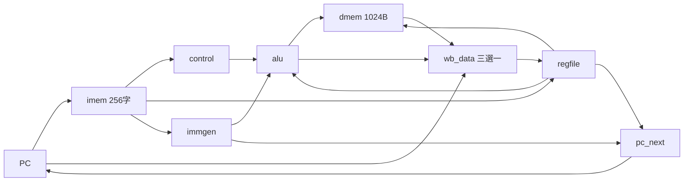

# A.1 單週期處理器完整實作（`single_cycle` 範例）

本附錄是 5.1 節的完整可執行版本：RV32I 單週期核心 `singlecycle.v`，全部整數指令一條跑完，附 Icarus Verilog 自檢。原始碼在 `_verilog/single_cycle/`，共 8 個檔案。

## A.1.1 定位：從骨架到可跑的 CPU

5.1 節的 `single_cycle_top` 只示範模組如何串接；本附錄的版本補齊三件事才真正可跑：第一，控制單元覆寫全部 RV32I 整數 opcode（含 `LUI`／`AUIPC`／`JAL`／`JALR` 六種格式）；第二，`ECALL` 到達即鎖定 `halted`，讓 testbench 知道何時停；第三，`prog.s` 功能測試＋`prog.hex`＋自檢 testbench 形成完整驗證閉環。

> 核心觀念：教學 CPU 的價值不在效能，而在「ISA 到硬體的對應可被逐條驗證」——69 條測試指令、88 步執行、每條都有 golden 可對。

## A.1.2 檔案一覽

| 檔案 | 行數 | 職責 |
|------|------|------|
| `singlecycle.v` | 133 | 頂層：取指、分支判定、記憶體讀寫、寫回選擇、PC 更新 |
| `alu.v` | 24 | 純組合 ALU，`op` 0–9（見下表） |
| `control.v` | 96 | 主控制：`opcode/funct3/instr[30]` → 13 個控制訊號 |
| `immgen.v` | 29 | I/S/B/U/J 五種立即數，符號擴展 |
| `regfile.v` | 26 | 32×32 暫存器檔，非同步讀、同步寫，x0 恆零 |
| `prog.s` | 87 | 功能測試：求和、邏輯移位、Load/Store、六種分支、`JAL/JALR`、`ECALL` |
| `prog.hex` | 69 列 | `prog.s` 經 `cli/rvasm.js` 組譯結果，`$readmemh` 載入 |
| `singlecycle_test.v` | 102 | 自檢 testbench：等 `halted` 後對拍 32 個暫存器＋記憶體 |
| `test.sh` | 9 | 一鍵編譯執行，`grep ^PASS` 判定成敗 |

ALU 操作編碼（`alu.v` 與 `control.v` 共用）：

| `op` | 0 | 1 | 2 | 3 | 4 | 5 | 6 | 7 | 8 | 9 |
|------|---|---|---|---|---|---|---|---|---|---|
| 運算 | ADD | SUB | AND | OR | XOR | SLL | SRL | SRA | SLT | SLTU |

## A.1.3 核心講解：頂層資料路徑

頂層的組合部分是五段式直線資料路徑，時序部分每週期只做三件事（見 `singlecycle.v`）：

```verilog
// 取指：PC 直接索引指令記憶體（256 字）
wire [31:0] instr = imem[pc[9:2]];
// 運算元選擇：LUI 用零當 A 端（alu_a_zero），AUIPC 用 PC 當 A 端（alu_a_pc）
wire [31:0] alu_a = alu_a_pc ? pc : (alu_a_zero ? 32'd0 : rs1_data);
wire [31:0] alu_b = alu_src_b ? imm : rs2_data;
// 寫回三選一：跳躍連結取 PC+4，載入取記憶體，其餘取 ALU
assign wb_data = wb_pc4 ? pc_plus4 : (mem_to_reg ? load_data : alu_y);
// 次態：JALR 目標最低位清零；分支成立才加立即數
wire [31:0] pc_next = jump ? (is_jalr ? jalr_target : pc + imm)
                           : ((branch & branch_taken) ? pc + imm : pc_plus4);
```

記憶體約定：指令記憶體 256 字（1KB），由 `prog.hex` 在 `initial` 經 `$readmemh` 載入；資料記憶體 1024 位元組小端序，位元組定址直接組字——`LB/LH` 取低位元組即對任意位址正確。`FENCE` 視為 NOP；`ECALL/EBREAK`（`funct3==000`）置 `halted`，管線凍結。

## A.1.4 驗證閉環：三層對拍

```sh
# 1. 組譯（cwd 在 _web_tools）：prog.s → prog.hex（69 列）＋ prog.bin
node cli/rvasm.js ../_verilog/single_cycle/prog.s
# 2. golden：軟體模擬器給出期望值（exit=0、steps=88、t0=55、a6=16）
node cli/rvemu.js ../_verilog/single_cycle/prog.s
# 3. 硬體自檢（cwd 在 _verilog/single_cycle）：應印出 PASS
bash test.sh   # halted at cycle 89, pc=0x114
```

`singlecycle_test.v` 在 `halted` 後檢查全部 32 個暫存器（含 `ra=0xfc` 連結位址、`s10=0x12345000` 的 `LUI`、`s11` 的 `AUIPC` 取 PC）與兩處記憶體（`mem[0x200]=0xaabbccdd`、`mem[0x204]=0xccdd00dd` 的 SB/SH 混寫）。任一不符即印 `FAIL` 並計數，`test.sh` 以 `grep ^PASS` 把結果轉成結束碼。

## A.1.5 資料路徑圖



## A.1.6 本節小結

- 133 行頂層＋4 個小模組即跑通 RV32I 整數全集，關鍵是控制訊號一次寫全、記憶體語意一次寫對。
- `halted` 鎖定＋`prog.hex`＋golden 三件套，讓每次改動都有客觀判據。
- 此核心是 A.2 節五階管線的對照基準：同樣的 `alu/control/immgen` 邏輯，原樣搬進管線（僅 `regfile` 加寫優先旁路）。

## A.1.7 想一想

1. `mem_read` 訊號在頂層其實沒被使用（載入恆為組合讀出），為何保留？若要支援記憶體等待（Wait State），它該接去哪裡？
2. `imem` 只有 256 字，`pc[9:2]` 索引；若程式跑飛到 1KB 以外會發生什麼？如何加一個越界 trap？
3. ★★ 實作題：加一條 `csrr a0, cycle` 讀取週期計數器（提示：頂層加計數器，`SYSTEM` 且 `funct3 != 000` 時寫回它）。
