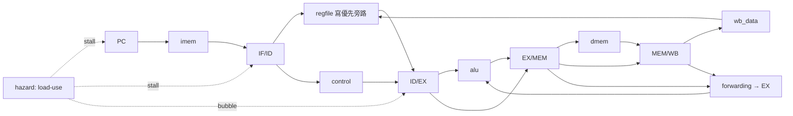

# A.2 五階段管線處理器完整實作（`5stage` 範例）

本附錄是 5.2 節與 5.3 節的完整可執行版本：經典 IF/ID/EX/MEM/WB 管線，分支在 EX 解決，EX 前遞（Forwarding）＋載入使用停頓（Load-Use Stall）處理資料冒險。原始碼在 `_verilog/5stage/`，共 11 個檔案，`alu/control/immgen` 與 A.1 節邏輯完全相同。

## A.2.1 定位：把 5.2 的圖變成會動的管線

5.2 節的 `id_ex_reg` 只示範一組管線暫存器；本附錄補齊管線成真的三個部件：第一，四組管線暫存器一次到位（`IF/ID`、`ID/EX`、`EX/MEM`、`MEM/WB`，控制訊號隨指令逐級攜帶）；第二，`forwarding.v`（MEM 優先於 WB）與 `hazard.v`（load-use 停頓）兩個 20 行級小模組；第三，76 條管線專用測試，刻意製造背靠背相依、load-use、分支連發，讓每一種冒險都無處可躲。

> 核心觀念：管線正確性 = 前遞覆蓋所有「舊值還沒寫回」的讀取，剩下的 load-use 缺口用一拍停頓補上；分支則用沖除（Flush）付兩拍代價。

## A.2.2 檔案一覽

| 檔案 | 行數 | 職責（與 A.1 差異處標 ★） |
|------|------|--------------------------|
| `pipeline.v` | 262 | 頂層：五級＋四組管線暫存器＋PC 控制 |
| `forwarding.v` | 22 | ★ EX 前遞：`00`=暫存器、`01`=WB、`10`=MEM（新值優先） |
| `hazard.v` | 15 | ★ load-use 停頓：EX 是 Load 且 ID 讀同暫存器即 `stall` |
| `regfile.v` | 30 | ★ A.1 版加寫優先旁路（同週期 WB→ID 讀到新值） |
| `alu.v`／`control.v`／`immgen.v` | 同 A.1 | 邏輯原樣沿用，未改一行 |
| `prog.s` | 99 | ★ 管線測試：前遞鏈、load-use、store 前遞、六種分支、`JAL/JALR` |
| `prog.hex` | 76 列 | `prog.s` 組譯結果 |
| `pipeline_test.v` | 107 | 自檢：等 `halted` 後對拍 32 暫存器＋3 處記憶體 |
| `test.sh` | 9 | 一鍵編譯執行，`grep ^PASS` 判定成敗 |

## A.2.3 核心講解（一）：分支解決與沖除

為求控制簡單，所有控制轉移統一在 EX 解決（靜態預測 not-taken），`taken` 同時沖掉 `IF/ID` 與 `ID/EX`：

```verilog
// EX：用前遞後運算元判定，JALR 目標最低位清零
wire ex_take = (id_ex_branch & ex_taken) | id_ex_jump;
wire [31:0] ex_target = id_ex_is_jalr ? ((ex_rs1_f + id_ex_imm) & 32'hFFFFFFFE)
                                      : (id_ex_pc + id_ex_imm);
// 時序：taken 優先沖除，stall 凍結 PC 與 IF/ID 並對 ID/EX 塞 bubble
if (!stall) pc <= pc_next;                       // pc_next = take ? target : pc+4
if (ex_take) begin if_id_pc <= 0; if_id_instr <= NOP; end
else if (!stall) begin if_id_pc <= pc; if_id_instr <= if_instr; end
if (ex_take || stall) begin /* ID/EX 控制訊號清零 */ end
else begin /* 由 IF/ID 鎖存 */ end
```

`flush` 只需清控制訊號（資料欄位隨便留，見 5.2.6 第 2 題），`NOP = addi x0,x0,0` 塞入 `IF/ID` 讓波形可讀。

## A.2.4 核心講解（二）：前遞與停頓的分工

`forwarding.v` 只看新舊關係，不管指令種類；`hazard.v` 只擋 load-use，不管其他相依：

```verilog
// forwarding：MEM（較新）優先於 WB；x0 永不轉發
if (mem_reg_write && mem_rd != 0 && mem_rd == ex_rs1) fwd_a = 2'b10;
else if (wb_reg_write && wb_rd != 0 && wb_rd == ex_rs1) fwd_a = 2'b01;
// MEM 前遞值：Load 取組合讀出，否則取 ALU 結果
wire [31:0] mem_fwd_data = ex_mem_mem_to_reg ? mem_rdata : ex_mem_alu;
// hazard：Load 在 EX、ID 指令讀同暫存器（LUI/AUIPC/JAL 不讀除外）
assign stall = id_ex_mem_read && (id_ex_rd != 0) &&
  ((id_uses_rs1 && id_ex_rd == if_id_rs1) ||
   (id_uses_rs2 && id_ex_rd == if_id_rs2));
```

兩個易錯點：其一，Store 的寫資料（rs2）也要在 EX 前遞後再鎖進 `EX/MEM`，否則 `add a2,…; sw a2,…` 會存入舊值；其二，`ECALL` 到 MEM 即鎖 `halted` 並凍結全管線，殘留在 IF/ID/EX 的後續指令永遠到不了 WB（控制全零的 NOP 化是安全網）。

## A.2.5 驗證閉環：管線專用證據

```sh
# 1–2. 組譯＋golden（cwd 在 _web_tools）：76 條指令、steps=68、exit=0
node cli/rvasm.js ../_verilog/5stage/prog.s
node cli/rvemu.js ../_verilog/5stage/prog.s
# 3. 硬體自檢（cwd 在 _verilog/5stage）：應印出 PASS
bash test.sh   # halted at cycle 93, pc=0x13c
```

93 = 68 指令＋3 次 load-use 停頓＋分支/`JAL`/`JALR` 沖除＋管線排空，每一拍都算得出來。對拍含三個管線專屬證據：`a2=0x557799ba`（`lw` 緊接 `add`，停頓一拍才正確）、`mem[0x204]=0x557799ba`（store 資料走前遞）、`s8=200`（相隔一條的 WB 前遞）。附帶收穫：註解曾把 `0x7F|0x700` 誤寫為 `0x7FF`，golden 的 `s9=0x77F` 當場抓包——這正是硬體對拍的價值。

## A.2.6 管線資料路徑圖（含前遞）



## A.2.7 本節小結

- 262 行頂層＋兩個 20 行級小模組即跑通全冒險覆蓋的管線，A.1 的 `alu/control/immgen` 一字未改——管線化是「切開＋攜帶＋冒險處理」，不是重寫資料路徑。
- 設計取捨只有一句話：分支放 EX（控制最簡，付 2 bubble）、load-use 停一拍（比 load 前遞便宜太多）。
- 下一步（呼應 6.1 節）：分支放 ID＋比較器前遞可把懲罰砍到 1 拍，是很好的 ★★★ 練習。

## A.2.8 想一想

1. 本設計 `taken` 沖 2 個 bubble；若把分支比較搬到 ID（加比較器＋ID 前遞），`prog.s` 的 cycle 數會從 93 降到多少？（提示：數 taken 次數。）
2. `hazard.v` 為何要區分 `id_uses_rs1/rs2`？若一律比對 rs1＋rs2，正確性受影響嗎？效能呢？
3. ★★★ 實作題：加一條 1-bit 分支預測器（taken 即預測 taken），`prog.s` 的迴圈在哪裡？沒有迴圈時它幫得上忙嗎？
